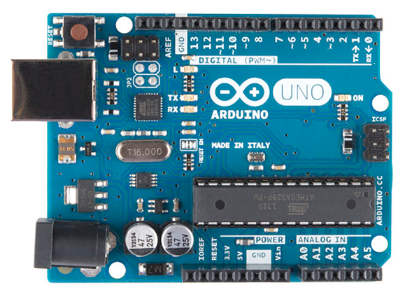
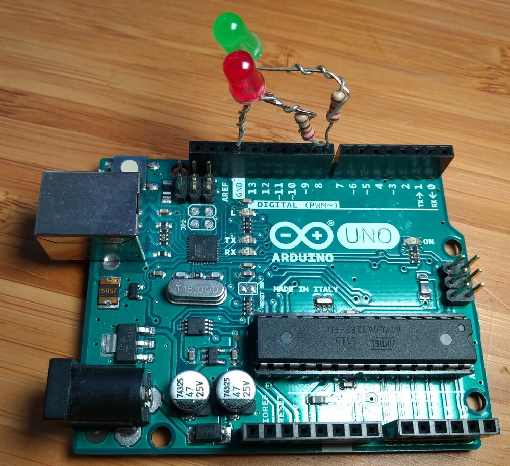
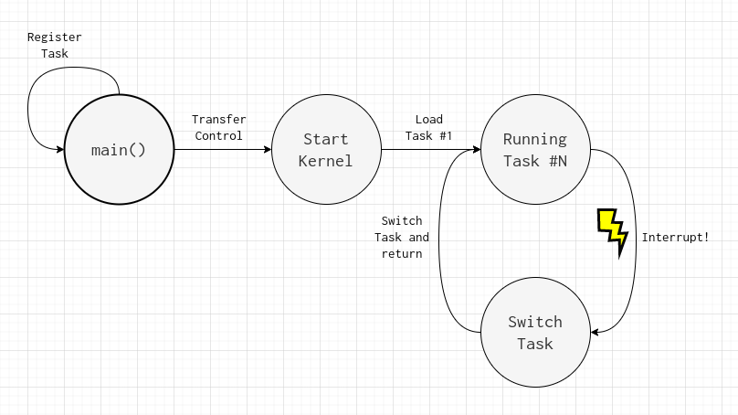
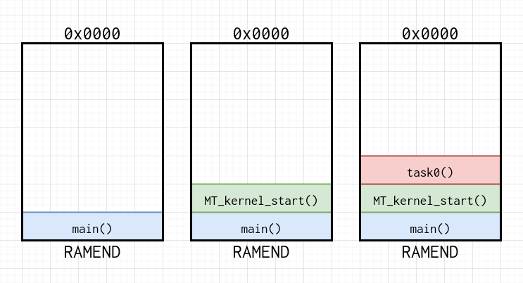
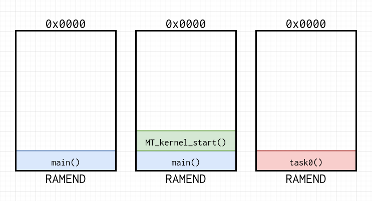
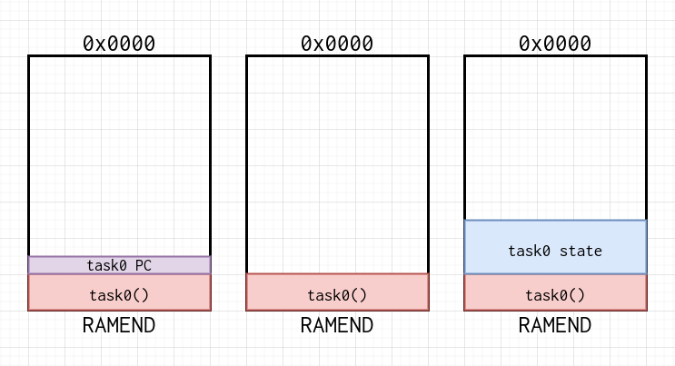
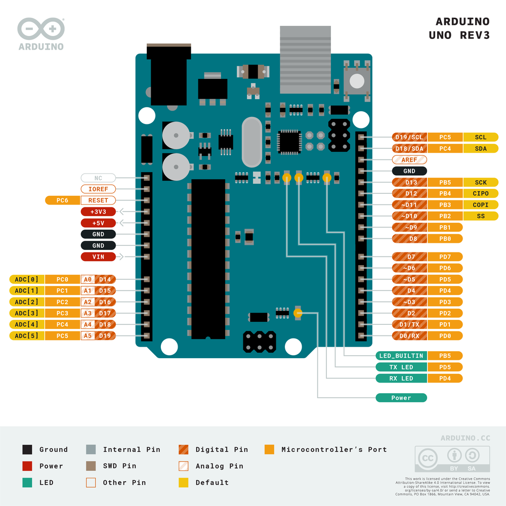

# Doing more than one thing at a time

How do computers run multiple independent programs at once? Maybe words like ["multi-core"](https://en.wikipedia.org/wiki/Multi-core_processor) or ["hardware threads"](https://github.com/riscv/riscv-isa-manual/releases/download/Ratified-IMAFDQC/riscv-spec-20191213.pdf) pop into your mind. These are some of the solutions of the modern age, which essentially just throw more hardware at the problem in order to achieve parallel instruction streams. But running multiple programs simultaneously has been done for a long time, before these technologies were common, or even just on simpler hardware like microcontrollers. So how do they do it?

The precise and kind of disappointing answer is that they **don't**. In fact, they straight up *can't* - a single core processor (excluding technicalities like [VLIW](https://en.wikipedia.org/wiki/Very_long_instruction_word) and other interesting architectures) cannot process more than one instruction stream at a time. The more interesting and clever answer is that they can get *pretty close* by exploiting the same class of trick that allows us to dim LEDs - you switch them so fast that human perception can't observe it!

This is called multitasking, though you probably had some vague idea about that already. Well today we're going to get down in the details and un-vague it by building an implementation of multitasking for something basically everyone has laying around: An ATmega238P microcontroller.

<center></center>

They are the superstar of the Arduino Uno, though we're not going to be using the arduino framework here at all. The Uno board is basically serving as a glorified USB programmer, and perhaps a convenient interface to push some LEDs into. And as a last note before we get going, I've written this article around a single architecture and chip, but the same principles will essentially apply to any chip you can get your hands on - even an x86 - though there will be considerably more hoops to jump through there!

## Playing along at home

If you want to give this a try yourself (and you really should), obviously you'll need an uno board. To be honest, with a few tweaks to the Makefile, you could probably get just about any arduino and/or Atmel chip working, but an uno will be the easiest. You'll also need:

- `avr-gcc`, `avr-libc`, `avrdude`, and `avr-binutils` installed (these should be in your package manager on linux, probably in brew on osx, and some random download page on windows)
- `avr-gdb` and `simavr` are optional extras which will allow you some much needed debugging and simulation capabilities when things get rough
- Two LEDs (preferably one green, one red) and two resistors to make sure you don't shove too much current through them. The values for the resistors aren't critical - pretty much anything will work - [but you can work them out if you so wish](https://www.luxalight.eu/en/resistor-calculator).

You find the full code [here on github](https://github.com/francisrstokes/ATmega328P-Bare-Metal-Task-Switching/tree/2dddb8a4a0f9c68ceebafe688ca67fe71116734c/src), including the Makefile for building the source.

## The rules of the game

<center></center>

OK let's put some bounds on this exercise. The most simple demonstration of this concept would be something having one independent task that blinks a red LED at some frequency `f1`, and an independent task that blinks a green LED at some frequency `f2`. When I say independent, I mean that the code should look something like this:

```C
#define RED_PERIOD   0x10000L
#define GREEN_PERIOD 0x7ffffL

void task_blink_red() {
  uint32_t counter = 0;

  while (1) {
    if (counter++ == RED_PERIOD) {
      toggleRedLED();
      counter = 0;
    }
  }
}

void task_blink_green() {
  uint32_t counter = 0;

  while (1) {
    if (counter++ == GREEN_PERIOD) {
      toggleGreenLED();
      counter = 0;
    }
  }
}
```

And it should not look like this:

```C
// This is the NON INDEPENDENT code
#define RED_PERIOD   0x10000L
#define GREEN_PERIOD 0x7ffffL

void task_blink_leds() {
  uint32_t redCounter = 0;
  uint32_t greenCounter = 0;

  while (1) {
    if (redCounter++ == RED_PERIOD) {
      toggleRedLED();
      redCounter = 0;
    }

    if (greenCounter++ == GREEN_PERIOD) {
      toggleGreenLED();
      greenCounter = 0;
    }
  }
}
```

Notice that `task_blink_red` and `task_blink_green` are both void functions which will never return? That's because in this model, each task function should be written as if it were the `main()` function, with full access and control of the entire microcontroller. As far as each task is concerned, there is no other LED to blink.

How we actually get those two functions to run together while remaining independent is the magic we'll be diving into, but first let's have a quick chat about AVR and microcontrollers in general, since we're going to need to know the hardware we're working with in order to pull this off.

## AVR Overview

The [ATmega328P](https://www.microchip.com/en-us/product/ATmega328p) is an 8-bit RISC microcontroller which implements the [AVR ISA](https://en.wikipedia.org/wiki/AVR_microcontrollers), with 32KiB of flash memory, 1KiB of EEPROM, and 2KiB of SRAM. Saying that it is resource constrained is a bit of an understatement - though it's definitely not the [most limited chip](https://www.youtube.com/watch?v=PZsWqOuJFKI) out there. Aside from the memory specs I just touched on, it has 32 general purpose registers, 3 timers, internal and external interrupts, as well as [UART](https://en.wikipedia.org/wiki/Universal_asynchronous_receiver-transmitter) serial, [I2C](https://en.wikipedia.org/wiki/I%C2%B2C), and [SPI](https://en.wikipedia.org/wiki/Serial_Peripheral_Interface) buses. If you don't know what any of those are, don't worry - it's not that important for now (but maybe open some of those links in new tabs and read about it later - it's pretty interesting).

RISC is a *reduced instruction set computer*. Basically, it's a general set of loosely related architectures that generally follow the principle of a small set of simple instructions - with the idea that simple instructions can be executed fast and are easily pipelined. ARM, MIPS, and [RISC-V](https://www.youtube.com/playlist?list=PLP29wDx6QmW4sXTvFYgbHrLygqH8_oNEH) all fall into this categorisation as well.

When I say that the ATmega238P is 8-bit, what that really means is that all of the registers are 8-bit, and that memory is generally addressed per byte as well. In this day and age of 64-bit everywhere, that might seem archaic, but these are small, cheap parts designed to run in embedded systems, drawing small amounts of power - and the tasks they're set to are generally not too intensive.

Somewhat unusually, AVR is a [harvard architecture](https://en.wikipedia.org/wiki/Harvard_architecture), in which program data and code exist in separate address spaces - though this doesn't end up having any real impact on building a multitasking system.

Interrupts are a way for the "outside world" to get the processors attention. This is useful when a piece of peripheral hardware like a timer has counted a preconfigured period and needs to inform the CPU, or when a bus connection like SPI has some data ready for the CPU to consume. Interrupts are *handled* by special functions, creatively named interrupt handlers. A microcontroller will typically have a fixed number of distinct interrupt types (the ATmega328P has 25), and each type will have its own handler. These handlers are all described in a table in memory - placed at a specific location defined by the processor - and when an interrupt occurs, the processor will look up the address of the handler in the table and jump to it's code.

The following table is taken from the [ATmega238P datasheet](https://ww1.microchip.com/downloads/en/DeviceDoc/Atmel-7810-Automotive-Microcontrollers-ATmega328P_Datasheet.pdf), section 11.1.

| Vector No. | Program Address | Source       | Interrupt Definition                                       |
|------------|-----------------|--------------|------------------------------------------------------------|
| 1          | 0x0000          | RESET        | External pin, power-on reset, brown-out reset and watchdog |
| 2          | 0x0002          | INT0         | External interrupt request 0                               |
| 3          | 0x0004          | INT1         | External interrupt request 1                               |
| 4          | 0x0006          | PCINT0       | Pin change interrupt request 0                             |
| 5          | 0x0008          | PCINT1       | Pin change interrupt request 1                             |
| 6          | 0x000A          | PCINT2       | Pin change interrupt request 2                             |
| 7          | 0x000C          | WDT          | Watchdog time-out interrupt                                |
| 8          | 0x000E          | TIMER2 COMPA | Timer/Counter2 compare match A                             |
| 9          | 0x0010          | TIMER2 COMPB | Timer/Counter2 compare match B                             |
| 10         | 0x0012          | TIMER2 OVF   | Timer/Counter2 overflow                                    |
| 11         | 0x0014          | TIMER1 CAPT  | Timer/Counter1 capture event                               |
| 12         | 0x0016          | TIMER1 COMPA | Timer/Counter1 compare match A                             |
| 13         | 0x0018          | TIMER1 COMPB | Timer/Counter1 compare match B                             |
| 14         | 0x001A          | TIMER1 OVF   | Timer/Counter1 overflow                                    |
| 15         | 0x001C          | TIMER0 COMPA | Timer/Counter0 compare match A                             |
| 16         | 0x001E          | TIMER0 COMPB | Timer/Counter0 compare match B                             |
| 17         | 0x0020          | TIMER0 OVF   | Timer/Counter0 overflow                                    |
| 18         | 0x0022          | SPI, STC     | SPI serial transfer complete                               |
| 19         | 0x0024          | USART, RX    | USART Rx complete                                          |
| 20         | 0x0026          | USART, UDRE  | USART, data register empty                                 |
| 21         | 0x0028          | USART, TX    | USART, Tx complete                                         |
| 22         | 0x002A          | ADC          | ADC conversion complete                                    |
| 23         | 0x002C          | EE READY     | EEPROM ready                                               |
| 24         | 0x002E          | ANALOG COMP  | Analog comparator                                          |
| 25         | 0x0030          | TWI          | 2-wire serial interface                                    |
| 26         | 0x0032          | SPM READY    | Store program memory ready                                 |

The first entry in the table is actually the `RESET` vector - a pointer to the first piece of code that runs when the microcontroller boots, or when it's physically reset.

The next five entries are for interrupts that occur when a signal is sent to one of the physical pins of the chip. Entry number 7, `WDT`, is actually the one we'll be making use of: The watchdog timer. The watchdog timer is a small piece of independently operating hardware inside the microcontroller that keeps track of time using it's own internal oscillator. The idea is that the programmer can put the chip into a mode where they must constantly check in with the `WDT`, and if they do not do so within a given time range, the `WDT` can either reset the chip entirely, or force an interrupt.

Entries 8-17 are also all timer related - but these are different, more high precision timers, which can be used for things like generating [PWM](https://en.wikipedia.org/wiki/Pulse-width_modulation) signals. These could also be used to implement multitasking (and in fact my first implementation used `TIMER1 OVF`), but for trade-off reasons we'll get into a bit later, I decided to use `WDT` instead.

The `SPI`, `USART`, and `TWI` related interrupts all relate to various communication lines and buses the microcontroller can send and receive data on. The `ADC` interrupt let's the program know that an analog signal input has been digitized, while the `ANALOG COMP` compares analog signals sent into two of the microcontrollers pins, and can trigger an interrupt (and other interesting behaviour) when one voltage is higher than the other. `EE READY` and `SPM READY` both relate to persistent memory that can be read and/or written to by the program.

So in summary, there is a big table of interrupt handlers that should always be present in the program (they're actually jump instructions). Interrupts occur either by sending signals to specific pins (external), or by timers, communication, or other peripheral hardware inside the chip (internal). When an interrupt occurs, the handler for whichever cause triggered the interrupt is "called". This calling is very much like a regular function, in that the return address is stored on the stack, but it comes with it's own return instruction: `reti` (return from interrupt). When the interrupt is complete, and the `reti` instruction is executed, the return address is popped off the stack, and execution is returned.

There is, of course, a little more to it than that, but that is the gist of things. With that in mind, let's see how we can use this knowledge to achieve multitasking.

## High level concept

The idea in a nutshell is this:

- We have the concept of some kind of *kernel*, which is some code/data which takes care of defining, registering, and switching tasks
- The `main()` function will basically only be used to register tasks and to start the kernel
- We will write an interrupt handler for the watchdog timer, which will essentially transfer control from the user code (task functions) to the kernel. Inside the interrupt handler, we can save the state of the current task (registers, program counter, stack pointer), and *switch* to the new task
- After returning, execution is returned to the newly switched task

<center></center>

Sounds...not too bad, right? Well, let's start to get a little more concrete about it.

## Structured state

We're going to need some structures to hold state about tasks and the kernel, so let's start in `kernel.h`.

```C
#ifndef MT_KERNEL_H
#define MT_KERNEL_H

#include <stdint-gcc.h>
#include <avr/io.h>
#include <avr/interrupt.h>

typedef void (*MT_TaskFn)();

struct MT_TaskDefinition {
  MT_TaskFn task;
  uint8_t stackSize;
};

struct MT_KernelTask {
  struct MT_TaskDefinition* task;
  uint16_t stackStart;
  uint16_t sp;
  uint16_t pc;
};

#endif
```

If you're not too familiar with C, header files, translation units, and all that jazz, you can do some reading on the subject, or checkout [this video by the Cherno](https://www.youtube.com/watch?v=9RJTQmK0YPI) (it's about C++, but is the same for C).

The `stdint-gcc` header, which comes with the AVR libraries, is included. This allows writing descriptive integer types that include their size and signedness in the name. The other two includes will be used a little later on, and essentially provide defintions, macros, and some functions for interacting with memory-mapped I/O registers and writing interrupt handlers.

In terms of information we need to store, a task *definition* (`MT_TaskDefinition`) is made up of two key pieces of information:

1. A pointer to a function - that is, an address for a function we can call or jump to later.
2. A stack size - since every task is basically pretending it owns the whole processor, it needs its own isolated place to track local variables and nested function calls

If we were going for something more complex, like a full [RTOS](https://en.wikipedia.org/wiki/Real-time_operating_system), then we'd also need more information, like priority, but let's just skip that for now.

A `MT_TaskDefinition` is good for passing to the kernel when registering a task, but the kernel itself will need to keep a little more information than that. `MT_KernelTask` needs to keep track of the [program counter](https://en.wikipedia.org/wiki/Program_counter), [stack pointer](https://en.wikipedia.org/wiki/Call_stack#STACK-POINTER), and address of the start of the stack. That last item is there so the kernel can make sure that no task overruns its own stack. If that were to happen, all bets would be off! And of course, it keeps a pointer to the original task definition.

OK so that takes care of the representation of individual tasks, both from the kernel and user perspectives. But the kernel will obviously to keep track of multiple states, as well as which state is currently active. So let's define another struct for that.

```C
#define MT_NUM_TASKS 16
struct MT_Kernel {
  struct MT_KernelTask tasks[MT_NUM_TASKS];
  uint8_t tasksRegistered;
  uint8_t activeTask;
  uint16_t nextStackAddress;
};

extern struct MT_Kernel MT_kernel;
```

In order, we have:

- An array of `MT_KernelTask`s, with a defined size of 16. This number is arbitrary, but since this is a memory constrained system, it's worth doing some calculations to see what is reasonable
- A counter of the number of tasks that have been registered
- An index for the active task
- A 16 bit value for holding the next available stack address that can be assigned to a task
- A *declaration* of a global instance of this `MT_Kernel` struct (the actual *definition* will be elsewhere, but now any other C files that include "kernel.h" will be able to see this variable)

Nothing should be too surprising here. Because of the limited number of tasks the kernel can track, it implies that we should check that whenever a task is registered, it doesn't exceed the array size. For the occasions that it does, let's define a helpful error handling macro:

```C
#define PANIC() while (1) {}
```

Well OK, probably not that helpful - but doing something more useful would start getting us away from the point. Something better would be like printing something to UART, or having a dedicated LED that could blink certain patterns to indicate what went wrong.

## The kernel interface

So now we have we have structures to store our state, and a way to panic when something goes wrong, let's define the actual kernel interface, consisting of functions that the *user* can call:

```C
void MT_kernel_init();
void MT_kernel_start();
void MT_register_task(struct MT_TaskDefinition* task);
```

Here we have 3 function declarations, which are pretty self-explanatory; Something to initialise the kernel, something to actually get it running, and something that allows us to register a task. Let's create a "kernel.c" file and start to define them.

```C
#include "kernel.h"
#include <string.h>

void MT_kernel_init() {
  // Turn off interrupts until the kernel is started
  cli();

  MT_kernel.tasksRegistered = 0;
  MT_kernel.activeTask = 0;
  MT_kernel.nextStackAddress = RAMEND;

  WDTCSR = _BV(WDIE); // WDT Enabled, in interrupt mode, every 16ms
}

struct MT_Kernel MT_kernel;
```

Ignore the inclusion of "string.h" for a moment.

As the comment specifies, the call to `cli()` *clears* interrupts. This is done so that the watchdog timer interrupt handler that we'll be writing does not execute before the data structures have been properly set up. `cli` is exposed by the "avr/interrupt.h" header we included in "kernel.h".

Next we place the initial values for relevant fields in `MT_kernel`. `nextStackAddress` is set to `RAMEND`, which is the address that marks well, the end of RAM. Stacks grow towards smaller addresses in AVR, and so the idea is to start as far back as possible and give each task a slice of the stack referenced from that point. `RAMEND` is defined in "avr/io.h", which is actually a kind of abstraction header that provides the same macros and constants for all of the various Atmel chips. When we compile code with avr-gcc, we need to pass the exact chip we're using, and that ends up selecting the right `RAMEND` for us.

```C
WDTCSR = _BV(WDIE); // WDT Enabled, in interrupt mode, every 16ms
```

The last line in the function is by far the most cryptic. `WDTCSR` is a *control register*, which is a memory-mapped byte, and is defined in section 10.9.2 of the datasheet. Memory-mapped here means that by reading or writing to this particular place in memory, we are actually **controlling** something on the chip. Each of the 8 bits in the register has a particular meaning (and sometimes multiple bits control the same thing, if more than 2 possibilities exist). The `_BV(x)` macro expands to `1 << x`, which allows for creating a [bit-mask](https://en.wikipedia.org/wiki/Mask_(computing)) we can use to set or clear bits easily in the register. `WDIE` stands for "Watchdog Interrupt Enable", and is bit 6 of the register. From the datasheet:

> When this bit is written to one [sic] and the I-bit in the status register is set, the watchdog interrupt is enabled. If WDE is cleared in combination with this setting, the watchdog timer is in interrupt mode, and the corresponding interrupt is executed if time-out in the watchdog timer occurs. If WDE is set, the watchdog timer is in interrupt and system reset mode. The first time-out in the watchdog timer will set WDIF.

So by setting this bit, we are enabling the watchdog interrupt. `WDE`, or "Watchdog System Reset Enable", is bit 3, and will be left cleared, and therefore will execute the interrupt when a time-out occurs - which is the desired behaviour. And since it is *not* set, it means the chip will not reset after the interrupt handler has executed, which definitely also the desired behaviour! Why would that even be an option? Well the watchdog timer is *usually* used to detect when critical error conditions have taken place, so by enabling the reset mode, the chip:

1. has some time to talk to any other hardware in the system
2. can safely reset to a known state when clean up is done

There are then 4 more bits in this register that together define the frequency of the watchdog timer. When all 4 bits are left cleared, a timeout will occur approximately every 16 milleseconds, or ~60 times per second. Each of the other configurations double this timeout, until it is approximately every 8 seconds. For our purposes, the shorter the timer interval, the better - since it will provide a smoother appearance that each task executes simultaneously. 16ms is not the shortest possible interval (some RTOS intervals are more on the order of task switching every 1ms!), but it's also not too bad. If we decided we needed a shorter interval, we could use one of the other builtin timers, which have much finer grained capabilities. However, this presents a tradeoff. Those timers are typically used for *actual useful work* on the microcontoller, like generating PWM signals, or asserting pins at a precise time. Since the job of the multitasking library is really to allow more expressive programs, it kind of has the responsibility to leave the most crucial resources for the programmer to actually make use of! Of course, the watchdog timer itself can in some circumstances actually be the critical resource the programmer needs, and so ideally the library would expose a mechanism for deciding at compile time which interrupt handler to use and configure the proper AVR registers, but that is something for another day.

Finally, after the function definition, we can see the actual definition for `MT_kernel`.

## Registering tasks

Next, let's take a look at registering tasks.

```C
void MT_register_task(struct MT_TaskDefinition* task) {
  if (MT_kernel.tasksRegistered >= MT_NUM_TASKS) {
    PANIC();
  }

  MT_kernel.tasks[MT_kernel.tasksRegistered].task = task;
  MT_kernel.tasks[MT_kernel.tasksRegistered].stackStart = MT_kernel.nextStackAddress;
  MT_kernel.tasks[MT_kernel.tasksRegistered].sp = MT_kernel.nextStackAddress;
  MT_kernel.tasks[MT_kernel.tasksRegistered].pc = (uint16_t)task->task;

  // Every task after the first will need to perform a stack restore, even on it's
  // first run. Here we make sure that the stack pointer is correctly offset, and that
  // the stack memory is zeroed out.
  if (MT_kernel.tasksRegistered > 0) {
    MT_kernel.tasks[MT_kernel.tasksRegistered].sp -= SAVED_STATE_SIZE;
    memset((void *)(MT_kernel.nextStackAddress - SAVED_STATE_SIZE), 0, SAVED_STATE_SIZE);
  }

  MT_kernel.tasksRegistered++;
  MT_kernel.nextStackAddress -= task->stackSize + SAVED_STATE_SIZE;
}
```

`MT_register_task` is a function that takes a pointer to a task definition (the one that the user creates, with pointer to the function and a stack size). The first thing we do is to check if the maximum number of tasks have already been registered, and if so, we can put the system in panic mode. Note that if we didn't do this, C would happily let us write off the end of the array, overwriting the `tasksRegistered` field in the struct.

Next we start filling in the kernel's view of this task. We can copy the pointer to the user provided task struct, then set the stack start based on the kernel provided `nextStackAddress`. For the first task, that will simply be `RAMEND`. The `sp` holds this task's saved *stack pointer*, and initially will just be equal to `stackStart`. Finally, this task's *program counter* is set to the address of the task function. Note that the task provides a *function pointer*, but we're converting it to an unsigned 16 bit value. This conversion is not strictly necessary, but makes life a little easier later on, since we'll need to deal with the high and low 8 bits separately.

A note here on pointers and addresses: All pointers on the ATmega328P are 2 bytes. This is actually not true of all AVR chips, so if you're trying this with something else you'll need to keep it in mind.

In the next part of the code, there is a comment that explains that we need to adjust the `sp` value for every task *after* the first one registered. This is because the first task will begin running when we call the yet unimplemented `MT_kernel_start()`, but every other task is going to start after the watchdog interrupt occurs. As we'll see shortly, in order to switch tasks, we'll need to save the state of the current task, then load the next task in the array, and *restore* its state. Obviously the first time a task runs, there isn't any state to restore, but we can avoid [special cases](https://gist.github.com/santisbon/42580049705ba3d8fbef7168e4668e3c) by writing the code to always restore. We'll get into the details of that soon enough, but to cover the body of the if statement, the `sp` is adjusted by some constant `SAVED_STATE_SIZE`, and `memset` is used zero `SAVED_STATE_SIZE` bytes from the `nextStackAddress`.

The number of registered tasks is incremented, and then `nextStackAddress` is *decremented* by the user provided stack size plus `SAVED_STATE_SIZE`. So from the kernels point of view at least, the stack size for a given task is larger than what the user actually asks for. This could be seen as tricky - after all, on a resource constrained system the user should know exactly what is happening with memory! But it would be trickier to let the user think they had say, 64 bytes of stack, when really some of that is going to be used for kernel purposes.

## Starting the kernel

Before we can implement `MT_kernel_start()`, we need to add a couple of declarations to the kernel header file.

```C
// In "kernel.h"

extern uint8_t MT_tmp_reg;
extern uint8_t MT_pc_high;
extern uint8_t MT_pc_low;
extern uint8_t MT_sp_high;
extern uint8_t MT_sp_low;

#define U16_TO_U8_L(u16) (uint8_t)(u16 & 0xff)
#define U16_TO_U8_H(u16) (uint8_t)((u16 >> 8) & 0xff)

#define U8S_T0_U16(u8l, u8h) ((uint16_t)u8h << 8) | (uint16_t)(u8l)
```

These 5 variables are going to act as our bridge between C and the AVR assembly we're going to have to write in order to get the true low level control required for multitasking.
The two macros `U16_TO_U8_L` and `U16_TO_U8_H` both perform a conversion on a `uint16_t` to extract the low and high byte respectively, explicitly cast to a `uint8_t`. Being explicit about such casts is a requirement when compiling with strict flags, which you should absolutely do when writing C - there are enough ways to write bugs without leaving the easily detectable ones on the table!

The last macro does approximately the inverse of the previous two; Taking a low and high byte, and joining them together into a `uint16_t`.

OK, now for `MT_kernel_start()` back in "kernel.c":

```C
void MT_kernel_start() {
  if (MT_kernel.tasksRegistered) {
    // Get the stack pointer of this task, but leave space to push a return address
    uint16_t sp = MT_kernel.tasks[MT_kernel.activeTask].sp - sizeof(void *);
    MT_sp_low = U16_TO_U8_L(sp);
    MT_sp_high = U16_TO_U8_H(sp);

    __asm__ __volatile__ (
      "lds __tmp_reg__, MT_sp_low   \n\t"
      "out __SP_L__, __tmp_reg__    \n\t"
      "lds __tmp_reg__, MT_sp_high  \n\t"
      "out __SP_H__, __tmp_reg__    \n\t"
      "push %[pcl]                  \n\t"
      "push %[pch]                  \n\t"
      : /* no outputs */
      : [pcl] "r"(U16_TO_U8_L(MT_kernel.tasks[MT_kernel.activeTask].pc))
      , [pch] "r"(U16_TO_U8_H(MT_kernel.tasks[MT_kernel.activeTask].pc))
    );

    // Enable interrupts
    sei();

    // On return, control will transfer to the first task
    return;
  }
}

uint8_t MT_tmp_reg;
uint8_t MT_pc_high;
uint8_t MT_pc_low;
uint8_t MT_sp_high;
uint8_t MT_sp_low;
```

That might look a little intimidating - but it's really not too bad. The logic of the function only runs if tasks have been registered, and otherwise the program will just continue to run as usual, returning to wherever it was called from (most likely the `main` function). On the other hand, if at least one task has been registered, it's stack pointer is put into a variable, and the size of a *void pointer* is subtracted. Since the `activeTask` should be zero at this point, and the first task registered has it stack pointer set to the end of RAM, this expression equates to `RAMEND - 2` on the ATmega328P. `sizeof(void *)` is used here in order to have the code at least close to portable, but could be hardcoded.

Then the low and high bytes of that calculated `sp` are placed into `MT_sp_low` and `MT_sp_high`. Now we come to our first piece of inline assembly. Before we understand what the instructions are and what they do, as well as how the inline assembly facilities work in C, let's think about what we're trying to achieve here. We need to start the first available task, and have it run until the watchdog timer interrupt occurs. We could simply *call the task function*, but there would be a problem: Doing so would create a new stack frame, leaving the local variables of this function intact, plus any in the function `MT_kernel_start` was called from (again, most likely `main`), as well as its local variables, and return addresses for unwinding the stack frames if we were to ever return from the task function. But of course, we know we're not going to return - one of the constraints of this whole idea is that task functions do not return. In a resource constrained system such as this, leaving all those bytes uselessly on the stack just doesn't make sense.

<center></center>

So instead, we are just going to hit reset on the stack entirely, manually reassigning the stack pointer. This is *not* something C allows you to do directly, which is why we need to drop down to assembly.

<center></center>

Since inline assembly is not all that common, even for regular C users, let's break this down a bit.

```C
__asm__ __volatile__ (
  "lds __tmp_reg__, MT_sp_low   \n\t"
  "out __SP_L__, __tmp_reg__    \n\t"
  "lds __tmp_reg__, MT_sp_high  \n\t"
  "out __SP_H__, __tmp_reg__    \n\t"
  "push %[pcl]                  \n\t"
  "push %[pch]                  \n\t"
  : /* no outputs */
  : [pcl] "r"(U16_TO_U8_L(MT_kernel.tasks[MT_kernel.activeTask].pc))
  , [pch] "r"(U16_TO_U8_H(MT_kernel.tasks[MT_kernel.activeTask].pc))
);
```

`__asm__` is a keyword that signals to the compiler that we're inserting inline assembly. `__volatile__` is an attribute we can apply to tell the compiler that the assembly we're inserting has important *side-effects*, and therefore should not be optimised out, even if the compiler happens to determine that it is useless code. What occurs inside the parentheses looks, at first glance, like a function call, but it has it's own special syntax with colons (`:`) that you can see above. As described here on the [GNU AVR inline assembly page](https://www.nongnu.org/avr-libc/user-manual/inline_asm.html), an `__asm__` statement is made up of four parts:

1. The assembler instructions, defined as a single string constant
2. A list of output operands, separated by commas
3. A comma separated list of input operands
4. Clobbered registers

The instruction string is straightforward, though it's worth noting that instructions end with `\n\t`. I actually don't know if that is 100% necessary, but that is what I have seen in every other resource, and therefore I'm doing it as well. The list of output operands is not used here, but can be used to move values out of registers directly into C variables. Likewise, the list of input operands allows us to go the other way - inserting C values directly into registers (well, not *directly*, but the compiler will generate the correct code to do that for us). This part is used, and is how we will get the *program counter* from our task structure into the assembly code. The clobbered registers part is generally not used as much (and is not used here), but allows us to tell the compiler that we have specifically used certain registers ("clobbering" their original values), and that it should generate code to save and restore their previous values. In the "inputs" section the line

```C
: [pcl] "r"(U16_TO_U8_L(MT_kernel.tasks[MT_kernel.activeTask].pc))
```

is used to associate the name `pcl` with the low byte of the active task's program counter. The "r" you see before the value we pass in is what's called a *constraint*. There are numerous constraints you can use, but this one tells the compiler to place this value into *any register* it deems fit for purpose.

All of the surrounding context should now be clear, and we can take a look at the specific instructions used. `lds` is "Load Direct from Data Space", loads one byte from the data space to a register. Operands of an instruction are specified as *destination* then *source*, so what the instruction is saying is "Load the byte at the address of the `MT_sp_low` variable into `__tmp_reg__`. `__tmp_reg__` is actually just register zero (`r0`), which the [compiler treats with a particular meaning](https://gcc.gnu.org/wiki/avr-gcc). Something else interesting here is that we can reference the addresses of global variables directly in the code, though this is limited; You cannot, for example, reference the member of a global *struct* this way.

The next instruction is `out`, which is "Store Register to I/O Location". "I/O Locations" refers to a separate address space to regular data, and AVR has a collection of instructions just for interacting with registers in this space. Confusingly, some of the registers in this space are also mapped into the data space as well, but with a different address of course! All of this is described in the datasheet, but it can be tricky to digest. So in this `out` instruction, we are moving the data in `__tmp_reg__` to `__SP_L__`, which the compiler knows is the I/O address for the low byte of the stack pointer.

The next two instructions repeat the process, but for the high byte. After the execution of these four instructions, we've set the stack pointer value the kernel assigned to the task into the microcontrollers *actual* stack pointer value.

The next two instructions are `push`, where we *push* a value on to the stack. Special syntax is used here to reference the *registers* the compiler chose for the two values we told the compiler to inject as inputs - the low and high bytes of this task's program counter.

After that code has executed, we have set up the stack correctly, and effectively jumped to the code for the first task, without any function calls, and a *full reset* of the stack frames.

## The watchdog timer interrupt

It is now time, then, to turn our attention to the interrupt mechanism. AVR, in the "avr/interrupt.h" header, provides a macro `ISR()`, to which we can provide the name of an interrupt handler source (as described in the interrupt table above), to define an interrupt handler. For example:

```C
ISR(WDT_vect) {
  // Interrupt handling code goes here
}
```

`ISR` stands for "Interrupt Service Routine"; handling an interrupt is often spoken of as "servicing" the interrupt. This macro expands to:

```C
void WDT_vect (void) __attribute__ ((signal, used, externally_visible));
void WDT_vect (void) {
  // Interrupt handling code goes here
}
```

And expanding the `WDT_vect` macro as well:

```C
void __vector_6 (void) __attribute__ ((signal, used, externally_visible));
void __vector_6 (void) {
  // Interrupt handling code goes here
}
```

Let's unpack this a bit. What that macro expansion has left us with is:

1. A `void` function declaration, called `__vector_6`, taking no arguments, with compiler attributes `signal`, `used`, and `externally_visible`
2. A function definition - which is the body we define for the interrupt handler

The name `__vector_6` is what the special name that gcc gives to the watchdog timer interrupt. It's number 6 in the table above (from a zero-indexed perspective that is), so that checks out.

The attributes instruct the compiler to treat this function specially. `signal` is an [AVR specific attribute](https://gcc.gnu.org/onlinedocs/gcc/AVR-Function-Attributes.html) which tells gcc this function is an interrupt (signal) handler, and that it should figure out which one from the name. Interestingly, there is also another attribute called `interrupt`. This does the same job as `signal`, but with this caveat:

> On the AVR, the hardware globally disables interrupts when an interrupt is executed. The first instruction of an interrupt handler declared with this attribute is a SEI instruction to re-enable interrupts. See also the signal function attribute that does not insert a SEI instruction. If both signal and interrupt are specified for the same function, signal is silently ignored.

So if `interrupt` were used here instead, the handler could be running, and another interrupt could potentially take control. While that may be desirable in some cases, the AVR library writers have decided that is should not be the default case.

The `used` attribute is a [common gcc attribute](https://gcc.gnu.org/onlinedocs/gcc/Common-Function-Attributes.html#Common-Function-Attributes). This tells gcc to zero out "call-used" registers in the function, and is a security measure that can prevent [Return-Oriented Programming (ROP) attacks](https://www.youtube.com/watch?v=zaQVNM3or7k).

Finally, `externally_visible` tells gcc that this function should be *visible* outside the current compilation unit - even in the presence of certain compiler flags that would prevent that behaviour.

OK so all in all, the `ISR()` method of defining interrupt handlers is really just defining a regular old function, with some specific attributes specified for gcc to generate appropriate code and to place it in the right place when it's loaded on to the chip. With that context in mind, let me tell you why we're **not going to use it**.

Part of a C compilers job, as previously mentioned, is to abstract away machine details from the programmer. So when a function is called for example, some of the registers should have their values saved before the call and restored after, and some of the registers can be safely overwritten. In most cases that's the desired effect, but in our case, we don't want the compiler to touch the stack in any way we can't control, since the whole thing hinges on our ability to redefine the stack at will.

So instead, we'll write our own manual function declaration/definition, using a different mix of attributes:

```C
void WDT_vect (void) __attribute__ ((signal, naked));
void WDT_vect (void) {
  // Interrupt handling code goes here
}
```

We're still using the `signal` attribute, but we've gotten rid of the other two. It turns out that they're not really needed when compilation is set up the way it is in this project. What we've added, though, is the `naked` attribute. This is an AVR specific attribute that tells gcc **not** to generate any code for saving or restoring registers. Generally, this should only be done in circumstances where the entire function body is just assembly - because any local variables and/or logic would modify the stack and registers in a way that gcc would not be able to correct for at the end of the function.

But in this case that's actually not a problem (as long as we do it correctly). Let's see what the body of the handler actually consists of:

```C
void WDT_vect (void) __attribute__ ((signal, naked));
void WDT_vect (void) {
  if (MT_kernel.tasksRegistered > 0) {
    // Save the current state
    MT_SAVE_TASK_CTX();

    // Save this tasks PC
    MT_kernel.tasks[MT_kernel.activeTask].pc = U8S_T0_U16(MT_pc_low, MT_pc_high);

    // Save this tasks SP
    MT_kernel.tasks[MT_kernel.activeTask].sp = U8S_T0_U16(MT_sp_low, MT_sp_high);

    // Set up next task
    MT_kernel.activeTask += 1;
    if (MT_kernel.activeTask >= MT_kernel.tasksRegistered) {
      MT_kernel.activeTask = 0;
    }

    // Place this tasks stack pointer in the global reference
    MT_sp_low  = U16_TO_U8_L(MT_kernel.tasks[MT_kernel.activeTask].sp);
    MT_sp_high = U16_TO_U8_H(MT_kernel.tasks[MT_kernel.activeTask].sp);

    // Place this tasks program counter in the global reference
    MT_pc_low  = U16_TO_U8_L(MT_kernel.tasks[MT_kernel.activeTask].pc);
    MT_pc_high = U16_TO_U8_H(MT_kernel.tasks[MT_kernel.activeTask].pc);

    MT_RESTORE_TASK_CTX();
  }

  // Enable interrupts
  sei();

  reti();
}
```

That hopefully shouldn't look too intimidating, as there are only a few lines in the body of the function, and we're going to go through them one by one.

First of all, we're checking if tasks have been registered with the kernel, and if not, we're simply re-enabling interrupts and then returning.

Otherwise, a few things happen. First, there is a call to `MT_SAVE_TASK_CTX`. This of course hasn't been defined yet, and is doing some of the conceptual heavy lifting here. For now, let's just say it's a macro that will drop some inline assembly into the function, and we'll take a deeper look at it shortly.

After that, the next couple of lines set the active tasks program counter and stack pointer respectively, using the global variables we defined earlier. Presumably these variables are set in some way by `MT_SAVE_TASK_CTX`.

Then we use a simple round-robin approach approach to set the next task to active, and place that task's `pc` and `sp` into the 8-bit high/low global variables. Finally, `MT_RESTORE_TASK_CTX` is called - another assembly macro - which is doing the inverse of `MT_SAVE_TASK_CTX`.

And that's really it from the high level. Let's take a peek into `MT_SAVE_TASK_CTX`:

## Saving task state

```C
#define MT_SAVE_TASK_CTX()                                           \
  __asm__ __volatile__ (                                             \
    /* The next two bytes on the stack hold the the current PC */    \
    "sts    MT_tmp_reg, __tmp_reg__         \n\t"                    \
    "pop    __tmp_reg__                     \n\t"                    \
    "sts    MT_pc_high, __tmp_reg__         \n\t"                    \
    "pop    __tmp_reg__                     \n\t"                    \
    "sts    MT_pc_low, __tmp_reg__          \n\t"                    \
    "lds    __tmp_reg__, MT_tmp_reg         \n\t"                    \
    /* */                                                            \
    "push   __tmp_reg__                     \n\t"                    \
    "in     __tmp_reg__, __SREG__           \n\t"                    \
    "push   __tmp_reg__                     \n\t"                    \
    "push   __zero_reg__                    \n\t"                    \
    "clr    __zero_reg__                    \n\t"                    \
    "push   r2                              \n\t"                    \
    "push   r3                              \n\t"                    \
    "push   r4                              \n\t"                    \
    "push   r5                              \n\t"                    \
    "push   r6                              \n\t"                    \
    "push   r7                              \n\t"                    \
    "push   r8                              \n\t"                    \
    "push   r9                              \n\t"                    \
    "push   r10                             \n\t"                    \
    "push   r11                             \n\t"                    \
    "push   r12                             \n\t"                    \
    "push   r13                             \n\t"                    \
    "push   r14                             \n\t"                    \
    "push   r15                             \n\t"                    \
    "push   r16                             \n\t"                    \
    "push   r17                             \n\t"                    \
    "push   r18                             \n\t"                    \
    "push   r19                             \n\t"                    \
    "push   r20                             \n\t"                    \
    "push   r21                             \n\t"                    \
    "push   r22                             \n\t"                    \
    "push   r23                             \n\t"                    \
    "push   r24                             \n\t"                    \
    "push   r25                             \n\t"                    \
    "push   r26                             \n\t"                    \
    "push   r27                             \n\t"                    \
    "push   r28                             \n\t"                    \
    "push   r29                             \n\t"                    \
    "push   r30                             \n\t"                    \
    "push   r31                             \n\t"                    \
    /* */                                                            \
    "in     __tmp_reg__, __SP_L__           \n\t"                    \
    "sts    MT_sp_low, __tmp_reg__          \n\t"                    \
    "in     __tmp_reg__, __SP_H__           \n\t"                    \
    "sts    MT_sp_high, __tmp_reg__         \n\t"                    \
  );
```

There's quite a few instructions there, but it's not as bad as it probably appears. Before we go through what each of them mean, and how they work together, here's a conceptual picture of what should happen:

<center></center>

The first box represents how the stack is when when the interrupt function starts running. The return address for `task0` is on top of the stack, and below it are any local variables or deeper call stacks that might have occurred inside the task function. When the interrupt is complete, the `reti` instruction will *pop* the return address off the stack and jump back. In order to switch tasks, we'll need to make sure that by the time we return, the address that is actually on the top of the stack is that of the *next task*. So we need to remove that the return address and store it in *this tasks* `pc`.

That leaves us in the second box. From here, we can save the state of all of the registers by pushing them all onto the stack. Since there are a fixed number of registers, we know exactly how much data that is - 33 bytes. Why 33 and not 32, like the actual number of registers? Don't worry, we'll get to that.

With that in mind, let's go back to the first few assembly instructions:

```asm
sts    MT_tmp_reg, __tmp_reg__
pop    __tmp_reg__
sts    MT_pc_high, __tmp_reg__
pop    __tmp_reg__
sts    MT_pc_low, __tmp_reg__
lds    __tmp_reg__, MT_tmp_reg
```

`sts`, or "Store Direct to Data Space", allows us to store the contents of a register to memory, and is the counterpart to `lds`. Why not `sds`, you say? No idea. Seems like it would have made sense, but hey, who am I to judge. So we're storing `__tmp_reg__` (`r0`) to the global variable we defined, aptly named `MT_tmp_reg`. This is done because we're going to need to pop that return address off of the stack, and in order to `pop`, you need a register to be able to pop into. But of course, we also need to save the state of `__tmp_reg__` because it could easily have an important value from the task function still in it! So the solution is to store it somewhere well defined in memory and retrieve it after we've done what we need to do.

Next we pop the high byte of this task's `pc` into the `__tmp_reg__`, and store it in the global. Then we do the same for the low byte. Finally, we restore the `__tmp_reg__` with an `lds` instruction, and we're ready to save some state!

```asm
push   __tmp_reg__
in     __tmp_reg__, __SREG__
push   __tmp_reg__
push   __zero_reg__
clr    __zero_reg__
```

The next instruction here is a `push` with the `__tmp_reg__`. Now that it has been successfully stored, we can use it again for another purpose: Saving the `SREG`. `SREG`, or `__SREG__` as we refer to it in the assembly code, is the *status register*. It's a special register that the microcontroller writes to automatically depending on the results of certain instructions. It defines the following bits:

- (C) Carry Flag
- (Z) Zero Flag
- (N) Negative Flag
- (V) Two's complement overflow indicator
- N ⊕ V, For signed tests
- (H) Half Carry Flag
- Transfer bit used by BLD and BST instructions
- Global Interrupt Enable/Disable Flag

We use the `in` instruction (which is the inverse of the `out` instruction) to load a value from I/O space into a register - the `SREG` to the `__tmp_reg__` in this case. Then we simply need to `push` the `__tmp_reg__` again, and we've saved the status register. This is why the size of the state stored to stack - `SAVED_STATE_SIZE`, which we saw earlier in `MT_register_task()` - was 33 bytes; The extra byte is `SREG`.

Next we push the `__zero_reg__`, which is actually `r1`. This register should, by convention, contain zero - but is allowed to be used in computation as a general register as long as it is reset afterward. The `clr`, or "Clear register", does just that.

The next 29 instructions are just pushing the registers `r2` to `r31` to the stack. The last four have a special purpose:

```asm
in     __tmp_reg__, __SP_L__
sts    MT_sp_low, __tmp_reg__
in     __tmp_reg__, __SP_H__
sts    MT_sp_high, __tmp_reg__
```

They read the current stack pointer with `in` (as high and low bytes), and then write them to the corresponding global variables using `sts`. With that, state has been stored, and the `sp` and `pc` successfully extracted, ready to be written back to the task structure.

The statements after `MT_SAVE_TASK_CTX` should now make a little more sense:

```C
// Save this tasks PC
MT_kernel.tasks[MT_kernel.activeTask].pc = U8S_T0_U16(MT_pc_low, MT_pc_high);

// Save this tasks SP
MT_kernel.tasks[MT_kernel.activeTask].sp = U8S_T0_U16(MT_sp_low, MT_sp_high);

// Set up next task
MT_kernel.activeTask += 1;
if (MT_kernel.activeTask >= MT_kernel.tasksRegistered) {
  MT_kernel.activeTask = 0;
}

// Place this tasks stack pointer in the global reference
MT_sp_low  = U16_TO_U8_L(MT_kernel.tasks[MT_kernel.activeTask].sp);
MT_sp_high = U16_TO_U8_H(MT_kernel.tasks[MT_kernel.activeTask].sp);

// Place this tasks program counter in the global reference
MT_pc_low  = U16_TO_U8_L(MT_kernel.tasks[MT_kernel.activeTask].pc);
MT_pc_high = U16_TO_U8_H(MT_kernel.tasks[MT_kernel.activeTask].pc);
```

## Restoring task state

As you might imagine, `MT_RESTORE_TASK_CTX` is pretty much just the inverse of `MT_SAVE_TASK_CTX`:

```C
#define MT_RESTORE_TASK_CTX()                       \
  __asm__ __volatile__ (                            \
    /* Restore this tasks SP */                     \
    "lds __tmp_reg__, MT_sp_low             \n\t"   \
    "out __SP_L__, __tmp_reg__              \n\t"   \
    "lds __tmp_reg__, MT_sp_high            \n\t"   \
    "out __SP_H__, __tmp_reg__              \n\t"   \
    /* Pop register state off the stack */          \
    "pop    r31                             \n\t"   \
    "pop    r30                             \n\t"   \
    "pop    r29                             \n\t"   \
    "pop    r28                             \n\t"   \
    "pop    r27                             \n\t"   \
    "pop    r26                             \n\t"   \
    "pop    r25                             \n\t"   \
    "pop    r24                             \n\t"   \
    "pop    r23                             \n\t"   \
    "pop    r22                             \n\t"   \
    "pop    r21                             \n\t"   \
    "pop    r20                             \n\t"   \
    "pop    r19                             \n\t"   \
    "pop    r18                             \n\t"   \
    "pop    r17                             \n\t"   \
    "pop    r16                             \n\t"   \
    "pop    r15                             \n\t"   \
    "pop    r14                             \n\t"   \
    "pop    r13                             \n\t"   \
    "pop    r12                             \n\t"   \
    "pop    r11                             \n\t"   \
    "pop    r10                             \n\t"   \
    "pop    r9                              \n\t"   \
    "pop    r8                              \n\t"   \
    "pop    r7                              \n\t"   \
    "pop    r6                              \n\t"   \
    "pop    r5                              \n\t"   \
    "pop    r4                              \n\t"   \
    "pop    r3                              \n\t"   \
    "pop    r2                              \n\t"   \
    "pop    __zero_reg__                    \n\t"   \
    "pop    __tmp_reg__                     \n\t"   \
    "out    __SREG__, __tmp_reg__           \n\t"   \
    "pop    __tmp_reg__                     \n\t"   \
    /* Save tmp reg to be able to load PC */        \
    "sts    MT_tmp_reg, __tmp_reg__         \n\t"   \
    /* Load new PC */                               \
    "lds    __tmp_reg__, MT_pc_low          \n\t"   \
    "push   __tmp_reg__                     \n\t"   \
    "lds    __tmp_reg__, MT_pc_high         \n\t"   \
    "push   __tmp_reg__                     \n\t"   \
    /* Restore tmp reg */                           \
    "lds    __tmp_reg__, MT_tmp_reg         \n\t"   \
  );
```

There is a little bit of fiddling around with the `__tmp_reg__` at the end, in order to have a free register we can use to `push` the program counter on to the stack as the "new" return address, but nothing too fancy.

After this, the function proceeds to re-enable interrupts, and `reti`, at which time it should jump into the next task - either to the beginning if it's the first time, or somewhere in the middle otherwise.

## Multitasking as a user

OK, let's bring it all together, and write the "main.c" file:

```C
#include "kernel.h"

#define RED_PERIOD   0x10000L
#define GREEN_PERIOD 0x7ffffL

void task_blink_red() {
  DDRB |= _BV(DDB1);
  PORTB |= _BV(PORTB1);

  uint32_t counter = 0;

  while(1) {
    counter++;
    if (counter >= RED_PERIOD) {
      PORTB ^= _BV(PORTB1);
      counter = 0;
    }
  }
}

void task_blink_green() {
  DDRB |= _BV(DDB0);
  PORTB |= _BV(PORTB0);

  uint32_t counter = 0;

  while(1) {
    counter++;
    if (counter >= GREEN_PERIOD) {
      PORTB ^= _BV(PORTB0);
      counter = 0;
    }
  }
}

struct MT_TaskDefinition redTask = {
  &task_blink_red,
  128
};

struct MT_TaskDefinition greenTask = {
  &task_blink_green,
  128
};

int main (void) {
  // Intitialise the multitasking kernel
  MT_kernel_init();

  // Register the two tasks
  MT_register_task(&redTask);
  MT_register_task(&greenTask);

  // Start the kernel and hand execution control to the first task
  MT_kernel_start();
}
```

The task functions are a little more specific than they were in the beginning. Just like with the `WDTCSR` register, `DDRB` is a memory mapped control register: "Port B Data Direction Register". The microcontroller has multiple *ports* which are bytes that group together 8 physical pins that can send data out of or into the chip. This is made clearer by checking a pinout diagram.

<center></center>

All of the orange labels show pins that belong to a port, and which number they correspond to. When we write to the `DDRB` register, we are setting the pins corresponding to positions where a bit is a 1 as an output. So the line:

```C
DDRB |= _BV(DDB1);
```

Is setting *Pin 1* of *Port B* as an output. The next line:

```C
PORTB |= _BV(PORTB1);
```

Is setting the output value of *Pin 1* to be a 1, or in other words, it is setting the voltage level of that pin to 5 volts. `PORTB` is also a memory mapped register, and like all the other memory mapped registers we've seen, is defined as a macro. When the macro is expanded, the line becomes:

```C
(*(volatile uint8_t *)(0x05)) |= _BV(PORTB1);
```

Here, `PORTB` corresponds to the memory address `0x05`. That value is *cast* to a volatile unsigned 8-bit pointer, and then dereferenced in order to write to the memory location. This exact same mechanism is used all registers of this kind.

The rest of the task function code mostly speaks for itself, perhaps except for the lines like:

```C
PORTB ^= _BV(PORTB0);
```

Here we use *xor assign* to toggle a specific bit in the `PORTB` register - which corresponds to turning the LED on or off, depending on which part of the cycle we are currently in.

After the task functions, the task definition structs are defined. These structs are created statically, taking up a known and predictable amount of space in the final program:

```C
struct MT_TaskDefinition redTask = {
  &task_blink_red,
  128
};

struct MT_TaskDefinition greenTask = {
  &task_blink_green,
  128
};
```

Finally, in the `main()` function, the kernel is initialised, the tasks registered, and the kernel started.


```C
int main (void) {
  // Intitialise the multitasking kernel
  MT_kernel_init();

  // Register the two tasks
  MT_register_task(&redTask);
  MT_register_task(&greenTask);

  // Start the kernel and hand execution control to the first task
  MT_kernel_start();
}
```

If you were to take a regular Arduino Uno board, wire it up as shown in the image at the top of this article, then compile this code with the configuration specified in the Makefile by running `make`, and then upload the resulting binary to the microcontroller with `make flash`, you would see the two LEDs flashing away independently and simultaneously.

## Going further

This is not the end of the story though. This simple implementation begs further questions and ideas:

- How could tasks be created dynamically, and with a well defined lifetime?
- What if some tasks were more important than others?
- What if two tasks needed to use the same hardware resources without interfering with each other?
- Is it possible for a task to voluntarily yield it's execution until a certain time has elapsed or event has occurred?

Defining answers and solutions to these questions involves thinking about various trade offs, and defining the requirements of exactly what the programs on your hardware really need to do. There is no *one correct way*, but rather a multitude of interesting paths to follow and implementations to realise.

## Conclusion

For me this project was an exercise in assessing whether I really *understood* this foundational idea in computing, and I hope that it has been able to spark some interest, or to fill in gaps that you may have had. I learned a lot simply by going through the process - not just about the theory, but also about C, about the AVR ISA and architecture, even about debugging with GDB (something that I've completely omitted here but was a rather *large part* of where I spent my time). More than anything, I was surprised and satisfied by how little hardware was needed to take on a project so intriguing; Just a ubiquitous arduino board and a couple of LEDs. Maybe it's enough to make someone out there dig theirs out and try something too.

If you're interested in some of my other adventures with bits and bytes, checkout the [Low Level JavaScript YouTube channel](https://www.youtube.com/channel/UC56l7uZA209tlPTVOJiJ8Tw), where I'm currently building a RISC-V CPU on an FPGA using a TypeScript based HDL called gateware-ts, as well as a lot more.

Thanks for reading.
