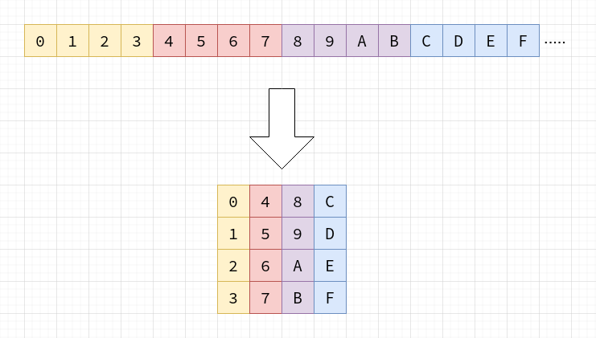
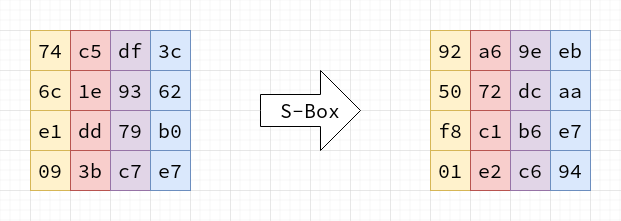
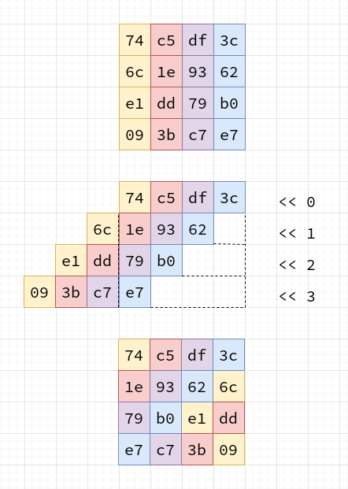
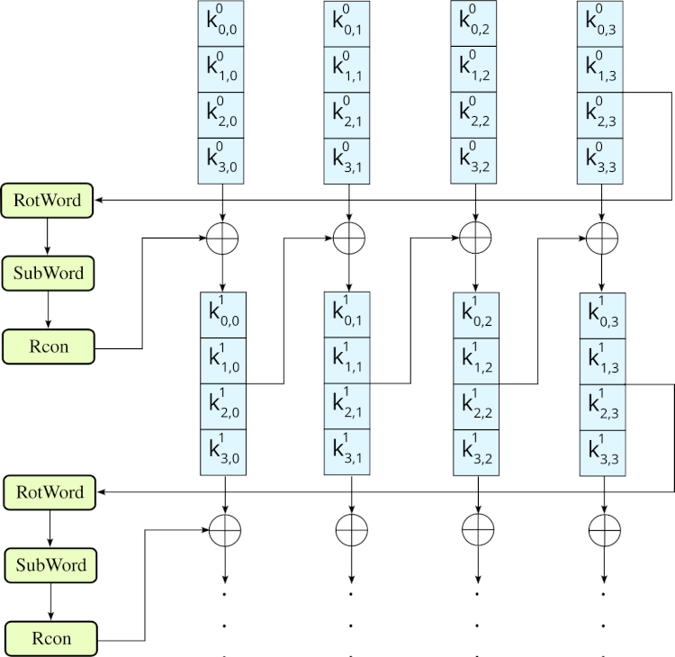
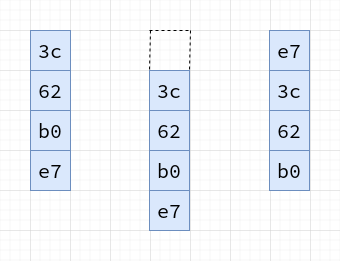
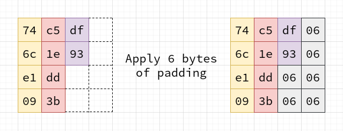
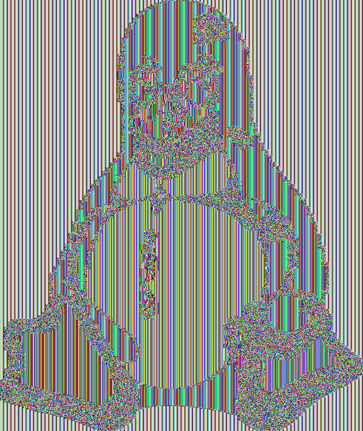
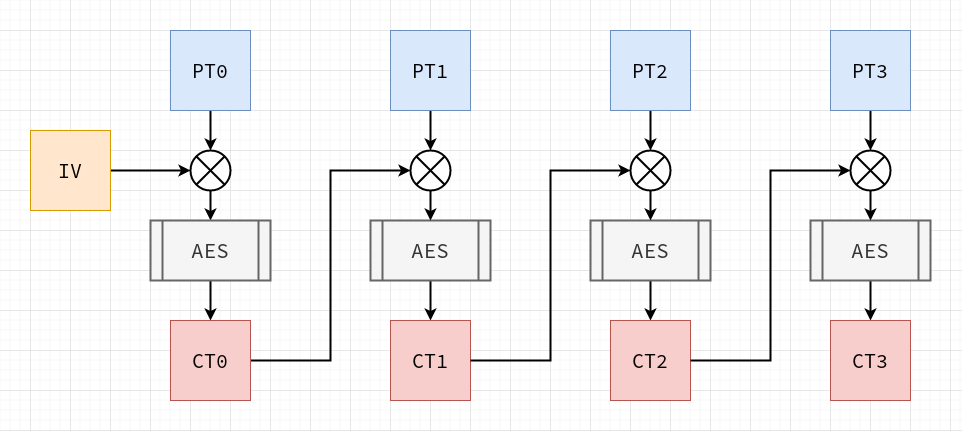

# Rolling your own crypto: Everything you need to build AES from scratch (and then never use it for anything of consequence)

You often hear the phrase **"Don't roll your own crypto"**. I think this sentence is missing an important qualifier: **"...and then use it for anything of consequence"**. If you are building a product or service, or are trying to communicate privately, then you should absolutely pick a vetted, open source, off-the-shelf implementation and use it. If, however, your goal is to learn, then there is honestly no better way than simply hacking away on your own code!

Before we get into it, just a quick word about why the phrase is so often touted: Cryptography is hard to get right for a number of reasons. First, there is the mathematical side of things, where a slip-up can take something that takes the *lifetime of the universe* to break, into something broken in *minutes* by someone with a bit of compute power. Lesser known perhaps, but still equally serious, is the issue of side-channels. The code you write can be completely correct, but still leak secrets through cache timing attacks, or even measured fluctuations in power usage as the algorithms are running. These are not academic attacks either - they are possible with off the shelf hardware, and someone with enough know-how to pull it off. The folks who write the industrial-scale crypto libraries are well aware of both of these aspects, and trust me: it's better to just leave it to them when it really matters. They're a pretty smart bunch.

## Do~~n't~~ try this at home

With the warnings out of the way, let's talk about why you **would** want to build your own crypto. One reason is [just for fun](https://justforfunnoreally.dev/)!. Another might be that you actually want to *become* one of those people who work on the industrial scale crypto. Finally, you might be interested from the red-team perspective; learning so that you try to attack the poor souls who write the insecure code.

I'm by no means an expert, but I recently got interested in peering behind the curtain while reading Jean-Philippe Aumasson's book [Serious Cryptography](https://nostarch.com/seriouscrypto). The chapter on AES gave a great overview of the algorithm, as well as its *modes of operation*, but some of the details were still a little fuzzy. This post is my attempt to explain some of the parts that were only clear to me after reading the [spec](https://nvlpubs.nist.gov/nistpubs/fips/nist.fips.197.pdf), trawling through code, and spelunking through an underground network of wikipedia rabbit holes.

## Just give me the code!

There is a full, [open source implementation in C](https://github.com/francisrstokes/AES-C) that accompanies this article. I strongly recommend reading the source as a supplement to the article, as it necessarily explores all of the ideas in their full detail.

## AES

AES, or the "Advanced Encryption Standard", is a extremely widely used symmetric block *cipher*. Symmetric here refers to the idea that both the one encrypting and the one decrypting use the same key. Block refers to the way in which the stuff you're encoding (the *plaintext*) is turned into the *ciphertext* (the random-looking but reversible sequence of bytes that is the result of the encryption). Cipher refers to any algorithm for encryption. A block cipher operates on multiple bytes of plaintext at the same time, arranged into a 2D block.

<center></center>

Each block is made up of 16 bytes (128 bits), and is arranged in column-major order. The big idea with AES is that this block is scrambled and mutated in a way that is completely reversible, driven by the *secret key*. The secret key is simply a sequence of bits that should only be known to the sender and the receiver. The choice of key must be as close to truly random as possible.

A block cipher can be contrasted with something like a *stream* cipher, where each byte of the plaintext is encrypted by itself using a *key stream*.

When the details and mathematical abstractions have had time to sink in, AES may actually appear remarkably simple, but do not be deceived; this simplicity is the result of careful engineering and pragmatism. For me personally, it was humbling to realise that my being able to understand and implement AES was not a reflection on me or my own skills, but rather the ingeniousness of the designers.

It is my aim that you come away from this article having a very good idea of how to implement AES yourself. We're going to look at the algorithm in-depth, from beginning to end, answering questions like:

- What are the operations and transformations involved?
- What kind of math underpins AES?
- What is key expansion and how does it work?
- How do you encrypt data that isn't a multiple of the block size?
- How does the same mechanism used in different modes produce results that vary in their security level?

## Operations and transformations

AES transforms each 16-byte block of data by a combination of moving the bytes around, performing reversible mathematical operations on them, and swapping them out for other bytes in a lookup table. These operations are used both to expand the secret key, deriving a further set of keys used throughout the encryption process, and the encryption process itself. The expansion process is called the *key schedule*.

The encryption process takes place over a number of *rounds*, and in each round the same set of operations is applied to the block, each time using one of the keys derived from key expansion.

The concrete steps of the algorithm are as follows for every block of the plaintext input:

0. Key schedule
    - The key schedule process is used to take the secret key, and derive an extended set of *round keys*

1. Addition of the first round key
    - The first round key (which is the secret key itself) is "added" to the input. This is not regular addition, but rather addition defined for the finite field $GF(2^8)$, which we will expand on in detail

2. A series of "rounds", the exact number of which is defined by the length of the secret key. We will talk about 128-bit keys in this article, in which there are 10 rounds. In a round, a series of operations take place:
    - Substitute Bytes
    - Shift Rows
    - Mix Columns
    - Adding the Round Key

3. The final round
    - The final round is the same as the previous rounds, except that the *Mix Columns* step is skipped

In the following sections, we will explore the practical and theoretical mechanics of each of these steps. It's not necessary to cover the operations in order to understand AES, so we will start with some of the simpler operations and then move on some of the more challenging parts.

### Substitute Bytes (SubBytes)

The simplest transformation to understand is *substitute bytes*, or `SubBytes` as it's known in the spec. This operation takes place in each round, as well as in the key scheduling process. In this step, every byte in the block is swapped with a corresponding byte in a lookup table called an *s-box*. The s-box used during encryption is:

|      |00|01|02|03|04|05|06|07|08|09|0a|0b|0c|0d|0e|0f|
|------|--|--|--|--|--|--|--|--|--|--|--|--|--|--|--|--|
|**00**|63|7c|77|7b|f2|6b|6f|c5|30|01|67|2b|fe|d7|ab|76|
|**10**|ca|82|c9|7d|fa|59|47|f0|ad|d4|a2|af|9c|a4|72|c0|
|**20**|b7|fd|93|26|36|3f|f7|cc|34|a5|e5|f1|71|d8|31|15|
|**30**|04|c7|23|c3|18|96|05|9a|07|12|80|e2|eb|27|b2|75|
|**40**|09|83|2c|1a|1b|6e|5a|a0|52|3b|d6|b3|29|e3|2f|84|
|**50**|53|d1|00|ed|20|fc|b1|5b|6a|cb|be|39|4a|4c|58|cf|
|**60**|d0|ef|aa|fb|43|4d|33|85|45|f9|02|7f|50|3c|9f|a8|
|**70**|51|a3|40|8f|92|9d|38|f5|bc|b6|da|21|10|ff|f3|d2|
|**80**|cd|0c|13|ec|5f|97|44|17|c4|a7|7e|3d|64|5d|19|73|
|**90**|60|81|4f|dc|22|2a|90|88|46|ee|b8|14|de|5e|0b|db|
|**a0**|e0|32|3a|0a|49|06|24|5c|c2|d3|ac|62|91|95|e4|79|
|**b0**|e7|c8|37|6d|8d|d5|4e|a9|6c|56|f4|ea|65|7a|ae|08|
|**c0**|ba|78|25|2e|1c|a6|b4|c6|e8|dd|74|1f|4b|bd|8b|8a|
|**d0**|70|3e|b5|66|48|03|f6|0e|61|35|57|b9|86|c1|1d|9e|
|**e0**|e1|f8|98|11|69|d9|8e|94|9b|1e|87|e9|ce|55|28|df|
|**f0**|8c|a1|89|0d|bf|e6|42|68|41|99|2d|0f|b0|54|bb|16|

Every 8-bit value is mapped to a different 8-bit value. In order to substitute a byte, the value is used as an index into the s-box table.

<center></center>

When decrypting, the *inverse* s-box is used. If you think of an s-box as a set of pairs `(index, value)`, then you can construct the inverse table by swapping index and value: `(value, index)`. For completeness, here is the decryption s-box:

|      |00|01|02|03|04|05|06|07|08|09|0a|0b|0c|0d|0e|0f|
|------|--|--|--|--|--|--|--|--|--|--|--|--|--|--|--|--|
|**00**|52|09|6a|d5|30|36|a5|38|bf|40|a3|9e|81|f3|d7|fb|
|**10**|7c|e3|39|82|9b|2f|ff|87|34|8e|43|44|c4|de|e9|cb|
|**20**|54|7b|94|32|a6|c2|23|3d|ee|4c|95|0b|42|fa|c3|4e|
|**30**|08|2e|a1|66|28|d9|24|b2|76|5b|a2|49|6d|8b|d1|25|
|**40**|72|f8|f6|64|86|68|98|16|d4|a4|5c|cc|5d|65|b6|92|
|**50**|6c|70|48|50|fd|ed|b9|da|5e|15|46|57|a7|8d|9d|84|
|**60**|90|d8|ab|00|8c|bc|d3|0a|f7|e4|58|05|b8|b3|45|06|
|**70**|d0|2c|1e|8f|ca|3f|0f|02|c1|af|bd|03|01|13|8a|6b|
|**80**|3a|91|11|41|4f|67|dc|ea|97|f2|cf|ce|f0|b4|e6|73|
|**90**|96|ac|74|22|e7|ad|35|85|e2|f9|37|e8|1c|75|df|6e|
|**a0**|47|f1|1a|71|1d|29|c5|89|6f|b7|62|0e|aa|18|be|1b|
|**b0**|fc|56|3e|4b|c6|d2|79|20|9a|db|c0|fe|78|cd|5a|f4|
|**c0**|1f|dd|a8|33|88|07|c7|31|b1|12|10|59|27|80|ec|5f|
|**d0**|60|51|7f|a9|19|b5|4a|0d|2d|e5|7a|9f|93|c9|9c|ef|
|**e0**|a0|e0|3b|4d|ae|2a|f5|b0|c8|eb|bb|3c|83|53|99|61|
|**f0**|17|2b|04|7e|ba|77|d6|26|e1|69|14|63|55|21|0c|7d|

If you're anything like me, then you're probably wondering where these substitution values even come from. Can you use any old values? The answer is yes and no. This s-box was designed by Joan Daemen and Vincent Rijmen - the creators of AES (which is also known as "Rijndael") - to limit its [statistical linearity](https://en.wikipedia.org/wiki/Linear_cryptanalysis), and susceptibility to [differential cryptanalysis](https://en.wikipedia.org/wiki/Differential_cryptanalysis). A different set of (poorly chosen) values could drastically reduce the security of the cipher. Interestingly, some implementers *do* choose to use their own values to overcome the possibility that Daemen & Rijmen purposefully inserted a kind of mathematical backdoor, but as far as I know, there is no evidence to suggest this kind of backdoor exists.

## Shift Rows

In the Shift Rows operation, as the name might suggest, some of the rows of the current block are shifted. The first row is not shifted at all (alternatively you could think of it having a shift of 0 bytes). The second row is shifted left by 1 byte, the third row 2 bytes, and the fourth row 3 bytes. The "shift" is actually better described as a *rotation*, because the bytes that are shifted outside of the row come back around into the empty spaces.

<center></center>

This operation breaks up the columns, and prevents the algorithm from being based only on columnar encryption, which would weaken it from a statistical analysis point of view.

## A diversion into finite fields

In order to dive further into the operations involved, we need to learn about finite field math. In AES, some addition and multiplication is required to perform the *Add RoundKey* and *Mix Columns* operations, as well as expanding the secret key in the *Key Schedule* process. However, these do not behave as you might be used to.

As a small note here before we get into it: I am not a mathematician, I am a software engineer. As such, my definitions necessarily do not really even scratch the surface of these topics, nor do they have the rigor you would find from a true mathematician. I know just enough to be dangerous, so apologies if my explanation lacks depth or contains errors. Lastly, while it's not strictly necessary to understand these concepts in order to simply *implement* them, I personally didn't feel accomplished until I did.

So first things first: What is a finite field? A finite field is a *field* that has a finite number of elements. Your next question, depending on your familiarity with the subject matter, may be: What is a field in this context? A field is a collection of elements (called a set) with a valid definition for addition, subtraction, multiplication, and division. A field can (and often does) have an infinite set of elements. The field operations must conform to a set of axioms, known as the *field axioms*:

- **Associativity** of addition and multiplication:
    - $a + (b + c) = (a + b) + c$
    - $a \bullet (b \bullet c) = (a \bullet b) \bullet c$
- **Commutativity** of addition and multiplication:
    - $a + b = b + a$
    - $a \bullet b = b \bullet a$
- **Identity** for addition:
    - There is some $0$ such that $a + 0 = a$
- **Identity** for multiplication:
    - There is some $1$ such that $a \bullet 1 = a$
- **Inverse** for addition:
    - For every element $a$ in the field $F$, there exists an element $-a$, such that $a + (-a) = 0$
- **Inverse** for multiplication:
    - For every element $a$ in the field $F$, there exists an element $a^{-1}$ or $1/a$, such that $a \bullet a^{-1} = 1$
- **Distributivity** of multiplication over addition:
    - $a \bullet (b + c) = (a \bullet b) + (a \bullet c)$

Division by zero is typically undefined. One famous field you've probably heard about is the *real numbers*. Another is the *rationals*.

AES uses a finite field (a Galois field), notated as $GF(2^8)$. What is interesting about this kind of field, and indeed any Galois field over a power of two, is that there is an intrinsic mapping to binary numbers and their related operations - which I'm told computers deal very well with.

In order to see how $GF(2^8)$ works, let's take a look at how it defines its operations, and how those operations conform to the field axioms.

### Addition

In $GF(2^8)$, addition takes place on polynomial expressions - which map almost directly to binary numbers, since $GF(2^8)$ contains 256 elements, and in binary, a byte can take on 256 unique values.

Addition is defined as the *exclusive or* logical operation (`^` in most languages). This is a little different from some of the conventional fields, but it does meet the criteria set out by the field axioms:

- Associativity: `a ^ (b ^ c) == (a ^ b) ^ c`
- Commutativity: `a ^ b == b ^ a`
- Identity: `a ^ 0 == a`
- Inverse: `a ^ a == 0` (i.e. every element is its own inverse)

Note that on its own, addition can't fulfill all of the axioms; We still need multiplication, and we'll get to that shortly. Before we do, though, we need to talk about the representation of the elements of the field.

Since we're in what is essentially *[abstract algebra](https://en.wikipedia.org/wiki/Abstract_algebra)* land, giving symbols like `2`, `100`, or `42` to the elements in the field doesn't make too much sense (it is however still conventional to call the additive identity `0` and the multiplicative identity `1` 🤷‍♂️). Instead, any given number tends to be represented as a *polynomial expression*. A polynomial expression is one in the form:

$$
a_nx^n + a_{n-1}x^{n-1} + \ldots + a_1x + a_0
$$

In $GF(2^8)$, any member can be expressed as a polynomial expression with 8 terms, and where the coefficients are either zero or one. This is basically what binary numbers (or any numbers in a particular base) are really - the summation of each of the possible places, multiplied by a constant which is not more than the number of symbols available in the base minus one.

Concretely, the binary number `10001101` can be expressed equivalently in polynomial form:

$$
x^7 + x^3 + x^2 + 1
$$

Note that since the only possible coefficients we could have are `0` or `1`, we simply include the term representing a place if it's a one, or not at all if it's a zero.

### Multiplication

Mechanically, we can take advantage of the fact that multiplication must adhere to the field axioms, and that polynomial expressions can be manipulated algebraically.

If we have have two numbers: `0x42` and `0xAB` (`0b01000010` and `0b10101011` respectively), then we can represent their product in polynomial form like so:

$$
(x^6 + x) \bullet (x^7 + x^5 + x^3 + x + 1)
$$

Then we can use the fact that our multiplication must be distributive, along with the fact that multiplying exponent terms in a polynomial equates to adding the powers, to expand out the expression:

$$
\begin{aligned}
&  (x^6 + x) \bullet (x^7 + x^5 + x^3 + x + 1) \\
&= (x^{13} + x^{11} + x^9 + x^7 + x^6) + (x^8 + x^6 + x^4 + x^2 + x) \\
&= x^{13} + x^{11} + x^9 + x^8 + x^7 + x^4 + x^2 + x
\end{aligned}
$$

The two $x^6$ terms cancel out, because the coefficients can only be `1` or `0` in this finite field, but would be `2` in this case (`2 % 2` is `0`).

This has the effect of turning the original problem into what is essentially just another binary number. The only small hitch is that this can clearly create elements that lay outside of the field; in this example, we end up with the binary number `0b10101110010110` (11158), which is definitely bigger than 256. For this reason, this kind of finite field must have an associated *irreducible polynomial*. The true result of multiplication is the expression modulo the irreducible polynomial. In the case of AES, the irreducible polynomial is:

$$
x^8 + x^4 + x^3 + x + 1
$$

In binary form, this would be `0b100011011` (or `0x11B` in hex). For illustrative purposes, we can compute the modulo by hand using long division. Since division is just repeated subtraction, and `xor` defined as addition also happens to be the valid definition for subtraction, this ends up being a very simple process.

```
  10101110010110 % 100011011
^ 100011011
  --------------
  00100011110110
^   100011011
    ------------
    000000101110

=         101110 = 0x2E
```

### A computational approach

Long division by hand is, however, not really an approach that maps well to computers. One of the parts that tripped me up when learning about AES and finite fields from more theoretical sources was understanding how to translate the algebra and equations to an algorithm. The answer that I'm going to show here is just one possibility, and not at all the most efficient. In fact, implementing AES in the way this article explains it is not the way you would find it in any *real* system, but it is probably the most direct translation of the key ideas.

The key to understanding this algorithm is realising that if we only partially simplify the multiplication expression from

$$
(x^6 + x) \bullet (x^7 + x^5 + x^3 + x + 1)
$$

to

$$
x^6 \bullet (x^7 + x^5 + x^3 + x + 1) + x \bullet (x^7 + x^5 + x^3 + x + 1)
$$

it becomes quite a bit easier to compute in binary. If we translate this partially simplified expression into the binary number view, we get something like this:

$$
01000000 \bullet 10101011 + 00000010 \bullet 10101011
$$

At each place of the binary number, we're multiplying by a power of 2, so we can do some more mathematical rearranging and produce:

$$
10101011000000 + 101010110
$$

We can get to this by shifting the left hand side of the multiplication down until 1, and shifting the right side up by the same amount. The problem is now one of shifts, xors, and accumulating a total, which is something easily done in any programming language. The following is written in C, but can be easily translated into any other language:

```C
uint8_t GF_Mult(uint8_t a, uint8_t b) {
  uint8_t result = 0;
  uint8_t shiftGreaterThan255 = 0;

  // Loop through each bit in `b`
  for (uint8_t i = 0; i < 8; i++) {
    // If the LSB is set (i.e. we're not multiplying out by zero for this polynomial term)
    // then we xor the result with `a` (i.e. adding the polynomial terms of a)
    if (b & 1) {
      result ^= a;
    }

    // Double `a`, keeping track of whether that causes `a` to "leave" the field.
    shiftGreaterThan255 = a & 0x80;
    a <<= 1;

    // The next bit we look at in `b` will represent multiplying the terms in `a`
    // by the next power of 2, which is why we can achieve the same result by shifting `a` left.
    // If `a` left the field, we need to modulo with irreducible polynomial term.
    if (shiftGreaterThan255) {
      // Note that we use 0x1b instead of 0x11b. If we weren't taking advantage of
      // u8 overflow (i.e. by using u16, we would use the "real" term)
      a ^= 0x1b;
    }

    // Shift `b` down in order to look at the next LSB (worth twice as much in the multiplication)
    b >>= 1;
  }

  return result;
}
```

This algorithm is a slight modification on what is sometimes known as the [peasants algorithm](https://en.wikipedia.org/wiki/Ancient_Egyptian_multiplication) - which has been used for thousands of years across various cultures.

## Mix Columns

Now that we have an understanding of what it means to *add* and *multiply* in the context of AES, we can take a look at the `MixColumns` operation. Again, in another case of thing-named-well, the name `MixColumns` tells us a lot about what this operation does at a high level. In essence, we're taking each of the columns in the current block, and mixing the elements together in such a way as to provide the algorithm with *diffusion*. Diffusion is the idea that changing a single bit in the plaintext leads to approximately half of the bits in the ciphertext to change.

Unlike `ShiftRows`, this is not simply a transposition of the bytes. Instead, each byte in the column is transformed by combining every byte in the columm in a unique but reversible way. Mathematically it is best understood as a vector-matrix multiplication, where the column is the vector, and the matrix is a set of coefficients. The multiplication and addition of each of the elements takes place of course in $GF(2^8)$.

$$
\begin{bmatrix}
    b_0 \\
    b_1 \\
    b_2 \\
    b_3 \\
\end{bmatrix} =
\begin{bmatrix}
    02 & 03 & 01 & 01 \\
    01 & 02 & 03 & 01 \\
    01 & 01 & 02 & 03 \\
    03 & 01 & 01 & 02 \\
\end{bmatrix}
\begin{bmatrix}
    a_0 \\
    a_1 \\
    a_2 \\
    a_3 \\
\end{bmatrix}
$$

Manually expanding all of the matrix operations in code would yield something like the following in C:

```C
void MixColumn(uint8_t column[]) {
  uint8_t temp[] = { 0, 0, 0, 0 };

  temp[0] = GF_Mult(0x02, column[0]) ^ GF_Mult(0x03, column[1]) ^ column[2] ^ column[3];
  temp[1] = column[0] ^ GF_Mult(0x02, column[1]) ^ GF_Mult(0x03, column[2]) ^ column[3];
  temp[2] = column[0] ^ column[1] ^ GF_Mult(0x02, column[2]) ^ GF_Mult(0x03, column[3]);
  temp[3] = GF_Mult(0x03, column[0]) ^ column[1] ^ column[2] ^ GF_Mult(0x02, column[3]);

  for (size_t i = 0; i < 4; i++) {
      column[i] = temp[i];
  }
}
```

The entire `MixColumns` operation does this for all 4 columns in the block.

## Key expansion and the key schedule

As mentioned a little earlier in the article, AES includes a mechanism for taking the secret key (which for the purposes of this article we will say is 128-bits), and expanding it into a series of *round keys* called the *key schedule*. The process of generating these round keys is fairly straightforward, and makes use of some of the operations we've already seen, as well as some we haven't yet looked at.

<center></center>

<center>CC BY-SA: Sissssou via https://en.wikipedia.org/wiki/AES_key_schedule</center>

We start by splitting the secret key into 4 columns. The secret key already constitutes the first round key. The last column is transformed by 3 operations:

- `RotWord`
- `SubWord`
- `Rcon`

In the `RotWord` operation, the bytes in the column are *rotated*, much the same as they are in `ShiftRows`, except that the bytes are only ever rotated by one.

<center></center>

In the `SubWord` operation, every byte is substituted using the S-box we looked at in the `SubBytes` step.

Finally, in the `Rcon` operation (round constant), the column is added to a predefined, constant column corresponding to the current round. The addition here is of course the `xor` operation. For a 128-bit key, these constant column vectors are:


$$
\begin{bmatrix}
01 \\
00 \\
00 \\
00 \\
\end{bmatrix}
\begin{bmatrix}
02 \\
00 \\
00 \\
00 \\
\end{bmatrix}
\begin{bmatrix}
04 \\
00 \\
00 \\
00 \\
\end{bmatrix}
\begin{bmatrix}
08 \\
00 \\
00 \\
00 \\
\end{bmatrix}
\begin{bmatrix}
10 \\
00 \\
00 \\
00 \\
\end{bmatrix}
\begin{bmatrix}
20 \\
00 \\
00 \\
00 \\
\end{bmatrix}
\begin{bmatrix}
40 \\
00 \\
00 \\
00 \\
\end{bmatrix}
\begin{bmatrix}
80 \\
00 \\
00 \\
00 \\
\end{bmatrix}
\begin{bmatrix}
1b \\
00 \\
00 \\
00 \\
\end{bmatrix}
\begin{bmatrix}
36 \\
00 \\
00 \\
00 \\
\end{bmatrix}
$$

After the last column in the initial round key has been transformed by these operations, the *next* 4-column round key is derived using the following steps:

- (Column 1) Adding the transformed column to the first column of the previous round key
- (Column 2) Adding the new round key *Column 1* to the second column of the previous round key
- (Column 3) Adding the new round key *Column 2* to the third column of the previous round key
- (Column 4) Adding the new round key *Column 3* to the fourth column of the previous round key

This whole process is repeated 10 times, yielding 11 total keys.

## Add Round Key

Understanding the key schedule, as well as the math behind $GF(2^8)$ makes understanding the `AddRoundKey` operation quite straightforward. The input block is added to the corresponding round key, generated during *key expansion*.

## Algorithm recap

With all of those operations in mind, let's revisit the bird's-eye algorithm view again. First of all, *key expansion* takes place, using the 128-bit secret key provided by the user. Then, for any given 128-bit block of plaintext data, the following transformation is applied:

1. Addition of the first round key
2. 9 Rounds:
    - Substitute Bytes
    - Shift Rows
    - Mix Columns
    - Adding the Round Key
3. The final round
    - Substitute Bytes
    - Shift Rows
    - Adding the Round Key

The output of these operations is an encrypted block of ciphertext. Decryption of the data is the precise inverse. The operations are performed in reverse, including shifting in the other direction during the `ShiftRows` step, using a different S-box in the `SubBytes` step, and using a different coefficient matrix during the `MixColumns` step.

One question you might rightly ask yourself at this point is: How do you encrypt data that isn't an exact multiple of 128-bits? There are a few different approaches you can take, but one of the most common is a clever trick that adds, at most, 128 bits of extra information to the ciphertext.

## Encrypting data that isn't a multiple of 128 bits

The trick is to work out how many additional bytes would be required to have a full 16 byte block. Then the block is padded with that many bytes, where each of those bytes has the value equal to the number of padded bytes.

<center></center>

The block is then encrypted as normal. If the data is already 16 bytes, an additional block is added, where every byte is the value `0x10` (16).

During decryption, the very last block of data is checked for this pattern. The last byte in the block should contain the number of padding bytes. If that number of bytes with the same value are not found, then in most cases the decryption will be considered to be invalid or corrupted. If bytes do match, the padding is stripped from the final output.

Note that this method is not part of the actual AES specification, rather it is specified as part of the [Public Key Cryptography Standards RFC 5652](https://datatracker.ietf.org/doc/html/rfc5652#section-6.3). The AES specification really only describes how the key schedule works, and how to encrypt a single block of data.

## Modes of operation

How entire files can be encrypted and decrypted in a systematic way is what is known as the *modes of operation* - and AES has several of them. We're going to take a look at two of them - ECB and CBC - and understand how even if the encryption algorithm itself is sound, how it is applied to data can create a new set of weaknesses.

### ECB: Electronic Code Book

The first mode of operation is ECB, or the *Electronic Code Book*. This mode is the most obvious method of using the algorithm; First compute all of the round keys, and then iterate through the plaintext data in chunks of 128-bits, turning that data into a block, and running it through the algorithm. The ciphertext output is placed into an output buffer or file, and the next 128-bits is loaded and processed.

There is a problem with this mode, however. While the encryption itself is completely secure (when implemented correctly), for some kinds of data, ECB can actually leak structural information. The most famous example of this is "the penguin".

<center></center>

This is Tux, the well known mascot of the linux community. If we encrypt this image data in a bitmap (i.e. non-compressed) form using AES-ECB (making sure to fix any headers required for the image to correctly render), then something like this very alarming image pops out.

<center></center>

Now, while the data in the second image is very clearly scrambled, we can all very much *still see the penguin*.

You may already have some idea of what's going on here. In AES-ECB, every block is encrypted individually, using the same key schedule. That has the implication that, if we feed the same 16 bytes of plaintext into the encryption algorithm multiple times, we will always get the same encrypted output. In the plaintext image of Tux, each pixel is encoded with 3 bytes - one for red, one for green, and one for blue. This means that any given block fed to the algorithm only contains ~5 pixels. On an image such as this, where the colour palette is limited, and large portions contain only one colour, the result is that those large blocks of repeated colour are simply replaced with a corresponding jumbled pattern; But importantly, that pattern is always the same, so the overall structure of the image is preserved.

Even if the data itself is secure, leaking structural information like this can be still be devastating in sensitive contexts. To remedy the problem, we can use another mode of operation, called CBC, or *cipher block chaining*.

### CBC: Cipher Block Chaining

In AES-CBC, the problem is addressed by forcing interdependence between all of the blocks in the plaintext data. When encrypting, a random IV, or *initial value/initialization vector* is chosen. The IV is simply a random 16-byte block. This IV is added to the first plaintext block before it is encrypted. The output is the first ciphertext block, $CT_0$. The next plaintext block is then added to $CT_0$ before being encrypted, forcing a reversible chain of dependence between the IV, the first plaintext block, and the second. This chain continues for every block in the plaintext input.

<center></center>

The IV is transmitted *in the clear* (i.e. not encrypted), along with the ciphertext. If we encrypt the Tux image data in CBC mode instead, the result is indistinguishable from random noise:

<center></center>

This approach is clearly more secure, but comes at a cost. Whereas ECB is completely parallelizable (it's [embarrassingly parallel](https://en.wikipedia.org/wiki/Embarrassingly_parallel) in fact), CBC must be run sequentially. Most people will agree, however, that when you really want to keep something, a little extra time is probably worth the trade off.

### Other modes of operation

There are many more modes of operation in AES that are out of scope for this article. AES-GCM, or *galois/counter mode*, is a mode that facilitates *authenticated* encryption. With authenticated encryption, the aim is to ensure that the receiver of an encrypted message knows with certainty that the message indeed came from the expected sender. Other modes, such as AES-CFB, allow AES to be used in a streaming fashion.

Modes of operation turn out to be equally as important as the algorithm itself, and choosing the wrong mode for the data, context, and situation, can have large implications for both security and performance.

## Closing words

I used to think of encryption as, essentially, magic - and dark magic at that! But there is nothing like diving into the details and building something from the ground up to show that all things can, with a little work and patience, be understood. I hope this article arms you with the tools and the confidence to try some of this out for yourself. I don't expect that the information presented here will be for you to write a complete implementation immediately, but it should form a good starting point. The specification provides not only a very approachable view on the subject, but also appendices with test vectors and expected outputs for all steps of the various operations. Aumasson's book is also a fantastic resource, not only for information about AES, but for a excellent overview on many different types of modern encryption and the field as a whole.

## Appendix 1: Generating the tux images

The Tux image used to show the weakness of ECB was generated by converting the original [Tux SVG image](https://commons.wikimedia.org/wiki/File:Tux.svg) into the PPM raw image format. PPM is a binary format that directly encodes the pixel values for every pixel in the image. There is a ~60 byte header that describes the version of the format used, the dimensions, and the maximum value that a colour value can take on.

In order to generate the encrypted image in binary form, the follow script was run:

```bash
#!/usr/bin/env bash

# Create a random 16 bit key (not at all a secure way of generating keys!)
cat /dev/urandom | head -c 16 > key.bin

# Extract the header from the original image
head -c 61 Tux.ppm > header.txt

# Exract the image data from the original image
tail -c+62 Tux.ppm > body.bin

# Encrypt the image data using AES-ECB
aes-c -e -m ecb -k key.bin -i body.bin -o body.enc.bin

# Concatenate the header + encrypted image data
cat header.txt body.enc.bin > tux.enc.ppm
```

After the resulting PPM image was generated, it was converted to png in order to be shown in this article. With just a little tweaking, you can produce a beautiful array of leaky tuxes in gif form:

<center></center>

## Appendix 2: Further reading

- https://nvlpubs.nist.gov/nistpubs/fips/nist.fips.197.pdf
- https://en.wikipedia.org/wiki/Advanced_Encryption_Standard
- https://en.wikipedia.org/wiki/AES_key_schedule
- https://en.wikipedia.org/wiki/Substitution%E2%80%93permutation_network
- https://en.wikipedia.org/wiki/Finite_field_arithmetic
- https://en.wikipedia.org/wiki/Confusion_and_diffusion
- https://en.wikipedia.org/wiki/Field_(mathematics)
- https://en.wikipedia.org/wiki/Finite_field
- https://en.wikipedia.org/wiki/GF(2)
- https://en.wikipedia.org/wiki/Characteristic_(algebra)
- https://words.filippo.io/the-ecb-penguin/
- https://www.youtube.com/watch?v=O4xNJsjtN6E
