# Building A Jank UART to USB Cable From Scavenged Parts

My home "lab" is, unfortunately, a manifestation of the unwinnable, uphill battle against entropy. The latest victim to the sprawl of boards, prototypes, and other miscellanea was my little Adafruit CP2104 USB to serial converter. As far as I can tell, it has literally dropped off the face of the earth. This is particularly irritating as I'm in the middle of another project for an upcoming video on the [channel](https://youtube.com/@lowbyteproductions), and needed that exact serial converter to test the implementation of a vital component in a system I'm building.

Of course, the first thing I did was hop online to order a new converter. Shortly thereafter, however, I came to the sudden realisation that this is something *I should be able to make myself*. I mean, whats the point in having a lab in the first place if you're not going to use it for this kind of thing! This is a yak that simply needs to be shaved.

## What even is a USB to serial converter?

Maybe I should contextualise this for a minute. What even *is* a serial converter? The high level overview is that "serial", or UART (*Universal Asynchronous Receive and Transmit*) is a protocol for exchanging data between two systems over two independent wires, with each side able to transmit and receive simultaneously, without those two lines necessarily being synchronised (hence "Asynchronous" in the name). This simple system has existed since at least as far back as the 1960s, and continues to be ubiquitous in the embedded world. A large part of that longevity is that it's such a simple protocol, from both a software and a hardware point of view.

The thing is, our modern computers can't speak UART directly. They used to though; Before USB became the only port available on your laptop, RS-232 serial ports were extremely common (even my earliest computers had these ports, and I'm not *that* old). But even though USB is everywhere now, it's actually a pretty complex beast. Most microcontrollers don't offer any kind of USB peripheral support out of the box (though awesome projects like [TinyUSB](https://github.com/hathach/tinyusb) can help with that), but the problem of wanting to connect embedded devices to computers easily and cheaply still very much exists. This is why companies like FTDI exist.

FTDI make a whole range of different chips that are able to take simple data streams like UART, and wrap them up into the complex world of USB. Even if you're not deep into embedded or electronics, you might recognise the name FTDI from their [pretty poor-taste scandal from a few years back](https://www.techrepublic.com/article/ftdi-abuses-windows-update-pushing-driver-that-breaks-counterfeit-chips/). Still, they're not the only ones in the market; Silicon Labs make the CP2104 I mentioned earlier, and the CH340 from Chinese manufacturer WCH is also pretty common.

These kinds of chips are in a lot more devices than you might realise. After all, they are the one of the simplest ways to make your device user friendly, and often run on standard USB drivers.

## Salvaging parts

I happened to have this old Arduino Duemilanove board just laying around, gathering dust, which has an FT232RL chip from FTDI to convert serial UART to USB. The FT232RL is one of the simplest and most common USB to UART chips out there, and is what the Arduino uses, together with the famed Arduino bootloader, to make it easy for people to upload code to the board with the push of a button.

<center>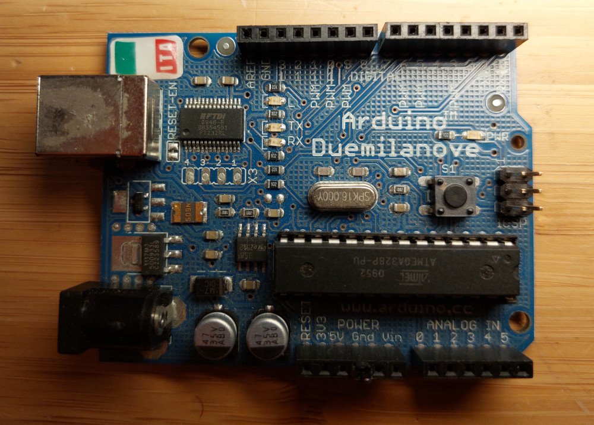</center>

The first thing I did was fire up the hot-air rework station in order to desolder the chip, along with the two capacitors just above it. This is essentially a machine that can blow hot air out of a nozzle at a precisely controlled temperature (several hundred degrees), and a precisely controlled flow rate. This hot air is able to heat up all of the pins of the chip at once, melting the solder. To help the process along, I added some flux to all of the pins to get the solder to melt and flow better. Then it was a simple case of swiftly grabbing it with some tweezers and setting it aside. Flux is kind of nasty, and leaves the part sticky. I cleaned it up with a cotton bud and some alcohol.

<center>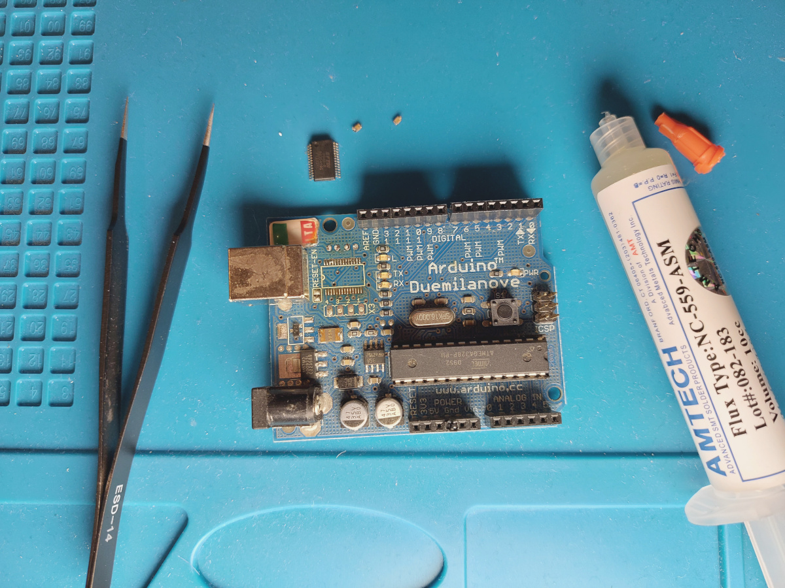</center>

As a side note, those teeny-tiny capacitors act as a buffer for the power supplies that comes into the chip. If there are any ripples or disturbances on the line, they smooth those irregularities out, and provide a clean power signal. Since this is a story about building a jank cable, I didn't end up using them. If I encounter any problems in the future, I might stick them back in.

You might have noticed this is an [SMD](https://nl.wikipedia.org/wiki/Surface-mounted_device) chip, which makes strapping a few pin headers to it a little challenging. That's where these awesome little SMD breakouts come in. A set of these is relatively inexpensive, and they basically allow you to turn any random chip into a dev board, which is pretty cool.

<center>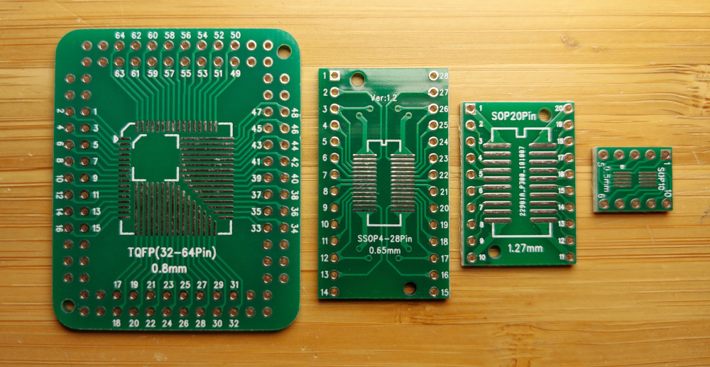</center>

The FT232RL is a 28-Pin SSOP chip, or ["shrink small-outline package"](https://en.wikipedia.org/wiki/Small_outline_integrated_circuit). This is the kind of thing you just learn to spot after a while, but you can always find this information in the chips datasheet. Or in a pinch, just line it up with the various sizes on the breakouts until you find one that fits!

To solder the chip to the board, I could have used solder paste and the hot-air rework station, but I don't actually have any solder paste on hand right now. So instead, I put a fine tip on the soldering iron, and channeled my inner [Voultar](https://www.youtube.com/c/Voultar). This kind of relatively low stakes operation with a fine-pitch part is really great for improving technique. You start by really taking some time to line the chip up with the pads on the board, then with a really tiny amount of solder on the iron, carefully tack one corner pin to its corresponding pad. At this point, if anything is unaligned, you can easily hit it with the iron again and reposition, until it's tacked down and perfectly in place.

When I had one corner down, I did the others in the same way. For the rest of the pins, I used some flux, and a drag soldering technique to get good contact with the pins to the pads. This essentially involves putting a little solder on the iron, and carefully "dragging" it across the pins, back and forth, until the solder is evenly distributed. The flux helps to direct the solder to the pins, but with such a fine pitch, solder bridges can easily form. Thankfully, they are just as easy to remove by cleaning the iron off, adding more flux, and dragging back and forth again. Rinse and repeat.

<center>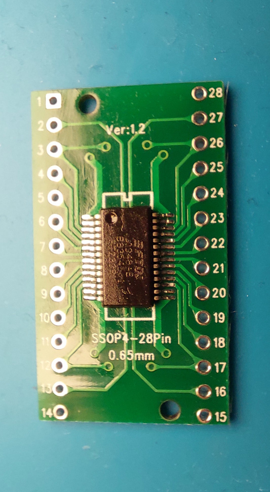</center>

With the chip nicely soldered, the next step was getting a USB cable attached. In non-jank UART to USB converters, you'll generally find a little micro USB port port on board so that you can bring your own cable to the party. I did spend a few minutes thinking about ways that I might be able to get a micro USB port rigged up, I quickly dismissed them in favour of simply cutting down an old USB cable and attaching the wires directly to the breakout.

By taking a look at the [datasheet for the FT232RL](https://nl.mouser.com/datasheet/2/163/DS_FT232R-11534.pdf), I was able to locate the USB Data plus and minus signals on pins 15 and 16 respectively. The other signals of interest for this application are:

- TXD on pin 1, the transmit pin
- RXD on pin 5, the receive pin
- VCCIO on pin 4, which is a reference voltage. The voltage on this pin will be used on TXD and RXD for data transfer. This is useful because it means the device can talk to 5V and 3.3V logic, both of which are common in electronics.
- VCC on pin 20. This is the main power supply for the chip, and can be anything from 3.3V to 5.25V. Since USB already includes a 5V power rail, it made sense to power the chip from it.
- GND, which appears on multiple pins. This provides a reference which other voltage levels are taken against.

<center>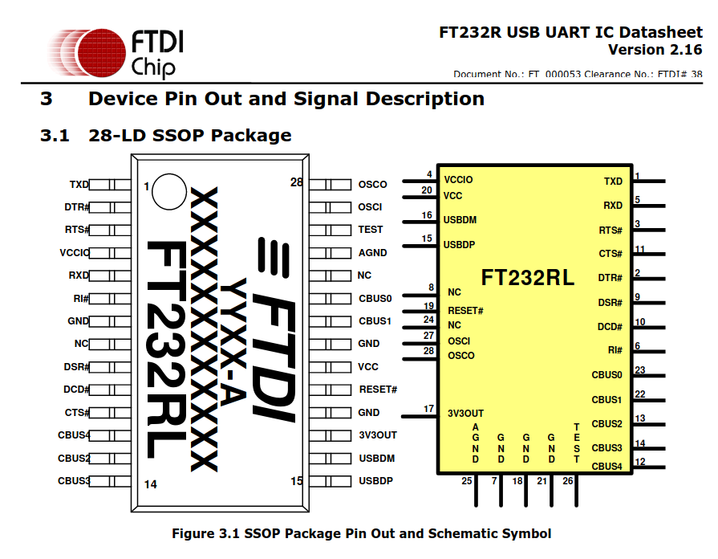</center>

You'll notice there are a bunch of additional signals on this chip. Some of them are used for more complex serial communication, and some are configurable programmable pins that can used for extra functionality. I don't really need any of that though.

For those that don't know, in its simplest form, USB data is transferred over a differential pair of twisted wires, that transmit the same signal, but with opposite polarity. This is necessary for keeping the signal integrity high, and is done with pretty much every high speed signalling solution. Note that this is a single signal transmitted across two wires, not a transmit and receive pair, like in UART.

I had a USB charging cable that someone had given me some time ago, which I think was from a some kind of smart watch. It appeared to have all 4 lines connected, and I wasn't going to use it for it's intended purpose, so it seemed like a good candidate for salvage.

<center>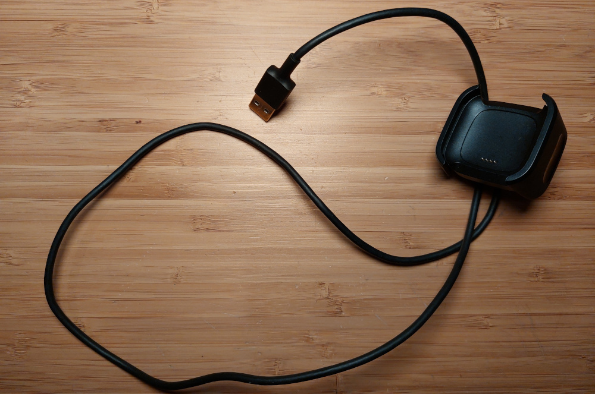</center>

After cutting the cable, I stripped back the insulation and shielding, and carefully exposed the internals of each of the wires, and then tinned them with a little solder.

<center>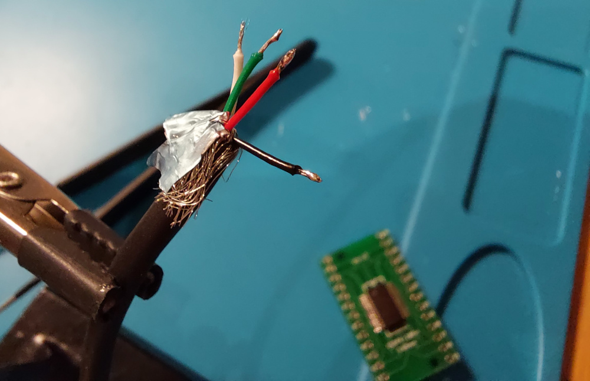</center>

The colours of the wires are standard. Red and black are power and ground, and green and white are data plus and data minus. Ratcheting up the soldering difficulty just a little more, I soldered the two wires *directly* to the pins of the chip. Now, you're probably thinking to yourself: "Why would you not just solder to the nice, big, widely spaced holes for the pin headers?", which is a fair question. I suppose this the one place I opted for a little less jank. You see, differential pairs actually require the length of wires and signal traces on a PCB to be carefully controlled. In theory, if the plus wire was a little longer than the minus wire, the two signals would arrive at the chip at *very slightly* different times. That would mess up the signal integrity, and maybe even prevent the device from working. All of that said, I'm almost certain that this wasn't required at all. There's a [marcan](https://social.treehouse.systems/@marcan) quote out there somewhere, where he talks about being able to run slower speed USB signals over a pair of wet noodles, and I couldn't help but think of that here. Still, good soldering practice (those pads are 0.65mm apart)!

<center>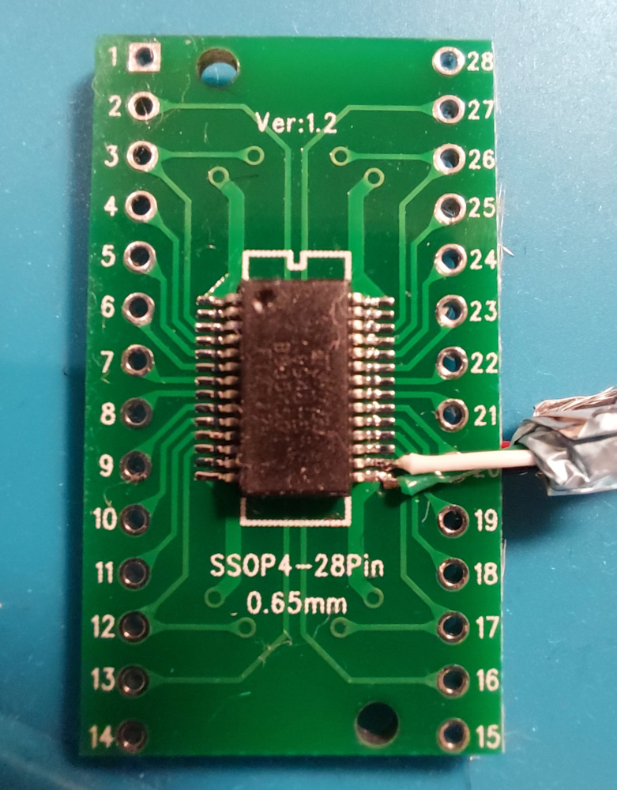</center>


On the reverse side of the breakout board, there is a footprint for a larger 28 SOP-type chip, which is of course wired to the same pins as the ones the FT232RL is attached to. I fed the power and ground cables to that side of the board and soldered them to the larger pads.

All of the other signals of interest are on the left side of the chip, so I soldered in some regular 2.54mm pitch pin headers to be able to reach the TX and RX signals, as well as the VCCIO, and a ground connection to share with whatever device this one will be talking to.

<center>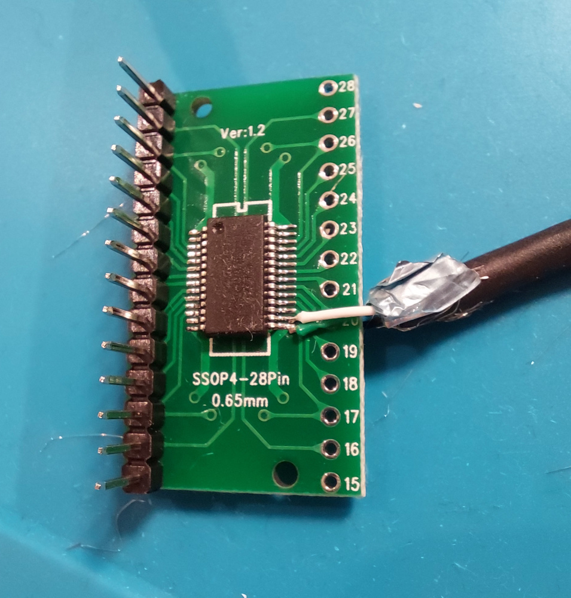</center>

At this point, I had checked that nothing was shorted using continuity mode on my multimeter, and tried plugging it in to my laptop. After running `lsusb`, which lists the connected USB devices, I saw this:

<center>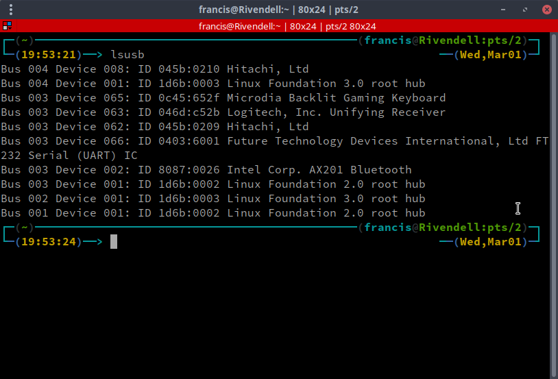</center>

No magic smoke, and the 6th entry showed that it was working! Of course, I wanted to check that the actual UART communication was operational too, so I wrote the shortest Arduino sketch I could think of:

```C++
uint8_t value = 0;

void setup() {
  Serial.begin(115200);
}

void loop() {
  char charToSend = 'A' + value;
  Serial.print(charToSend);

  if (++value >= 26) {
    value = 0;
  }

  delay(1000);
}
```

<center>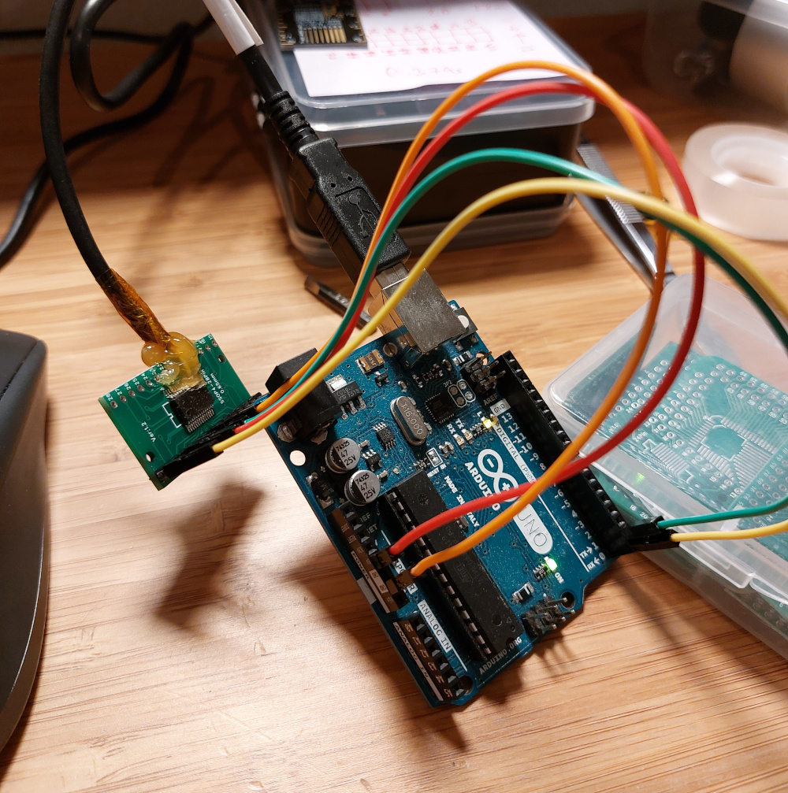</center>


After connecting the cable up to an Uno board, I ran `screen /dev/ttyUSB0 115200 8N1` to connect to the UART serial port, and was greeted by:

```
FGHIJKLMN
```

Notice the kapton tape and hot glue mess. That's really there to re-enforce the flimsy solder connections, and to stop anything from shorting later on, but it definitely helps with the scavenged look.

So the jank cable was a success! I'm still happy that a professionally made adapter is coming in the next few days, but damn if it doesn't feel cool to know that I can whip up my own tools in a pinch.

<center>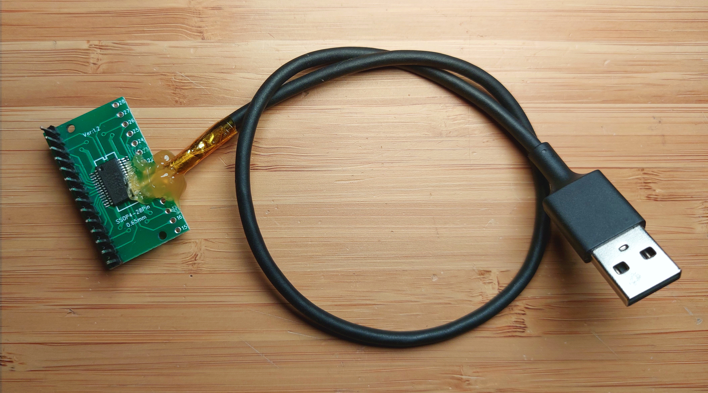</center>


## And if you're looking for some UART coolness

[James Sharman](https://www.youtube.com/playlist?list=PLFhc0MFC8MiCs8W5H0qZlC6QNbpAAe_O-) has an excellent video series where he both explains and builds a UART implementation in hardware using discrete logic chips. James's channel is honestly criminally undersubscribed. All of his stuff is great.
