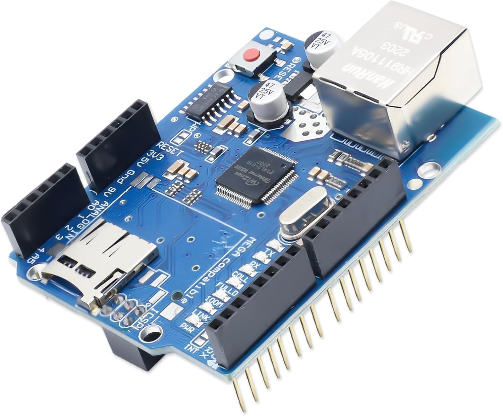
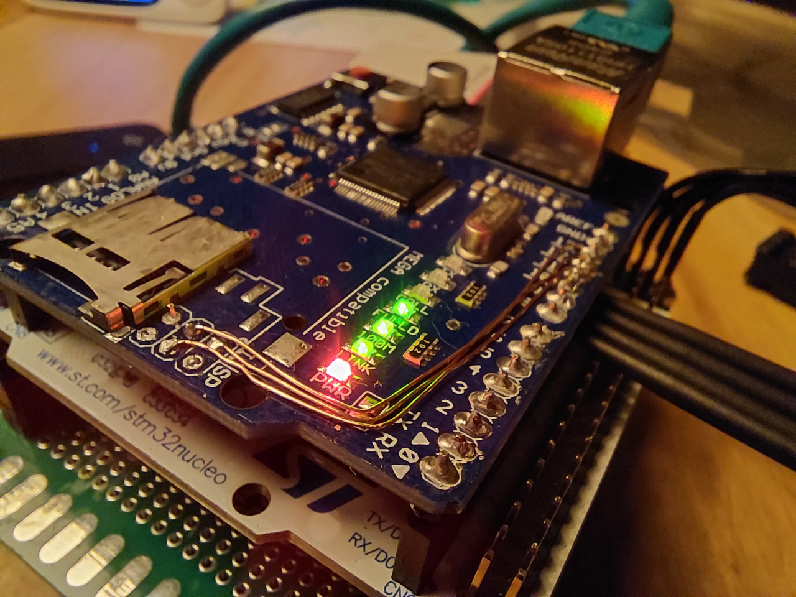
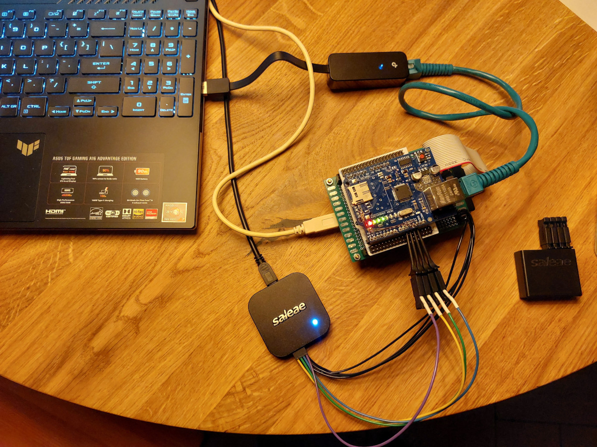
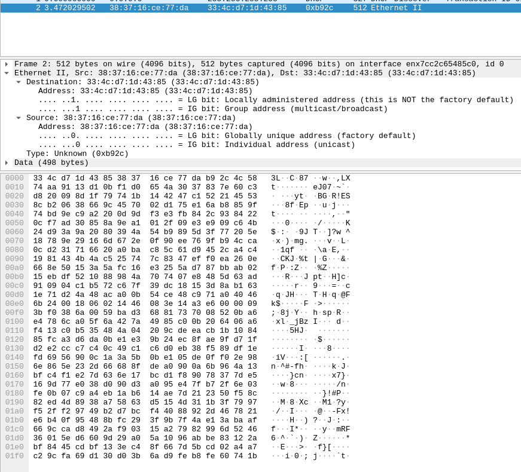
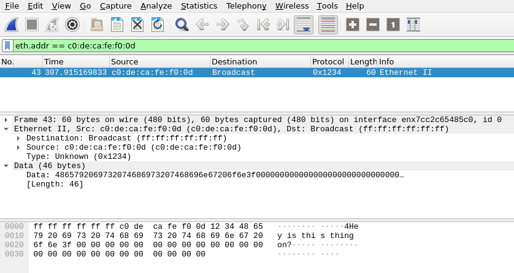

# I sent an ethernet packet

For as long as I've been making videos on the [low byte productions](https://youtube.com/@lowbyteproductions) youtube channel, I've wanted to make a series about "Networking from scratch", by which I mean building a full TCP/IP stack from the ground up on a microcontroller. It's been nearly 6 years now, and the past few days felt like as good a time as any to start.

This blog entry is fairly limited in scope; On the surface, it's about how I successfully sent my first ethernet packet, but really it's a story about bugs and debugging, and some thoughts about overcoming challenges in projects.

## Microcontroller

The microcontroller I'm using is an STM32F401 on a nucleo devboard. This is the same setup I used in the [Blinky to bootloader](https://www.youtube.com/watch?v=uQQsDWLRDuI&list=PLP29wDx6QmW7HaCrRydOnxcy8QmW0SNdQ) series, the [3D renderer on an oscilloscope](https://www.youtube.com/watch?v=TAfWea21ooM) video, and a bunch of others. It's an ARM Cortex-M4 that can run up to 84MHz, with 96KiB of RAM. That's enough to hold onto decent handful of packets.

## Ethernet

Ethernet is a word that covers a surprising number of things. You might associate it with the port you plug into for wired internet, or know about the idea of ethernet *frames*. Ethernet is actually a whole family of technologies and standards (many of which are now obsolete) that encompasses the hardware involved at the physical level, various signalling formats that encode and transmit bits, the strategies for dealing with bus collisions, and the layout of frames, which contain and protect the data being sent from one place to another.

Due to the complexity of the signalling involved with ethernet, a dedicated ASIC is generally used, which takes in data at the frame level, and takes care of wiggling the electrical lines in the right way over a cable ([though there are of course exceptions](https://www.youtube.com/watch?v=mwcvElQS-hM)). For this project, I'm using the W5100 chip from Wiznet, in the form of the original Arduino Ethernet shield. Well, it's a cheap knockoff that ended up needing some rework to actually function properly, but we'll get to that.



The W5100 chip itself is pretty cool. It's essentially an ethernet ASIC with a hardware TCP/IP stack built-in. It has 4 "sockets", which can be set up to work at the TCP, UDP, IP, or "MAC Raw" levels. Since the whole point of this project is build a TCP/IP stack from scratch, I'm only making use of one socket in the MAC Raw mode, where I hand it ethernet frames, and it sends them out. The caveat is that an *actual* ethernet frame contains more than just the data; It also includes: A preamble, start of frame marker, and a 32-bit CRC. The preamble and start of frame marker are really only relevant at the electrical level, which the chip fully takes care, and the CRC is also helpfully computed by the W5100.

## Problem No. 1: Shouting into the void

I coded up a driver to communicate with the W5100 chip. Data exchange takes place using SPI - the serial peripheral interface - which is a 4-wire signalling protocol for full duplex communication. One of the wires is for the main chip's (the microcontroller's) output, one is for the subordinate chip's (the W5100's) output, one is for the clock to which data is referenced, and the last is a "chip select" signal, which tells the subordninate chip that communication is happening. There are more details to SPI, which dictate things like if your data is referenced to the rising or falling edge of the clock, whether the clock signal idles high or low, whether bits are transferred MSB or LSB first, and how many bits occur per transfer (typically 8, or one byte).

That gives you a low-level way to exchange bytes, but basically nothing else. The W5100 datasheet lays out a higher-level protocol on top of SPI to actually control the chip. In this protocol, you send commands made up of 4 bytes on the MOSI (main out, subordinate in) line:

```
+--------+-----------+----------+--------+
| byte 0 | byte 1    | byte 2   | byte 3 |
+--------+-----------+----------+--------+
| op     | addr high | addr low | value  |
+--------+-----------+----------+--------+
```

The first byte specifies the operation, which is either a write (`0xf0`) or a read (`0x0f`) - anything else is invalid and should be ignored. The second and third bytes specify a 16-bit address (big-endian), and the last byte is, in the case of a write, a value to be written at that address. The W5100 transfers data out on MISO (main in, subordinate out) line at the same time, which follows this pattern:

```
+--------+--------+--------+--------+
| byte 0 | byte 1 | byte 2 | byte 3 |
+--------+--------+--------+--------+
|  0x00  |  0x01  |  0x02  |  0x03  |
+--------+--------+--------+--------+
```

In the case of a read operation, byte 3 actually returns the value read at the specified address.

What are these addresses? Well, internally, the W5100 has its own *address space*, which has transfer and receive buffers, as well as a bunch of registers for setting up and controlling the flow of packets. For reference, it's laid out like:

```
+-----------------+------------------+
| Address Range   | Function         |
+-----------------+------------------+
| 0x0000 - 0x002f | Common registers |
| 0x0030 - 0x03ff | Reserved         |
| 0x0400 - 0x07ff | Socket registers |
| 0x0800 - 0x3fff | Reserved         |
| 0x4000 - 0x5fff | TX Memory        |
| 0x6000 - 0x7fff | RX Memory        |
| 0x8000 - 0xffff | Reserved         |
+-----------------+------------------+
```

My first clue that something wasn't right was that I was sending out commands on MOSI, and seeing garbage on MISO. One thing I really like about this chip is that it specifically sends back a known value every time you clock out a byte, and so it's really easy to see that something is off in the communication. I puzzled over this for a while, and realised I'd fallen into the trap that you should always avoid when doing anything embedded - I unconditionally trusted the hardware.

As I mentioned earlier, The W5100 is sitting on an arduino shield - which is an addon board meant to clip directly on top of the standard but absolutely awful arduino headers. Because Arduino is so ubiquitous, this shield format has found its way onto myriad other devboards that have nothing to do with arduino, simply because it gives you an instant tie-in to readily available peripheral modules. The nucleo devboards from ST also have headers to accomodate arduino shields, but alas, this particular shield had an annoying little trick up it's sleave. You see, the arduino also has another little 6-pin header on board called the ICSP - the in-circuit serial programmer. This header can be used to reprogram Atmel chips (which the tradional arduinos use) over SPI. The designers of this shield decided to make use of that 6-pin header, and the fact that it shares the same SPI signals with those on the standard header, and routed the SPI lines to the ICSP header **instead of** the standard pins on the arduino header. On a proper arduino, this would be no problem, because the arduino board itself internally connects those signals. But a nucleo board doesn't have an ICSP header, so the SPI signals I was sending out were going nowhere.



I realised this after probing around with a multimeter, measuring resistances between the power rails and the SPI signals. If you measure *infinite* resistance, you know there is a problem! A quick trip to the soldering station, and a few enamelled copper wires later, I had bodged my board to properly connect everything to the nucleo.

## Problem No. 2: The essence of comedy

With the SPI signals actually going where they should be, I was actually communicating with the device! I had enough code written to set up the W5100 to do raw ethernet transmissions, set up the MAC address, configured the TX and RX memory segments, and finally write a simple test ethernet frame into TX memory and trigger a transmission. I connected the nucleo+shield to my laptop with a CAT5 cable, fired up wireshark, and! Nothing.

If you're regularly doing stuff down at the low-level, this kind of problem can be really daunting. There are no helpful (or even cryptic) error messages to investigate. No stack trace to follow. It's simply: You wiggled some electrons up and down across the wires, and it didn't do the thing you thought it would.

One very useful tool to have in your belt for this kind of thing is a logic analyser, which is like an oscilloscope, but specifically made for analysing digital signals, i.e. ones that go between a logical high and low level. These devices have a number of channels - usually between 8 and 32 - and a USB connection. In the middle is some speedy magical silicon which buffers, conditions, and samples those channels at a high rate, compresses the bitstreams, and pushes them through the USB, ready to be analysed by software. The cool thing here is that you can investigate individual signals, or more usefully, groups of signals (like an entire SPI bus). In that case, the software will actually interpret the signals, and give you a display of the bytes sent in a transaction, as well as export tools for processing those same bytes as a CSV or other structured format.

I have a Saleae Logic 8, which is a fairly fancy device, but you can get cheap and cheerful analysers for ~€10, which can also integrate with Saleae's Logic2 software (they're pretty iffy about working correctly and consistently, but there's always a tradeoff, right). As soon as I captured the SPI traffic flying across, I could see something was off. The first command I sent looked good, and so did the response over the MISO line. It's a software reset, and appears something like this:

```
       +--------+--------+--------+--------+
       | byte 0 | byte 1 | byte 2 | byte 3 |
+------+--------+--------+--------+--------+
| MOSI |  0xf0  |  0x00  |  0x00  |  0x80  |
+------+--------+--------+--------+--------+
| MISO |  0x00  |  0x01  |  0x02  |  0x03  |
+------+--------+--------+--------+--------+
```

Decoded, it's a `write` to address `0x0000`, the "Mode Register", with the most significant bit set, which triggers a software reset. You can also see that the device dutifully responded with the bytes `0x00` to `0x03`. The next command is a `read` from the same address, which is supposed to check if that same most significant bit has been cleared to 0, which indicates that the reset is complete. It looked like this:

```
       +--------+--------+--------+--------+
       | byte 0 | byte 1 | byte 2 | byte 3 |
+------+--------+--------+--------+--------+
| MOSI |  0x0f  |  0x00  |  0x00  |  0x00  |
+------+--------+--------+--------+--------+
| MISO |  0x03  |  0xff  |  0xff  |  0xff  |
+------+--------+--------+--------+--------+
```

Huh. The response on the MISO line is not the counting up behaviour, but instead it starts at `0x03` and then just responds forevermore with `0xff`. Not good. I pondered this one for a little while, and thankfully the little knowledge I have of digital logic, and actually building hardware on FPGAs came in clutch. The fact that the first value returned by the W5100 was `0x03`, which is the also the *last* value it returned, is a pretty big clue.

Digital hardware, internally, is made up of circuits that implement useful primitives like "registers" and "flip-flops". These circuits are *synchronous* to a clock, and are able to capture/store/reset values presented to their inputs. You take these primtives, mix them together with others like multiplexers (the circuit equivalent of an if-statement), decoders, and of course logic gates, and you can build up to more complex constructions like state machines. The really important thing about all of this is that there are some pretty important timing-related constraints that need to be upheld. It takes a signal time to come out of a register, pass through a handful of logic gates/multiplexers/whatever, and then enter a new register. If, for example, the clock were to switch too fast, before the signal had made its way to the next register, the abstraction falls apart and it simply ain't gonna work.



My thinking was that something like this was happening here; The W5100 didn't have enough time to do its thing, and that's why I was seeing the *previous* state of MISO (`0x03`) when the second command transaction was taking place. It probably wasn't going to be the SPI clock though, since the datasheet implies the maximum clock rate for the SPI bus is ~14MHz, and I was running way below that. Instead, I suspected that the chip select line was probably going high (i.e. being disabled) too soon, causing the chip to get into a bad state.

I added a small loop to introduce a few microseconds of extra time before changing the state of the chip select line, and it worked! All of a sudden, the responses on the MISO line looked right. And further more, it seemed like the rest of the setup was also working, and I was getting sensible and sane values back from the chip when reading back configuration values I had written to it.

I still haven't completely gotten to the bottom of the matter. Diligent readers will note that the datasheet does in fact contain a SPI timing diagram on page 66, but the only constraint mentioned there with regard to the chip select line was certainly being met. I should go back and try to figure out the exact bounds where things break down, but there are only a certain number of hours in the day, and right now I'd rather just progress with the project.

## Problem No. 3: There's life in this packet, but not as we know it

Of course, the first thing I did was to fire up wireshark again, and see if that packet would appear. And it did! Sort of. Well, not really.

*A* packet did appear, but not the one that I'd sent. Instead, at the moment the transmission command went out of the microcontroller, a raw ethernet packet, filled with garbage, and far larger than the one I had placed came out across the screen.



I'd been trying to avoid reading other peoples code related to this chip, because a lot of the fun of this kind of project, for me, comes in the exploration and discovery of trying to get the thing working from specs and datasheets alone. But at this stage, I was willing to sanity check my understanding against something known to be working properly.

A little tip that a lot of very seasoned embedded developers could learn from is that, at times like this, arduino actually comes in *really* useful. Grab an arduino, install some library, write ~5 lines of code (because all the complex stuff happens under the hood), and if you get the result, you now have a gold standard working thing to compare to. It actually took me quite a lot longer to find a library that would let me transmit a raw ethernet packet, however. As it turns out, most Arduino users, who want to be able to add network connectivity to a project, do not want to do it all from scratch. The official libraries actually removed support for sending raw packets from the public API. However I managed to find a [project on github](https://github.com/njh/W5100MacRaw) that was the minimum necessary steps to send and recieve packets.

I read the source, and compared against my own, and there were no immediately obvious offenders. Some of the register writes and reads occurred in a different order, some were ommitted in mine or theirs, but none of that seemed to be the problem. Normally sequence-dependent stuff like that is called out explicitly in the datasheet. Still, I changed my reads and writes to mimic theirs exactly, and for whatever reason I was still getting the garbage packet in wireshark.

I decided at this point to try a different tactic. I believe in writing little tools to help guide development and debugging. This will be things like taking some low-level output, parsing it, and re-presenting it in a higher-level form. I typically write these little tools in python, and take the time to do argument parsing to properly document what comes in and what goes out. In this instance, I wanted to take the SPI capture CSV export coming the Saleae's Logic2 software, parse the bytes, and present a list of register writes and reads, with proper names, formatting, etc. The full tool is just over 200 lines of code, most of which is just a copy-paste of register names/addresses directly from the data sheet. The whole thing took me maybe one hour to put together.

I took a capture of the gold-standard Arduino, as well as my garbage-producing implementation, and then passed the CSV data export of both through my tool. Running a simple diff, the problem jumped out immediately. I'll tell you now that this wasn't a glamourous bug, but then most aren't. My W5100 driver code contained a convienience function called `w5100_write16(u16 address, u16 value)`, which did two 8-bit write commands to two sequential registers. Many of the registers in the W5100 are actually 16-bit values, but the command format only allows for writing 8 bits at a time, so these values are split into high and low part. Long story short: My `w5100_write16()` function wrote to the same address twice, instead of the writing to `address + 1` for the second byte. In the processed logs from my tool, this was easy to see. The arduino looked like:

```
...
5.3645086 : [w] S0_TX_WR0  [0x0424] 0x00
5.36453178: [w] S0_TX_WR1  [0x0425] 0x3c
...
```

And mine:

```
8.45262964: [w] S0_TX_WR0  [0x0424] 0x00
8.45286726: [w] S0_TX_WR0  [0x0424] 0x3c
```

The details aren't important here, but this was a write to the *Socket 0 transmit write pointer* register. Remember earlier when I was talking about digital logic and state machines and abstractions breaking down etc? Well, this is actually another example of that, in a way. The W5100 expects you to read this 16 bit register (in order!), write bytes into TX memory, and then write back to this register with the new write pointer, and finally issue a socket command to *send*. By not writing the transmit write pointer in the correct order (in fact, not writing the second byte at all), and then issuing the send, I had put the chip into yet another weird and undefined state where it just did some random stuff. And of course, no errors, no stack traces - just weird effects.



I fixed the function, and my test packet showed up in full glory in wireshark. To say I was happy to see it would be an understatement.

## The moral of the story?

So I sent an ethernet packet. Not exactly the worlds biggest achievement when you realise how many of those are whizzing around in cables, passing through your body in the form of 2.4GHz radio waves right now, but certainly one that I was happy to call a win.

Sometimes it's just fun to take the time to recount the numerous and often stupid bugs you encounter while working on a pet project - I know I love reading that from others, at least. But if I had any kind of point, it would probably be that spending the time to do things like write tools and explore the debugging space is pretty much **always worth it.**

Strangely, I've found that there is a not-insignificant number of people are *against* this - especially in a professional environment. I think this has something to do with the JIRA-fication of development process, where all work is divided and sub-divided, and anything that does not directly check a box and produce a deliverable is wasted effort. It's disheartening that there is a whole group of people - developers and managers alike - who do not understand or see the value in *exploration as part of the process*. Writing a tool is often just as important and impactful as writing a test - more so even, if you don't fully understand the system you're working with yet.

Debugging is, at its core, a manifestation of the scientific method; You gather data, make predictions, and test those predictions with experiments. Experiments yield new data, and you update your predictions, and hopefully come out the other side with a proper understanding. Tools like the one I wrote here are kind of akin to making plots of raw data. One good plot can tell you everything you need to know about your data.

The project is making more significant progress now, and the new problems and new bugs are coming in at a higher abstraction level, which are more to do with (mis)understanding RFCs, and writing multitasking code than anything else. I might write more on the project at some point, but that'll be for another day.
