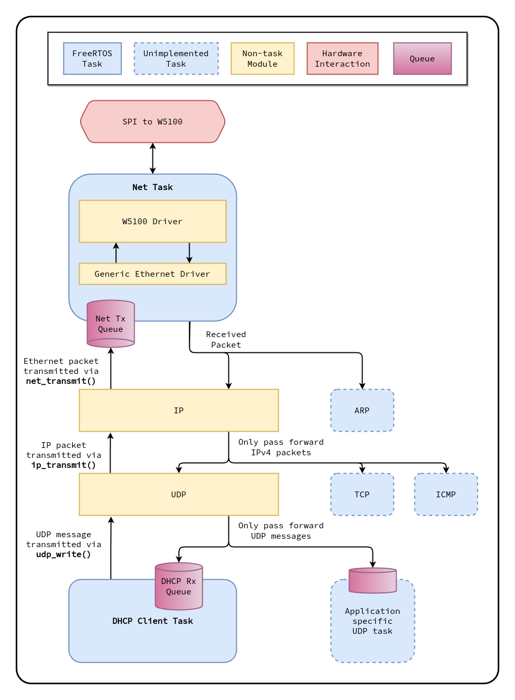
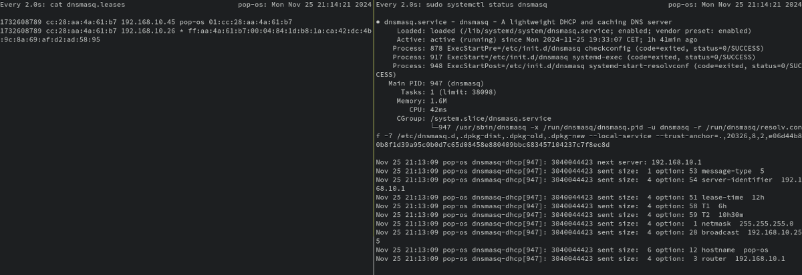

# I got an IP address

This is a follow up to a previous blog entry, [I sent an ethernet packet](https://github.com/francisrstokes/githublog/blob/main/2024/11/1/sending-an-ethernet-packet.md).

I'm writing a networking stack on a microcontroller. Not for production, or to make the *fastest/smallest footprint/insert metric here*, but just to get a deeper understanding about how things work all the way at the bottom, and hopefully to be able to make a video series out of the knowledge at some point in the future.

I left off having successfully sent a test ethernet packet (or more pedantically, a *frame*, as a few hackernews commenters pointed out!), by talking a simple SPI protocol to an W5100 ethernet ASIC, where the packet was placed into its internal buffer and commanded to be sent out over the physical lines. The end goal, of course, is to have an operating TCP/IP networking stack, and to be able to do fun things like host a webserver, and make HTTP requests.

But how do you get from sending the lowest level messages over a network, MAC address to MAC address, to things like hostnames, IP addresses, ports, and reliable network transmission? We're going to cover a little bit of that in this article - primarily how I was able to use DHCP to obtain an IP address from my home network, but also how the overall architecture of the firmware is laid out, and of course how I build some tooling to help debug the whole process.

## Architecture

The firmware I wrote about in the previous article had only a single goal in life: to send a single ethernet packet. The only thing it did thereafter was to spend eternity spinning in a while loop. Going from that to something complex enough to handle several simultaneously running protocols running next to each other is not completely trivial. Some of the requirements I set down for the firmware architecture were:

- It must have a single, low-level, hardware-independent facility for sending and receiving packets
- Protocols (and other downstream network "users") should have independent processes
- There must be a mechanism for processes to be informed about packets they care about
- The low-level packet code should take care of buffering packets to be transmitted, and informing processes when their packet has been written to the interface

I should note here that I'm not a networking expert at all, nor have I studied other networking stacks out there in the wild. This whole project is, like I mentioned, a way for me to dig deeper into this topic. As such, the architecture I've come up with might be way off base, or miss some important aspects.

With requirements and disclaimers in mind, I chose to use FreeRTOS, a widely-used open-source real-time operating system. That gives me a straightforward way to create independent tasks (think very lightweight processes), and a kernel which can take care of switching them. Additionally, it provides some concurrency primitives and methods for inter-task communication. It is definitely *not* an operating system in the sense of linux or windows; By default, there are no drivers, no file systems, and no virtual memory to speak of.



This diagram shows a simplified view of the architecture design. The `Net` task takes care of the low-level packet wrangling. As you can see, it utilises abstraction layer in the form of a "Generic Ethernet Driver", which talks to the W5100 driver. This ensures that none of the networking code is tied to the specific ethernet ASIC I happen to be using. If tomorrow I decide to use an ENC28J60 chip, or the W5500 instead, I only have to rewrite that part, along with a little glue code to conform to the generic driver interface.

### Generic Ethernet Driver

The generic driver itself follows a linux-style design, where any driver implements a specific interface made of 4 functions:

- `void init(void)`
- `bool ioctl(u32 request, void* arg)`
- `bool read(void* packet)`
- `bool write(void* packet)`

`init`, `read`, and `write` are probably fairly self-explanatory. `ioctl`, or IO-control, is a kind of general side-band operation, where the thing you're trying to do is assigned a request number, and the `arg` pointer could be any relevant data or structure related to that operation. For example, setting the MAC address is assigned the number `1`, and the `arg` pointer in that case is expected to be pointing at a series of 6 bytes to use as the MAC address. For a more complex operation, the `arg` pointer might point at a structure, with some members being input parameters and others being outputs. Either way, if the operation is successful, it returns true.

The driver implements this by creating a structure filled with function pointers:

```C
typedef struct NetDriverInterface_t {
    void (*init)(void);
    bool (*ioctl)(u32 request, void* arg);
    bool (*read)(void* packet);
    bool (*write)(void* packet);
} NetDriverInterface_t;
```

This kind of interface turns out to be incredibly universal. Almost every device you might imagine driving requires initialisation, has some notion of inputs and outputs (writes and reads), and everything else is jammed neatly into that overflowing kitchen drawer that is `ioctl`.

## Packet transmission

Tasks other than `Net` do not call into the `NetDriverInterface_t` directly, however; That could easily cause havoc and race conditions, because you'd have multiple independent tasks attempting to use the same shared resource. Instead, the `Net` module is the owner of the driver, and exposes its own API for writing a packet: `net_transmit()`. Instead of immediately transmitting the packet, it is placed into a *FreeRTOS queue*, and picked up later when the `Net` task is free. FreeRTOS's queues are the core concurrency primitive in the RTOS. Under the hood, both semaphores and mutexes are also based on queues.

While this solves the concurrency problem, it introduces a new problem; Namely, the task attempting to transmit a packet doesn't know when or if that packet actually got sent out of the interface. Because the queue is not immediately processed, and because the queue may already have items inside, there is an inherent delay, which the the transmitting task somehow needs to account for. More importantly, queues have a fixed size, and there may be no space for the packet at all - which means `net_transmit()` could fail.

The signature of `net_transmit()` is:


```C
bool net_transmit(NetTxPacket_t* packet);
```

In other words, the user passes a reference to some packet memory they've already arranged, and if the function returns false, the operation failed. If it returns true, it only means that the packet was placed into the queue successfully - not that it has been sent to the interface. For all intents and purposes, that is the same thing though. One thing I'm learning more viscerally than ever with this project is that everything about networking is assumed to be unreliable, right up until you get to a protocol like `TCP`, where that reliability is explicitly built in. If an operation fails for some reason, the sender or the receiver need to take care of that.

Still, I wanted a way for transmitting modules to know that their packet had gone out of the interface at the very least. Taking a closer look at the `NetTxPacket_t` structure:

```C
typedef struct NetTxPacket_t {
    volatile i32* complete;
    NetPacketBuffer_t packet;
} NetTxPacket_t;
```

`complete` is a pointer to some memory where a completion flag will eventually be written. When someone calls `net_transmit()`, this is written with a `0`. When, eventually, the packet is taken out of the transmitting queue and sent over the interface, it is written with a `1`. I've left the possibility of writing negative values for errors, though I haven't defined any error states. There are some errors to handle in the W5100 driver, but they are still TODOs at this point.

This provides the mechanism for a a transmitting task to block until the packet is sent:

```C
...
// Keep trying to push the packet into the queue until successful
while (!net_transmit(&tx_packet)) {
    vTaskDelay(1);
}

// Wait until the packet has either sent or errored out
while (*tx_packet.complete == 0) {
    vTaskDelay(1);
}
...
```

`vTaskDelay()` is a function provided by the FreeRTOS kernel, which puts this task to sleep for a number of "ticks", which is this case directly translate to milliseconds. It's a bit coarse, but fine for this project, where lightning fast efficiency is not required.

Really sharp readers might be wondering why `complete` needs to be a pointer. Wouldn't it make more sense for it to just be an `i32`? Well, yes, except FreeRTOS queues work by copying data into the queue, not by placing a pointer to the data in the queue. This means that when the packet is eventually sent, the `Net` task could write to `complete`, but it wouldn't be the same `complete` flag the sender could check. Performance-wise, copying data around like this is not ideal scenario, but it does make some things a lot simpler. So instead, `complete` is a pointer, and the transmitter also has the choice to fill it in with `NULL`, in which case `Net` will skip writing to it.

`NetTxPacket_t` contains a member called "packet", which is a `NetPacketBuffer_t` structure. This is defined as:

```C
typedef struct NetPacketBuffer_t {
    u16 length;
    u8 buffer[1500];
} NetPacketBuffer_t;
```

This is the actual packet data. Ethernet packets can be up to 1500 bytes long, and this struct also keeps track of true size in the `length` field. 1500 bytes, or 1.46KiB might not seem like a whole lot of data, but it's a fair sized chunk on a microcontroller with just 96KiB of RAM.

## Receiving packets

The `Net` task runs in a loop, and does just three things:

- Transfers any packets currently in the packet buffer
- Pulls the packets out of the ethernet interface, and hierarchically matches them to endpoints in the system
- Sleeps for a short amount of time (1ms)

Matching packets to some kind of handler in the system could be achieved in many different ways, and indeed, the method I settled on was not the first one I implemented. The idea is to have all of the protocols that sit directly on top of ethernet implement a function with this signature:

```C
bool packet_match_fn(const NetPacketBuffer_t* packet);
```

These functions can examine the packet, and decide if they consider themselves to be the "owner" of said packet.

Before even consulting the protocol-level packet matching functions, `Net` already rejects any packets that are not either a broadcast (i.e. the destination MAC address is `ff:ff:ff:ff:ff:ff`), or weren't sent specifically to this devices MAC address. Some ethernet ASICs can be configured to do this on the hardware level, but this functionality unfortunately does not exist in the W5100.

`Net` then loops through all the known packet matching functions, and stops when one returns true. It is the responsibility of that function to push (copy) the packet into a queue, or to delegate the decision about ownership to an even higher-level protocol.

### IP

Taking a look at the architecture diagram again:


You can see that the flow for a received packet is that it first calls the `IP` module's packet matching function. That function checks if this is an IPv4 packet, and if so, if the packet is an ethernet broadcast, an IP broadcast, or the IP matches what this device knows to be its own IP (we'll get to that later!). After that, it reads the protocol field of the IPv4 header, and delegates to the specific packet matching function of that protocol if one exists.

If there is no match, it returns false, and `Net` consults the next packet matching function. Right now, there is no other protocol to check, but in the future, protocols like "ARP", the address resolution protocol, will have the next chance to examine the packet.

For some context here, an IPv4 packet contains this data:

```
  0                   1                   2                   3
  0 1 2 3 4 5 6 7 8 9 0 1 2 3 4 5 6 7 8 9 0 1 2 3 4 5 6 7 8 9 0 1
 +---+---+---+---+---+---+---+---+---+---+---+---+---+---+---+---+
 |Version|  IHL  |Type of Service|        Total Length           |
 +---+---+---+---+---+---+---+---+---+---+---+---+---+---+---+---+
 |        Identification         |Flags|     Fragment Offset     |
 +---+---+---+---+---+---+---+---+---+---+---+---+---+---+---+---+
 |  Time to Live |   Protocol    |        Header Checksum        |
 +---+---+---+---+---+---+---+---+---+---+---+---+---+---+---+---+
 |                         Source Address                        |
 +---+---+---+---+---+---+---+---+---+---+---+---+---+---+---+---+
 |                      Destination Address                      |
 +---+---+---+---+---+---+---+---+---+---+---+---+---+---+---+---+
 |                    Options (if IHL > 5)                       |
 +---+---+---+---+---+---+---+---+---+---+---+---+---+---+---+---+
 |                             Padding                           |
 +---+---+---+---+---+---+---+---+---+---+---+---+---+---+---+---+
 |                             Payload                           |
 |                               ...                             |
 |                                                               |
 +---+---+---+---+---+---+---+---+---+---+---+---+---+---+---+---+
```

IP, or the internet protocol, introduces the idea of "internet protocol addresses". For IPv4, these are 32-bit addresses which allow not only physically networked machines to communicate, but also whole networks to communicate with each other. IP packets can be routed around within networks, through routers and gateways, back into networks, and only ever have to resolve the physical MAC address at the very end of the journey.

The [protocol](https://en.wikipedia.org/wiki/List_of_IP_protocol_numbers) field is one byte wide, and contains far more protocols than this device will ever support. The main items of interest for this project are `UDP` and `TCP`.

### UDP

Going back to the packet matching process, the `IP` module would call the `UDP` ("user datagram protocol") module's packet matching function. `UDP` (like `TCP`) introduces the idea of "ports", which are one addressing layer deeper; Instead of addressing the machine (indirectly) through its IP, now the packet is addressing a particular *service* or endpoint on that computer. `UDP` is "connectionless", i.e. it doesn't perform handshaking and liveness checking between the two endpoints, and it doesn't make any guarantees about the packet reaching its destination. Finally, it is *message-oriented* as opposed to *stream-oriented*, which means that each UDP packet is assumed to be a standalone piece of data, rather than a small piece of a larger, sequential whole.

While UDP is "connectionless" in the sense that it doesn't *actively* enforce rules about either endpoint, it only makes sense to match packets when there is a predefined idea of being connected to a service.

For this reason, the `UDP` module exposes an API to register a "connection":

```C
typedef struct UDPConnection_t {
    u16 src_port;
    u16 dst_port;
    u32 ip_address;
    u32 ip_mask;
    QueueHandle_t rx_queue;
    struct UDPConnection_t* next;
} UDPConnection_t;

bool udp_register_connection(UDPConnection_t* connection);
```

A module wanting to send an receive UDP packets (yes, I know they're called datagrams) creates a `UDPConnection_t` struct, and fills in the relevant details. The `QueueHandle_t` member is a FreeRTOS queue, which needs to be created separately. Note that `UDPConnection_t` is also a linked list node, with a pointer to the "next" `UDPConnection_t`. Internally, the `UDP` module keeps a linked list of known connections, and will manipulate the `next` pointer when `udp_register_connection` is called. This linked list is protected by a mutex, in case multiple modules try to call `udp_register_connection` (or `udp_close_connection`) at the same time.

In the case of DHCP, the client (the one who is attempting to obtain an IP address in the network) is (usually) on port 68, and the server (the one handing out IP addresses) is on port 67, and the filled struct looks like:

```C
UDPConnection_t dhcp_udp_connection = {
    .src_port = 68,
    .dst_port = 67,
    .ip_address = 0xffffffff,
    // We use UDP_IP_MASK_ANY here because the DHCP server will actually unicast to the offered IP address,
    // but we won't actually have that address until after we complete the DHCP negotiation
    .ip_mask = UDP_IP_MASK_ANY,

    // This is assigned later when the queue is created
    .rx_queue = NULL,
    .next = NULL,
};
```

DHCP is also a bit of a weird example to start this explanation with because it is a sort of chicken-and-egg situation. You don't yet have an IP address, but you need to use the IP network layer to obtain one! DHCP, which we'll get into in more detail shortly, has two kinds of "operations": `BOOTREQUEST` and `BOOTREPLY` (for historical reasons they are prefixed with "BOOT", as DHCP is an extension of a protocol called BOOTP). When a client sends a request, but does not have an IP address, the request is sent with the IP `0.0.0.0`, and is sent to the address `255.255.255.255`, which is the IP broadcast address. So in the above example, the IP address is set to `0xffffffff` (the u32 equivalent of `255.255.255.255`), and the `ip_mask` field is set to a special value `UDP_IP_MASK_ANY`, which indicates that incoming messages can be from any IP. Under normal circumstances, this `ip_mask` field can be used to match against one or more specific IPs to accept UDP data from. In the case of a single IP address, `ip_mask` and `ip_address` would simply be set to the same value.

So with alllll of that in mind, we can unwind the stack to where the `UDP` modules packet matching function is determining the owner of the packet it has been passed by the `IP` module, who got it from `Net`. It traverses the linked list of connections, and attempts to find one where the ports and IPs match the message. If it finds one, it attempts to push into the associated queue, and returns `true` - indicating that this packet has found a home! If the queue is full, the packet is simply dropped - but this is OK, since `UDP` doesn't guarantee delivery. The client or server should simply try to send the packet again some time later if it doesn't receive a message it was expecting.

Great! This gets a packet all the way out of the generic ethernet interface, and into the hands of the DHCP module, which itself can transmit UDP messages by calling into the `UDP` APIs, which call into the `IP` APIs, which eventually call into `net_transmit()`. Fantastic, so how does DHCP work?

## DHCP

We're a few thousand words in, and now getting into the meat of how an IP address is actually allocated on a network. Like everything else in the world, there is a simple version (which we'll be looking at), and a plethora of far more complex, real-world versions that exist outside the home network. In principle, DHCP is a conversation that starts with a client shouting about their wish to be part of a network, and one or more DHCP servers responding like vendors at a bustling market. The client can take their pick of offers, and make a formal request for what the server advertised. Finally the server agrees, and the IP is leased to the client for a certain time period (sometimes, rarely, indefinitely).

These exchanges take place using the DHCP packet format, which is carried in a UDP payload:

```
  0                   1                   2                   3
  0 1 2 3 4 5 6 7 8 9 0 1 2 3 4 5 6 7 8 9 0 1 2 3 4 5 6 7 8 9 0 1
 +---+---+---+---+---+---+---+---+---+---+---+---+---+---+---+---+
 |     op      |    htype    |     hlen     |      hops          |
 +---+---+---+---+---+---+---+---+---+---+---+---+---+---+---+---+
 |                            xid                                |
 +---+---+---+---+---+---+---+---+---+---+---+---+---+---+---+---+
 |           secs            |           flags                   |
 +---+---+---+---+---+---+---+---+---+---+---+---+---+---+---+---+
 |                            ciaddr                             |
 +---+---+---+---+---+---+---+---+---+---+---+---+---+---+---+---+
 |                            yiaddr                             |
 +---+---+---+---+---+---+---+---+---+---+---+---+---+---+---+---+
 |                            siaddr                             |
 +---+---+---+---+---+---+---+---+---+---+---+---+---+---+---+---+
 |                            giaddr                             |
 +---+---+---+---+---+---+---+---+---+---+---+---+---+---+---+---+
 |                                                               |
 |                        chaddr (16 bytes)                      |
 |                                                               |
 |                                                               |
 +---+---+---+---+---+---+---+---+---+---+---+---+---+---+---+---+
 |                                                               |
 |                          BOOTP legacy                         |
 |                           (192 bytes)                         |
 |                                                               |
 +---+---+---+---+---+---+---+---+---+---+---+---+---+---+---+---+
 |                          magic cookie                         |
 +---+---+---+---+---+---+---+---+---+---+---+---+---+---+---+---+
 |                      options in TLV format                    |
 z                               .....                           z
 |                          (variable length)                    |
 +---+---+---+---+---+---+---+---+---+---+---+---+---+---+---+---+
```

- The `op` field describes whether this is a request or a reply
- `htype` and `hlen` are the hardware type and length, which in our case is ethernet and `6`
- `hops` counts the number of times this packet passed through a *relay agent*, which is applicable in networks where a broadcast would not reach all network nodes due to physical segmentation
- `xid` is a client-provided 32-bit unique identifier. All messages exchanged during a negotiation should use this same ID
- `secs` tracks how many seconds have elapsed since the beginning of the exchange
- `flags` allows the client to specify if replies should be sent unicast (i.e. directly) or broadcast
- `ciaddr` is the clients valid IP address. At the beginning of the process, with no IP to speak of, this field will be `0`
- `yiaddr` is "your" IP address, i.e. the one assigned by the server. When the client sends requests, this field is `0`
- `siaddr` is the server IP address
- `giaddr` is the gateway address - the address of the first *relay agent* the DHCP message passes through. In a home network situation, this will likely just be `0`
- `chaddr` is the client hardware address. It is 16 bytes long in order to accommodate hardware addressing types other can ethernet, where the hardware ID may exceed 6 bytes. For ethernet, the remaining bytes are padding and can be set to `0`
- The "BOOTP legacy" is not a real field, but rather a set of non-applicable fields which are not used for DHCP. The full 192 bytes can be set to `0`
- `magic cookie` is a special byte sequence that identifies this as a DHCP message (`0x63825363`)
- `options` contains extra data items in a TLV format (type/length/value). Despite the name, some of these are not optional, such as the specific type of DHCP message is specified here.

TLV options come in the following form:

- 1 byte for the option type
- 1 byte for the length of the value
- 0-255 bytes for the value

As an example, option type `12` is "hostname", where a client can inform the server of their own name. If the hostname were "stm32eth", the bytes would look like:

```
+-------+-------+-------+-------+-------+-------+-------+-------+-------+-------+
| Type  |  Len  |                      Value                                    |
+-------+-------+-------+-------+-------+-------+-------+-------+-------+-------+
| 0x0c  | 0x08  | 0x73  | 0x74  | 0x6d  | 0x33  | 0x32  | 0x65  | 0x74  | 0x68  |
+-------+-------+-------+-------+-------+-------+-------+-------+-------+-------+
```

The end of the options section is specified with a `0xff` byte in what would be the next "type" field.

Another important option is `55`, the "parameter request list", where the client supplies a list of values they'd like to receive from the server. These are things important details like the subnet mask, router address, and DNS server, but also [others](https://www.iana.org/assignments/bootp-dhcp-parameters/bootp-dhcp-parameters.xhtml) like NTP (network time protocol) servers.

The DHCP client flow follows a state machine:


Clients start in the `Init` state, and send out a `DHCPDISCOVER` message. In a cold start condition, where the device has no IP preferences, the packet is set up as follows:

- On the ethernet level
    - The destination MAC address is set to broadcast
    - The *ether type* (the lowest level protocol differentiator) is set to IPv4
- On the IP level
    - The source IP is set to `0.0.0.0`
    - The destination IP is set to `255.255.255.255` (broadcast)
    - The protocol is set to the UDP
- On the UDP level
    - The source port is set to `68`
    - The destination port is set to `67`
- On the DHCP level
    - The `op` is set to request
    - The `xid` field is set to a "random" value
    - The `ciaddr`, `yiaddr`, `siaddr`, `giaddr` fields are all set to `0.0.0.0`
    - The `chaddr` is set to the devices configured MAC address (obtained with `net_get_mac_address()`)
    - In terms of options:
        - `53`: DHCP message type (`1`, DISCOVER)
        - `12`: Hostname ("stm32eth")
        - `55`: Parameter request list
            - Subnet mask
            - DNS server
            - Domain name
            - Broadcast address
            - Router address

Note: Right now at this stage of development, the `DHCP` task registers a UDP connection, but that connection is only used to *receive* packets. Sending packets is done by constructing `NetTxPacket_t` structs and calling `net_transmit()`. In order to properly make use of the `udp_write` and `ip_transmit` APIs shown in the architecture diagram, the ARP module needs to be in place. We'll talk about ARP in the next post of this series.

After sending a DHCPDISCOVER message, the client moves into the `Select` state. Since this is a broadcast message, every device (and therefore every DHCP server) on the physical network segment will receive the discover request. Any of those DHCP servers may choose to make an *offer* to the client. The offer is sent directly to the clients MAC address, with the source IP being the servers IP, and the destination IP being the one the server is offering to the client. On the UDP level, the source and destination ports are reversed from those in the discovery message. On the DHCP level:

- The `op` is set to response
- The `xid` is the one the client used
- `ciaddr` is still `0.0.0.0`
- `yiaddr` is set to the offered IP address
- `siaddr` is set to the servers IP address
- `giaddr` is set to the IP of the first relay agent, which on a simple network will not exist, and will be `0.0.0.0`
- `chaddr` is set to the clients MAC
- In terms of options:
    - `53`: DHCP message type (`2`, OFFER)
    - `51`: Lease time
    - `58`: Renewal time (50% of the lease time)
    - `59`: Rebinding time (87.5% of the lease time)
    - `1`: Subnet mask
    - `28`: Broadcast address
    - `3`: Router address

A client can potentially spend some amount of time collecting up offers while in `Select`, and eventually chooses one server to request from, and moves to the `Request` state. In a simple setting, there will only be a single DHCP server, and therefore only a single offer.

In the `Request` state, the client sends another broadcast packet, formally requesting what the server has offered. Most of the content of this packet is exactly the same as the one sent during `Init`, but with a few changes. The options are first cleared, and then set to:

- `53`: DHCP message type (`3`, REQUEST)
- `50`: Address request (the one offered by the server)
- `54`: DHCP server identifier (IP address of the server)
- `12`: Hostname (the client hostname, again)

Finally, the client waits for an incoming DHCPACK message, which confirms the IP lease, and moves to the `Bound` state.

The client can, after the *renewal time* has passed, seek to renew the lease. For the sake of brevity, I won't go into the full details now, but it involves sending a *unicast* DHCPREQUEST directly to the server - this time filling out the `ciaddr` field. The client can renew when the *renewal time* (50% of the lease time) has elapsed. When the *rebinding time* (87.5% of the lease time) has elapsed, and the client has attempted to renew without success, as a fallback, they can *broadcast* a DHCPREQUEST with the `ciaddr` field filled in, and hope that one of the DHCP servers will renew. If that fails, then the client must relinquish the IP when the lease elapses and start the whole process anew.

## Translating to code

Using the above understanding, I wrote a DHCP task that would attempt to obtain an IP from the network. Below is more or less the actual task code in the firmware, which matches very closely to the state machine diagrammed above:

```C
void dhcp_task_fn(void* params) {
    while (true) {
        if (!dhcp_rx_buffer_valid && xQueueReceive(dhcp_packet_rx_queue, &dhcp_rx_buffer, pdMS_TO_TICKS(10)) == pdTRUE) {
            dhcp_rx_buffer_valid = true;
        }

        switch (dhcp_state) {
            case DHCPState_TaskInit:  dhcp_state_task_init();   break;
            case DHCPState_Init:      dhcp_state_init();        break;
            case DHCPState_Select:    dhcp_state_select();      break;
            case DHCPState_TxRequest: dhcp_state_tx_request();  break;
            case DHCPState_Request:   dhcp_state_request();     break;
            case DHCPState_Bound:     { /* Networked! */ }      break;
            // Renew/Rebind omitted
        }

        vTaskDelay(pdMS_TO_TICKS(DHCP_TASK_INTERVAL_MS));
    }
}
```

As you can see, the function contains an infinite loop, where, at the beginning, it attempts to receive a packet from the queue if there is currently no valid DHCP packet in the buffer. During `DHCPState_Init`, the task calls into `dhcp_state_init()`, which will transmit a DHCPDISCOVER message. I'll include the full function in its final form here for context, but don't worry too much about trying to grok every line:

```C
static void dhcp_state_init(void) {
    dhcp_last_message_time = xTaskGetTickCount();

    dhcp_setup_base_packet();

    // Write the discovery payload
    dhcp_tx_packet.packet.buffer[DHCP_OFFSET_OP] = DHCP_OP_BOOTREQUEST;
    dhcp_tx_packet.packet.buffer[DHCP_OFFSET_HTYPE] = DHCP_HTYPE_ETHERNET;
    dhcp_tx_packet.packet.buffer[DHCP_OFFSET_HLEN] = DHCP_HLEN_ETHERNET;
    dhcp_tx_packet.packet.buffer[DHCP_OFFSET_HOPS] = 0;

    dhcp_xid = dhcp_get_xid();

    net_write_u32(&dhcp_tx_packet.packet.buffer[DHCP_OFFSET_XID], dhcp_xid);
    net_write_u16(&dhcp_tx_packet.packet.buffer[DHCP_OFFSET_SECS], 1); // Seconds
    net_write_u16(&dhcp_tx_packet.packet.buffer[DHCP_OFFSET_FLAGS], 0); // Flags
    net_write_u32(&dhcp_tx_packet.packet.buffer[DHCP_OFFSET_CIADDR], 0); // Client IP
    net_write_u32(&dhcp_tx_packet.packet.buffer[DHCP_OFFSET_YIADDR], 0); // Your IP
    net_write_u32(&dhcp_tx_packet.packet.buffer[DHCP_OFFSET_SIADDR], 0); // Server IP
    net_write_u32(&dhcp_tx_packet.packet.buffer[DHCP_OFFSET_GIADDR], 0); // Gateway IP
    memcpy(&dhcp_tx_packet.packet.buffer[DHCP_OFFSET_CHADDR], net_get_mac_address(), 6); // Client hardware address
    memset(&dhcp_tx_packet.packet.buffer[DHCP_OFFSET_CHADDR + 6], 0, 10); // The rest of the client hardware address can be zeroed out

    // All 0 padding, BOOTP legacy
    memset(&dhcp_tx_packet.packet.buffer[DHCP_OFFSET_BOOTP_LEGACY], 0, 192);
    net_write_u32(&dhcp_tx_packet.packet.buffer[DHCP_OFFSET_MAGIC_COOKIE], DHCP_MAGIC_COOKIE);

    // DHCP options
    // Message type: DHCP Discover
    u16 options_offset = dhcp_write_option_tlv(
        &dhcp_tx_packet.packet.buffer[DHCP_OFFSET_OPTIONS],
        DHCP_OPTION_MESSAGE_TYPE,
        1,
        (u8[]){ DHCP_MESSAGE_TYPE_DISCOVER }
    );

    // Hostname option
    options_offset += dhcp_write_option_tlv(
        &dhcp_tx_packet.packet.buffer[DHCP_OFFSET_OPTIONS + options_offset],
        DHCP_OPTION_HOSTNAME,
        strlen(dhcp_hostname),
        (u8*)dhcp_hostname
    );

    // Requested parameters option
    const u8 requested_parameters[] = {
        DHCP_PARAMETER_SUBNET_MASK,
        DHCP_PARAMETER_DNS_SERVER,
        DHCP_PARAMETER_DOMAIN_NAME,
        DHCP_PARAMETER_BROADCAST_ADDRESS,
        DHCP_PARAMETER_ROUTER,
    };
    options_offset += dhcp_write_option_tlv(
        &dhcp_tx_packet.packet.buffer[DHCP_OFFSET_OPTIONS + options_offset],
        DHCP_OPTION_PARAMETER_REQUEST_LIST,
        ARRAY_SIZE(requested_parameters),
        requested_parameters
    );

    dhcp_tx_packet.packet.buffer[DHCP_OFFSET_OPTIONS + options_offset] = DHCP_OPTION_END;

    // Calculate lengths involved at ip, udp, and packet level
    u32 payload_length = 240 + options_offset + 1;
    ip_write_total_length(dhcp_tx_packet.packet.buffer, IP_HEADER_SIZE + UDP_HEADER_SIZE + payload_length);
    udp_write_payload_length(dhcp_tx_packet.packet.buffer, UDP_HEADER_SIZE + payload_length);

    // Compute the IPv4 checksum (the UDP checksum is optional)
    ip_compute_and_write_checksum(dhcp_tx_packet.packet.buffer);

    // Finally, set the packet buffer length
    dhcp_tx_packet.packet.length = UDP_PAYLOAD_OFFSET + payload_length;

    // Transmit the packet
    (void)net_transmit_blocking(&dhcp_tx_packet);
    if (*dhcp_tx_packet.complete == NET_COMPLETE_STATUS_ERR) {
        // We failed to transmit the packet, try again
        *dhcp_tx_packet.complete = 0;
        return;
    }

    // Move to the next state
    dhcp_state = DHCPState_Select;
}
```

This function is 95% just writing some prescribed data into a buffer. Note the use of the `net_write_u32()` and `net_write_u16()` utility functions. While most CPUs these days deal with data stored and manipulated in little-endian form, everything in the networking world is done in big-endian. The ARM Cortex-M4 chip this is running on is also little-endian, so it's necessary to translate multi-byte values before transmitting and after receiving.

When the packet data is written, and all the lengths and checksums have been written, it is transmitted using `net_transmit_blocking()`, which is a wrapper function around `net_transmit()` that keeps trying to push the packet to the transmit queue until it succeeds, and then waits for the `complete` pointer to be written with a non-zero value.

During `DHCPState_Select`, the `dhcp_state_select()` waits for a valid received packet by checking `dhcp_rx_buffer_valid`, and returns if one is not present. Otherwise, it checks if the packet is an *offer*, notes down some of the provided values, and moves to the `DHCPState_TxRequest`. If no offer is found within a fixed time period, the state is reset to `DHCPState_Init`, and the process starts again from scratch, with a new `xid` value.

`DHCPState_TxRequest` is not shown in the diagramed state machine, but I find the code easier to reason about if the state machine is only either transmitting a packet, or assessing a received packet - but not doing both. The body of the `dhcp_state_tx_request()` function is very similar to `dhcp_state_init()`, with a few options changed as described above.

Finally the code moves into the `DHCPState_Request` state, where it waits for a DHCPACK to come in, or for a timer to elapse in order to restart the process. When it arrives, the `DHCP` module informs the `IP` module of pertinent details like the IP address it obtained, and the router address.

Great! Except, of course, this didn't work first try. And in fact, just getting to a situation where I *could* test this out reliably took quite a bit of work.

## Debug Time

How would you go about testing this? Sure, I could plug my board directly into my router, and start shooting out requests, right? This is a bad idea for a couple of reasons. I heard [Trammel Hudson](https://trmm.net/) say in a talk once that he didn't hack on his internet-connected washing machine at home because it was a "mission critical" device; Well, I probably feel even more strongly about the source of my internet connection than I do about my washing machine (which is *not* internet-connected, for the record).

But even if I didn't feel that way, it's not a good strategy for testing this code because I have no *control* or *insight* into the DHCP process going on inside my router.

So instead, the idea was to run a DHCP on my own laptop, which only interacted with USB-to-ethernet interface that I've been using for this project. If you're thinking about doing something like this yourself, these things are absolutely invaluable. They work right out of the box, and (with a little configuration) won't interfere with any other interface on your system (affecting the aforementioned mission-critical internet connection).

After googling around for a while, I found two candidates for running a local DHCP server: **dnsmasq** and **systemd-networkd**.

I started out with systemd-networkd, which is a service that is, surprise surprise, part of the systemd software suite. It's set up and configured using a `.network` file in the `/etc/systemd/network` folder:

```
[Match]
Name=enx7cc2c65485c0

[Network]
Address=192.168.10.1/24
DHCPServer=yes

[DHCPServer]
PoolOffset=2
PoolSize=40
DefaultLeaseTimeSec=43200
MaxLeaseTimeSec=43200
```

This binds the configuration to the network interface `enx7cc2c65485c0`, and gives it a fixed IP of `192.168.10.1`, with a subnet mask of `255.255.255.0`. It enables the DHCP server and configures a few parameters, such as the pool size (how many contiguous IPs will be handed out starting at some offset).

With wireshark sniffing the network traffic, I plugged in my device, and saw it spit out a DHCPDISCOVER message. That was a good sign! But as I waited, I didn't see an offer coming down the wire. I was right back in that zone of no errors, no warnings, only a thing that didn't do what I'd hoped it would.

After poking around for a while, it didn't look there was any real way to see what was going on inside the systemd-networkd (so much for having a controllable black box). So I switched gears, rolled back my configuration there, and started setting up dnsmasq.

From what I can tell, dnsmasq is a project that is favoured on platforms like raspberry pi. It's lightweight, not too complex, but offers fairly extensive possibilities for configuration. It's meant more as a DNS server (hence the name: dnsmasq), but includes a DHCP server as well. One of the absolute best things about this software is that the configuration file it creates by default (`/etc/dnsmasq.conf`) is fully self-documented with comments. I didn't have to look at any online documentation in order to:

- disable the DNS server
- bind to my desired interface
- configure the DCHP address pool range and lease time
- output the lease database directly to a file in my home directory
- give extra verbose information in the logs about DHCP transactions

The config file, with all comments removed, looks like this:

```
port=0
no-resolv
interface=enx7cc2c65485c0
dhcp-range=192.168.10.2,192.168.10.50,12h
dhcp-leasefile=/home/francis/dnsmasq.leases
log-dhcp
```

I *did* have to manually assign an IP address and subnet mask to the interface using the `ip` command:

```bash
sudo ip addr add 192.168.10.1/24 dev enx7cc2c65485c0
```

Configured, I again ran wireshark, connected the device, and! Same result. No offer packet!

At this point, I got a little dejected. My packet looked fine in wireshark. There were no horrible red highlights showing an invalid packet - well, not after I fixed the most blindingly obvious ones! But I'd fixed those while running systemd-networkd. I set the project down, went to take a shower, and then an idea bubbled up through my subconscious in a way that can only happen when you put the problem out of your mind! I could connect the USB-to-ethernet interface I'd been using to my laptops dedicated PCI-E ethernet port! That way, the PCI-E interface would attempt to obtain an IP from the network it had just been plugged into, i.e. the DHCP server running from dnsmasq.

I opened a terminal with tmux, and set up a split that would `watch cat dnsmasq.leases` in one view, and `watch sudo systemctl status dnsmasq` in another. Then I ran wireshark to capture traffic, and plugged the two ports into each other. Immediately, a DHCP transaction started taking place, and within a few seconds, my PCI-E interface had obtained an address! I could see the lease handed out in the watch window, as well as a log of the transactions passing by. I'm not quite sure why the interface ends up obtaining two IP addresses, but I'm, sure there is a good reason (let me know in the comments/issues).



This felt like a real win, because it *proved* that my setup was configured correctly, and in doing so, eliminated a whole branch of possible things that could be going wrong.

I compared wireshark captures of my devices failed DHCPDISCOVERY to the successful one I'd seen, and there were some differences. My firmware was sending just a few options, but my PCI-E interface quite a lot more. I decided to build a script in python that would let me construct a raw ethernet packet, and send it out of a specified interface. I already had the basis for this laying around [in a gist](https://gist.github.com/francisrstokes/6dacd3cfa90ec75a321c173071d4fd60) from some previous experiments.

I set up a buffer using raw data I extracted from my wireshark logs. Then I set wireshark monitoring again, and ran the script. I saw the DHCPDISCOVER packet appear, but no offer in response. It took me a minute to realise my mistake. I was sending the packet out of the USB-to-ethernet interface, but the packets were not looping back, so of course I wasn't going to get a response! After changing the script to instead fire the packet out of my PCI-E interface, connecting the two interfaces together, I actually saw the thing working. I had to tweak the MAC address, of course, since the PCI-E interface was going to try to get a lease using the same one.

After adding a few functions that would calculate lengths and checksums, and then write the correct values into back into the buffer, I could modify the packet at will - removing or adding options, and still having a valid packet to send. Slowly and methodically, I morphed the packet to exactly what I was sending from the firmware. And the crazy thing? It actually worked. I was getting an offer from the DHCP server.

I was kind of stumped though, but I could also feel that I was getting really close. With two wireshark windows open side-to-side, I compared every single byte and field in the two packets. Halfway through the IP section, I realised my mistake: The IP checksum in my firmware's packet was 0 - empty. Somehow, I had forgotten the line:

```C
ip_compute_and_write_checksum(dhcp_tx_packet.packet.buffer);
```

An oversight, no doubt. What confused me was that wireshark hadn't shown anything wrong with the packet at all! As it turns out, wireshark does *not validate checksums* by default. There are good reasons for that - if you're capturing a huge amount of traffic on a network for analysis, you don't necessarily care in that moment if everything is well-formed.

I still learned a bunch of useful things through this exercise. With that one simple line added in the firmware, my DHCPDISCOVER message was getting a DHCPOFFER in return! Another 15 minutes of testing and tweaking, and I was the proud owner (well, leaser) of local network IP address **192.168.10.38**!

## Wrapping up

This post (and of course the work itself) has a fairly different character to the previous one; Fewer soldering irons and timing issues, more "high level" firmware considerations, and understanding layers of the stack. Personally I love that feeling of moving from a beginners understanding, to one where I have enough overview to see how deep everything really goes. I know I'm only just beginning to scratch the surface, but I feel comfortable enough now to search around and dig in to details.

I'm also learning just how powerful and versatile the networking tools on linux really are (and I haven't even touched eBPF on this project yet). Going forward, I expect this is going to be an area where I'm going to have to sharpen up quite a bit. The next layers of the stack are going to involve communicating with other devices on the network, including gateways and routers. If I want to be able to test and debug with the same level of control I've enjoyed here, I'm going to need to figure out how to host or simulate those in my isolated laptop environment. If you know anything about that, drop me a comment, or pass by on the [Low Byte Productions discord server](https://discord.gg/FPWaVgk).

I hope you've enjoyed the journey. Next time we'll be climbing a little higher in the stack, and hopefully establishing an actual, two way connection!
