# Why the CORDIC algorithm lives rent-free in my head

*This post is an adaptation of a [twitter thread](https://twitter.com/fstokesman/status/1787949934123049021) I put together a few days ago.*

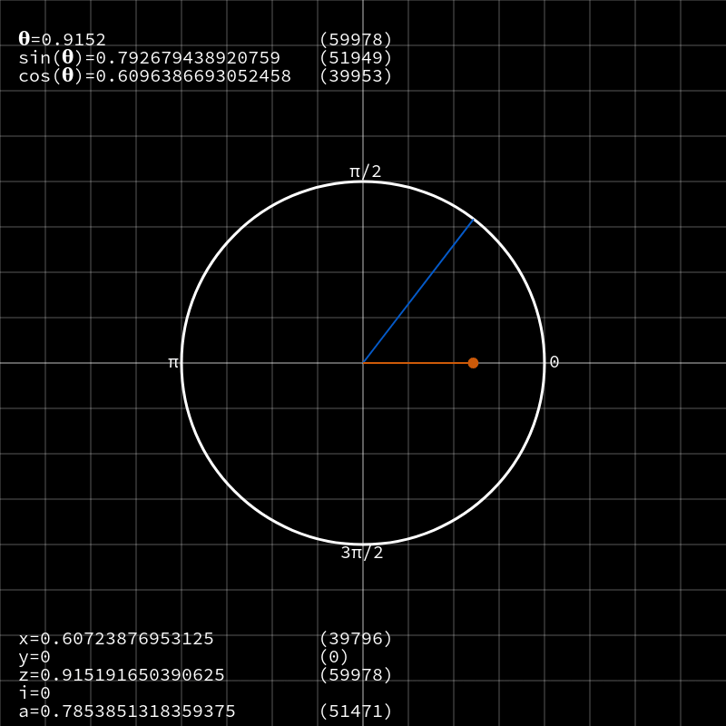

CORDIC is an algorithm for computing trig functions like `sin`, `cos`, `tan` etc on low powered hardware, without an FPU (i.e. no floating point) or expensive lookup tables. In fact, it reduces these complex functions to simple additions and bit shifts.

I'll cut right to the chase and tell you *why* I love this algorithm so much, and then we'll dive into the details of exactly how it works. Essentially, the actual operations of the algorithm are incredibly simple - just shifts and adds, as I mentioned before - but it does this by combining vector math, trigonometry, convergence proofs, and some clever computer science. To me, it's what people are talking about when they describe things of this nature as "elegant".

Let's start with an obvious point: You don't need this if you're working on high powered hardware. This technique is applicable for embedded environments; especially less capable microcontrollers and FPGAs. Even then, it's possible that more capable hardware/peripherals will be available which would be "faster", though speed is not the only measure of usefulness.

## Avoiding floating point

*(if you're already familiar with fixed-point, you can safely skip this section)*

You might be wondering how are we able to avoid floating point, when functions like `sin(x)` produce values between -1.0 and 1.0? Well, floating point is not the only way of representing rational numbers. In fact, before IEEE 754 became the popular standard that it is today, *fixed point* was used all the time (go and ask any gamedev who worked on stuff between 1980 and 2000ish and they'll tell you all about it).

In fact, I got nerd-sniped into this whole CORDIC investigation after listening to [Dan Mangum's fantastic Microarch Club podcast](https://twitter.com/MicroarchClub/status/1759606520713453630), where Philip Freidin dropped the spicy hot-take that "Floating point is a crutch", and that using it might be a sign that you don't *really* understand the algorithm you're working on. Of course I should mention this was more in the context of custom ASICs rather than your run-of-the-mill webapp, but the quote really stuck with me.

So how does fixed point work? Well you take an integer type like `int32_t`, and say the top 16 bits are the whole part of the number, and the bottom 16 bits are the fractional part. You could divide the number up differently (e.g. 10 bits for the whole part and 24 for the fractional), but we'll use 16/16 as an example here.

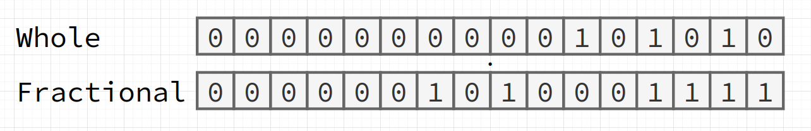

That gives a range of around `-32768.99997` to `32767.99997`. We've *fixed* the radix point at the 16th bit, though again, we could have put it anywhere. Moving the point allows us to trade off for precision where it makes sense (i.e. more bits for whole numbers, or more bits for fractional representation).

Something worth noting here is that the number is still an `int32_t` - we the programmers have assigned the extra meaning here (though this is also true of literally every data type in computing - there are only bits in the end!).

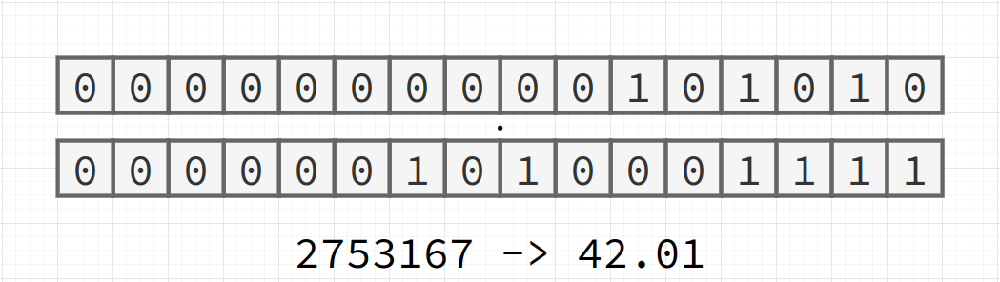

How do we get a number into this format? Well, we've got 16 bits of fractional precision, so take a float like `42.01`, and scale it up by `(1 << 16)`. That gives us `2753167` when cast into an `int32_t`. If we want to go from fixed point back to floating point, we just do the opposite. `2753167 / (1 << 16)` gives us `~42.0099945`, which is very close to `42.01`.

```C
#define SCALING_FACTOR (16)

static inline int32_t fixed_from_float(float a) {
  return (int32_t)(a * (float)(1 << SCALING_FACTOR));
}

static inline float fixed_to_float(int32_t a) {
  return (float)a / (float)(1 << SCALING_FACTOR);
}
```

We could also forgo floating point altogether and encode a number like `1.5` manually. The whole part is just `1`, so we shift that up (`(1 << 16)`), and the fractional part is the halfway point between `0x0000` and `0xffff`, so call it `0x7fff`. That gives us `98303` in decimal.

Operations like addition and subtraction Just Work™ - assuming you're using the same scaling factor for whichever numbers you're operating on. It is possible to mix and match scaling factors, but it increases the complexity.

Multiplication is only marginally trickier. Multiplying the two fixed point numbers together essentially scales everything up by scaling factor. This can be resolved by just shifting the result back down.

```C
static inline int32_t fixed_multiply(int32_t a, int32_t b) {
  return ((int64_t)a * (int64_t)b) >> SCALING_FACTOR;
}
```

Division is basically the same story, except in reverse. There's a trick to squeeze out some extra precision by prescaling the dividend by the scaling factor, and then dividing by the divisor.

```C
static inline int32_t fixed_divide(int32_t a, int32_t b) {
  return ((int64_t)a << SCALING_FACTOR) / (int64_t)b;
}
```

OK we can do basic operations, but what if I need something more complex, like I don't know, a trig function? This is where CORDIC comes in.

## The CORDIC algorithm

CORDIC stands for "co-ordinate rotation digital computer", and was cooked up back in the mid 50s (though the general algorithm has been known to mathematicians for hundreds of years). The core idea is that we can rotate a vector around a unit circle by progressively smaller and smaller angles, and the vector components will end up being the sine and cosine of the angle we're interested in.


It's sort of like a binary search:  You move towards the target angle by some large angle and check if you're ahead or behind, and then move by half that angle either clockwise or anticlockwise. This process repeats with smaller and smaller angles until the result converges.

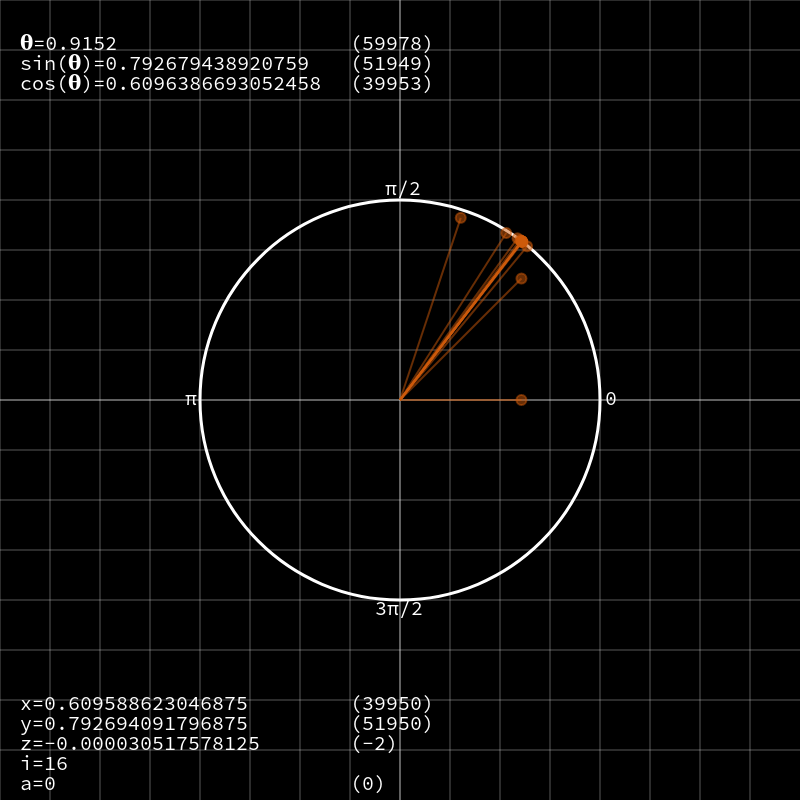

If you've worked with these kinds of operations before, you'll know that rotating a vector involves multiplying it with a matrix consisting of sines and cosines of the angle to be rotated to. That seems counter productive, since those are the functions we're trying to compute!

$$
\begin{bmatrix}
x' \\
y'
\end{bmatrix} = \begin{bmatrix}
\cos(\theta) & -\sin(\theta) \\
\sin(\theta) & \cos(\theta)
\end{bmatrix} \begin{bmatrix}
x \\
y
v\end{bmatrix}
$$

We'll put that aside for a second, and get a big picture overview before solving this problem. Now, it's fairly obvious that rotating by say `22.75˚` is the same as rotating by `45˚` and then `-22.5˚` - i.e. we can break up a rotation into smaller parts, with both positive and negative components.

Let's say that we have a maximum rotation of `90˚` (𝚷/2 radians), and we're trying to figure out `sin(0.7)` (about `40˚`). Starting with a vector `(1, 0)` and a target of `0.7` radians, we rotate `0.7853` rads (`45˚`) anti-clockwise.

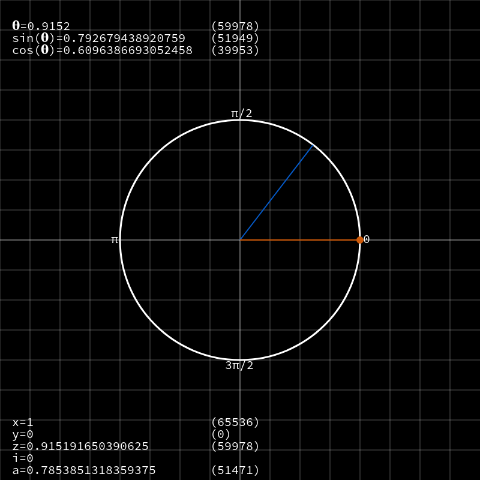

Target now becomes `0.7 - 0.7853 = -0.0853`. Since it's negative, we now rotate clockwise by 0.3926 rads (22.5˚). Target becomes -0.0853 + 0.3926 = 0.3073, which is positive, so the next rotation will be anti-clockwise by 0.1963 rads (11.25˚).

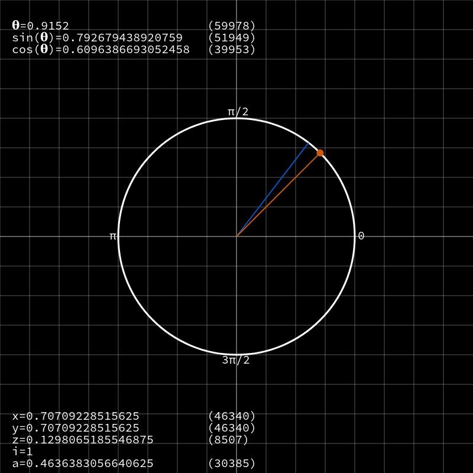
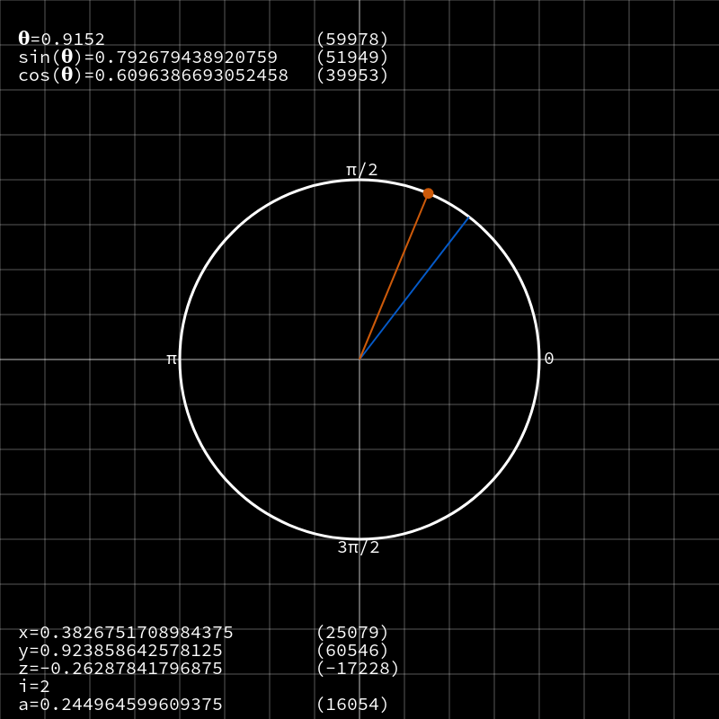

If we continue this process for a total of 16 iterations, the vector lines up almost perfectly with the original target angle. The `y` value of the vector is ~= `sin(a)`, while `x` ~= `cos(a)`! This is how CORDIC works; we rotate a vector around, and the state we keep is an approximation of various trigonometric functions.

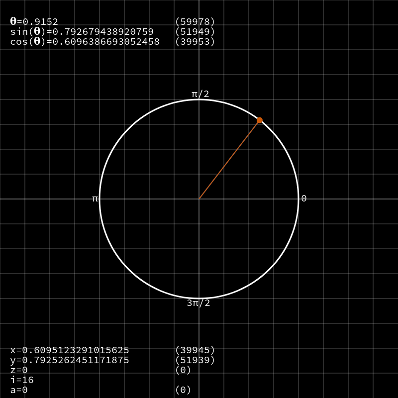

With some understanding in hand, we can return to the issue of, well, rotations actually requiring the functions we're trying to compute! We can use trigonometry to simplify the matrix.

$$
\cos(\theta) = \frac{1}{\sqrt{1 + tan^2(\theta)}}
$$

$$
\sin(\theta) = \frac{\tan(\theta)}{\sqrt{1 + tan^2(\theta)}}
$$

$$
\begin{bmatrix}
x' \\
y'
\end{bmatrix} = \cos(\theta)\begin{bmatrix}
1 & -\tan(\theta) \\
\tan(\theta) & 1
\end{bmatrix} \begin{bmatrix}
x \\
y
\end{bmatrix}
$$

We have a few constants ones now, but we still have the `tan(a)`, plus the `cos(a)` out front. Let's ignore the `cos(a)` and focus on getting rid of `tan(a)`. As you saw when we ran through the algorithm, we're always rotating by a total of `~90˚`: First by `45˚`, then `22.5˚`, then `11.25˚`, and so on. Since we're doing this a fixed number of times, we can just precompute those values, and put them in a table. You might be thinking: *"You said there wouldn't be any tables!"*. Well, no. I said there wouldn't be any *expensive* tables. This table, in our case, will only contain 16 `uint32_t`s - a whopping 64 bytes! Even the most stripped down embedded projects can *usually* afford that. (In contrast, an *unoptimised* table for `sin(x)` that contains 4096 entries covering values from -1 to 1 would need 16KiB - and that's pretty poor precision!)

$$
\begin{bmatrix}
x' \\
y'
\end{bmatrix} = \cos(\theta)\begin{bmatrix}
1 & -table[i] \\
table[i] & 1
\end{bmatrix} \begin{bmatrix}
x \\
y
\end{bmatrix}
$$

That means our rotation matrix now only contains constants! We do however still have that `cos(a)` term. In fact, every iteration brings it's own new `cos(a)` term. But because of algebra, we can simply multiply all those terms together and apply them at the end.

$$
\cos(\theta_0) \cdot \cos(\theta_1) \cdot \cos(\theta_2) \cdot ... \cdot \cos(\theta_N)
$$

Still, that's not great. But! No matter whether we take positive or negative steps, or the number of iterations, this multiplied out series of cosines actually converge to a constant value: `~0.6366`. All we need to do is to multiply out by this value after all iterations.

$$
~0.6366 = \cos(\pm45˚) \cdot \cos(\pm22.5˚) \cdot \cos(\pm11.25˚) \cdot ... \cdot \cos(\pm\theta_N)
$$

So that gives us only multiplications by constants over a number of iterations! Not bad. But didn't I say that CORDIC only used bit shifts and addition? For that, we need to go a little deeper into the rabbit hole.

## Shifts and Adds

What the angles we plugged into `tan(a)` could instead be strategically chosen so that the result would always be an inverse power-of-2? This would be great, since multiplying or dividing by a power-of-2 is just a left or right shift for integers.

Well, the `atan(x)` (arc-tangent or inverse tangent) function can do that for us. We can build a new 16-entry table, where each value is `atan(2**-i)`, for i=0 to 15. The actual rotation values for each iteration are now (`45˚`, `26.565˚`, `14.036˚`, `7.125˚`, etc).

It doesn't actually half the angle each time, but as it turns out: using these angles, the process will *still* converge on the correct result! Now all those multiplications by `tan(a)` have become bit shifts by the iteration number.

We still need to recompute our constant for the `cos(a)` terms. That now comes out to be around `0.60725`, which would be converted to the fixed point number `39796`.
And! It turns out there's a trick that means we don't even need to multiply by this value at the end. When we initialise the vector, we set `x` to this constant instead of 1.

$$
~0.60725 = \cos(\pm\arctan(2^{0})) \cdot \cos(\pm\arctan(2^{-1})) \cdot \cos(\pm\arctan(2^{-1})) \cdot ... \cdot \cos(\pm\arctan(2^{-N}))
$$

So now the CORDIC algorithm looks like this:

Precompute a table for `tan(a)`, where each entry is `atan(2**-i)`. These values are, of course, converted to fixed point, so: `atan(2**-i) * (1 << 16)`

Then, when we want to compute a sine or a cosine, we take the angle (e.g. `0.9152`), convert it to fixed point: `0.9152 * (1 << 16) = 59978`

Then setup initial parameters:

```
x = 39796
y = 0
z = 59978
```

The `z` parameter here is not part of the vector, but rather tracks our target angle over time. The sign of this parameter determines if we rotate clockwise or anti-clockwise.

With the parameters set up, each iteration looks like this (in pseudocode):

```python
if z >= 0:
    x_next = x - (y >> i)
    y_next = y + (x >> i)
    z -= table[i]
else:
    x_next = x + (y >> i)
    y_next = y - (x >> i)
    z += table[i]
x = x_next
y = y_next
```

Now we can follow a few iterations through, and see the algorithm converge on the correct sine and cosine values. Values in parentheses are fixed point.


During the first iteration, `z` was positive, so the vector is rotated anti-clockwise by `~0.785` rads. Note that the magnitude of the vector increased.

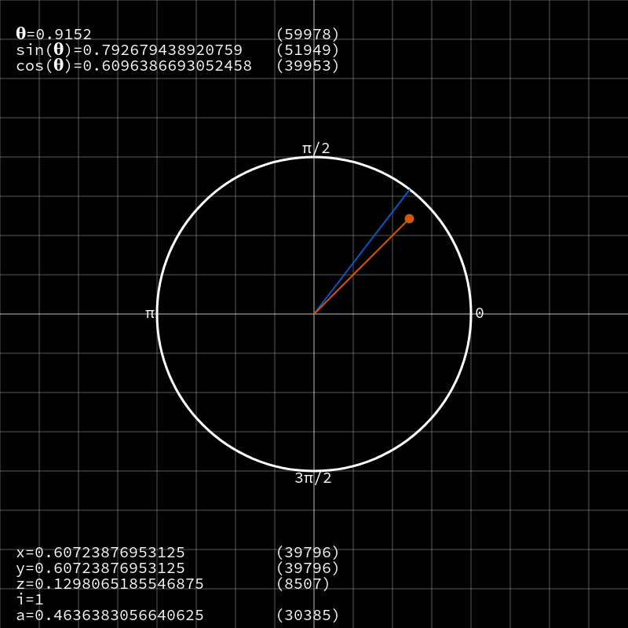

In the second iteration, `z` was still positive, so again the vector is rotated anti-clockwise, by `~0.436` rads, though this time it overshot the mark. The magnitude of the vector is almost one now - that's the cos(a) product term starting to converge after we set the initial `x` value!

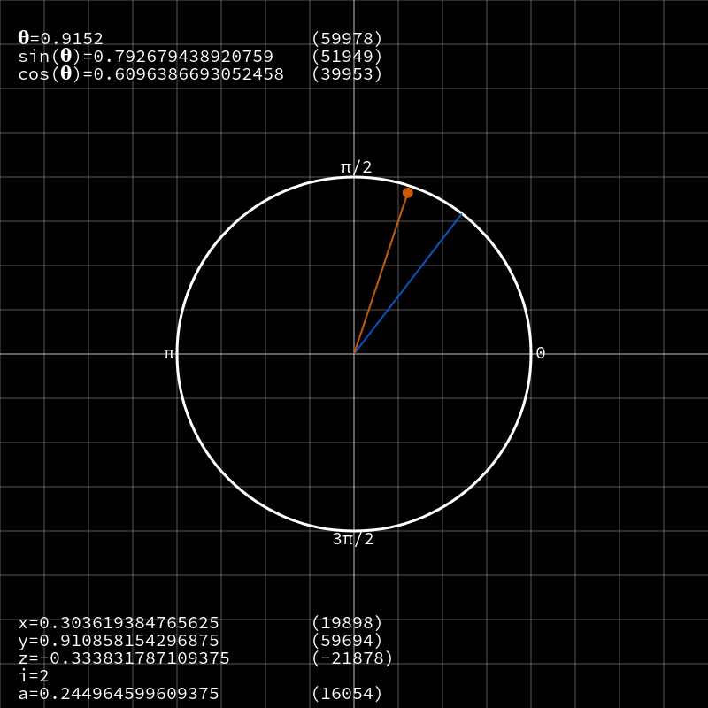

On iteration 3, `z` was negative, so the vector is rotated clockwise by `~0.244` rads. It's clearly starting to creep up on that mark, and you can see that just a handful of iterations, we'd be able to get a fairly close approximation!

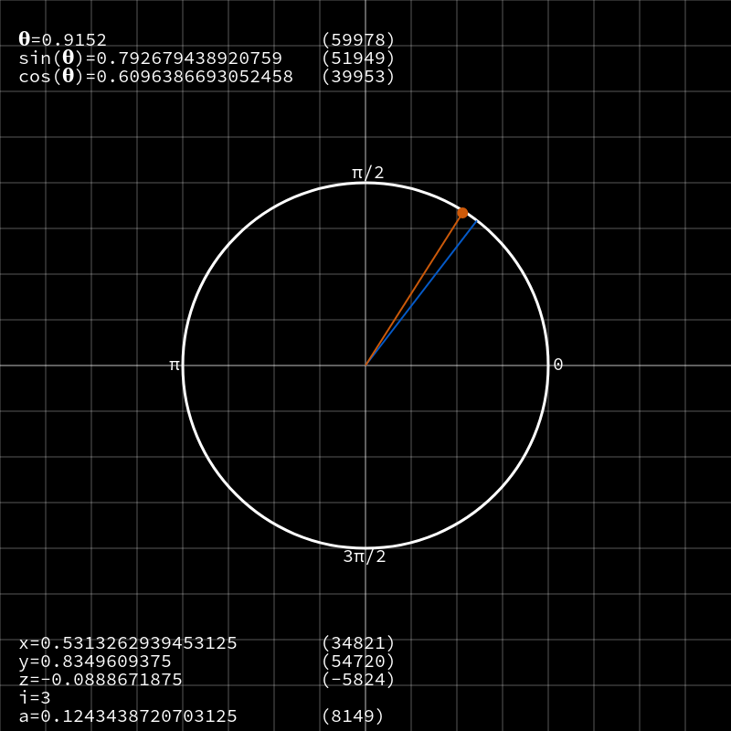

On iteration 4, `z` was again negative, so clockwise rotation by `~0.124` rads. Now that the angular change is getting pretty small, and the vector is very close to the actual result, the rotations ping back and forth, getting closer and closer to the real value.

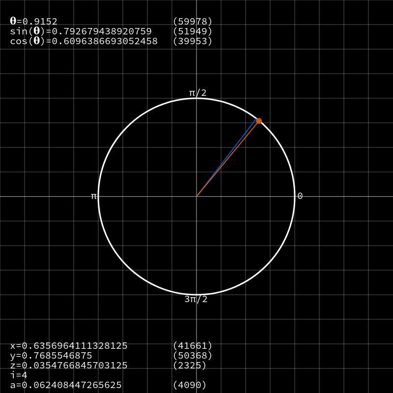

Skipping forward to the last iteration, `y` now contains a very accurate approximation for `sin(0.9152)` - with an absolute deviation of just `0.00000956`. The cosine value (in `x`) deviation is slightly higher, at `0.0000434`, but still pretty good!

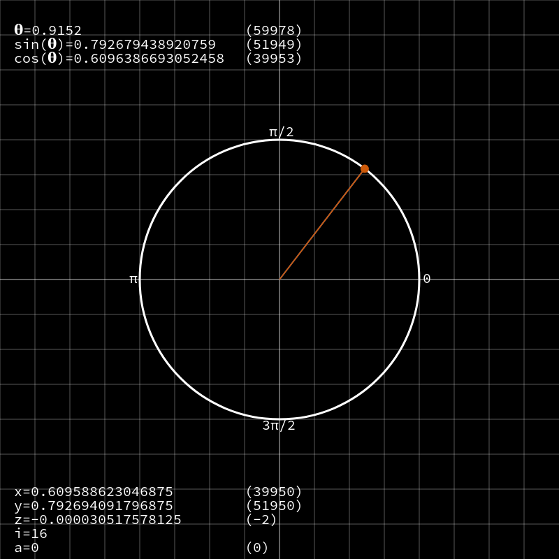

## Wrapping up

There is _a lot_ more to CORDIC than this, which I may cover in a future post. For instance, I didn't mention the special considerations you have to make if the angle of interest is outside of the first or fourth quadrant of the unit circle. I also didn't talk about how, with a few modifications, CORDIC can be used to compute many other functions, including `tan`, `atan`, `asin`, `acos`, `sinh`, `cosh`, `tanh`, `sqrt`, `ln`, `e^x`. Related algorithms also exist, such as [BKM](https://en.wikipedia.org/wiki/BKM_algorithm), designed specifically for computing logs and exponentials.

I'm planning on covering this in some detail on the [Low Byte Productions YouTube channel](https://www.youtube.com/@LowByteProductions?subscribe), so follow me there if this kind of thing is something you'd like to learn more about.
