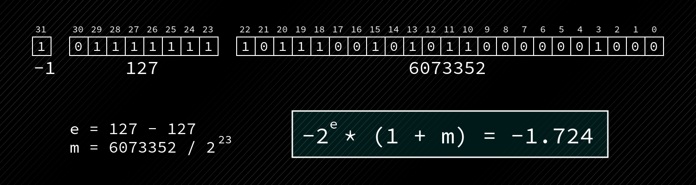
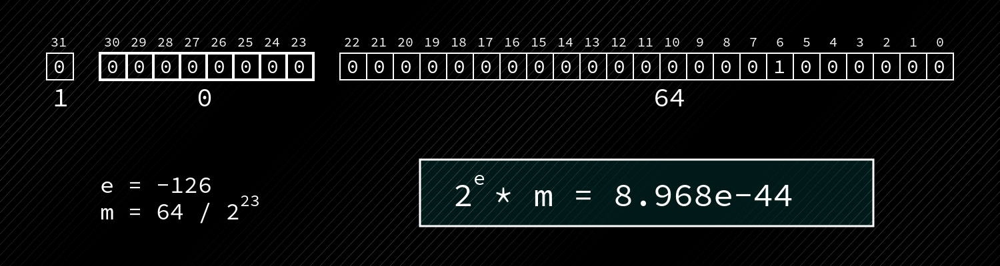
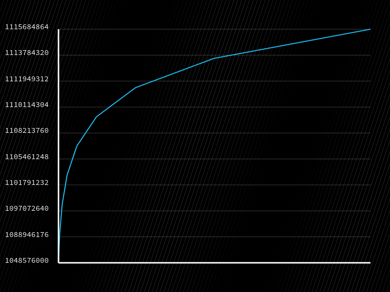
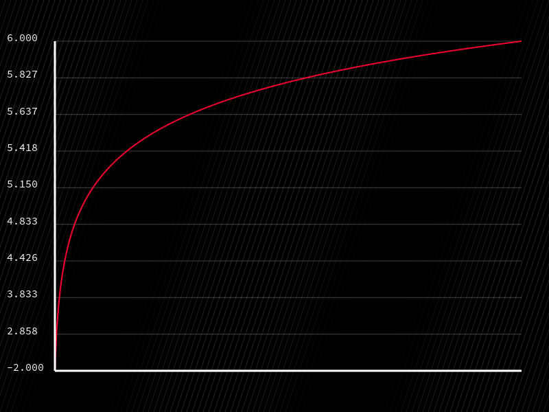
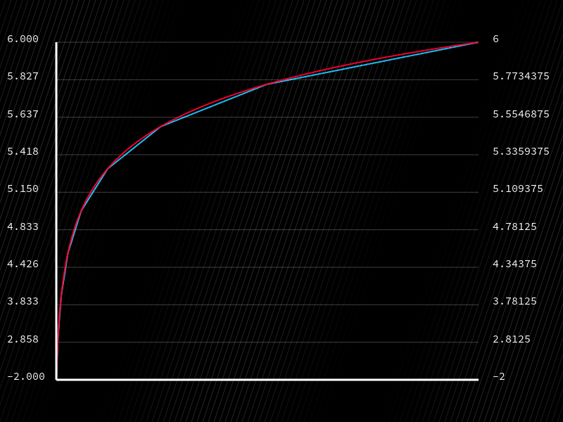

# Everything I Know About The Fast Inverse Square Root Algorithm

The **fast inverse square root algorithm**, made famous (though not invented) by programming legend John Carmack in the Quake 3 source code, computes an inverse square root $\frac{1}{\sqrt{x}}$ with a bewildering handful of lines that interpret and manipulate the raw bits of float. It's *wild*.

```C
float Q_rsqrt(float number) {
  long i;
  float x2, y;
  const float threehalfs = 1.5F;

  x2 = number * 0.5F;
  y  = number;
  i  = *(long*)&y;                            // evil floating point bit level hacking
  i  = 0x5f3759df - ( i >> 1 );               // what the fuck?
  y  = *(float*)&i;
  y  = y * ( threehalfs - ( x2 * y * y ) );   // 1st iteration
  // y  = y * ( threehalfs - ( x2 * y * y ) );   // 2nd iteration, this can be removed

  return y;
}
```

In this article, we'll get into what's actually happening at the mathematical level in quite a bit of detail, and by the end, with a little persistence, you'll come away actually *understanding* how it works.

I'm not the first to write about this algorithm, and I surely won't be the last, but my aim is to show *every* step of the process. A lot of really fantastic resources out there still skip over steps in derivations, or fail to highlight out apparently obvious points. My goal is to remove any and all magic from this crazy algorithm.

It's important to note that this algorithm is very much *of its time*. Back when Quake 3 was released in 1999, computing an inverse square root was a slow, expensive process. The game had to compute hundreds or thousands of them per second in order to solve lighting equations, and other 3D vector calculations that rely on normalization. These days, on modern hardware, not only would a calculation like this not take place on the CPU, even if it did, it would be fast due to much more advanced dedicated floating point hardware.

## The algorithm

```C
float Q_rsqrt(float number) {
  long i;
  float x2, y;
  const float threehalfs = 1.5F;

  x2 = number * 0.5F;
  y  = number;
  i  = *(long*)&y;                            // evil floating point bit level hacking
  i  = 0x5f3759df - ( i >> 1 );               // what the fuck?
  y  = *(float*)&i;
  y  = y * ( threehalfs - ( x2 * y * y ) );   // 1st iteration
  // y  = y * ( threehalfs - ( x2 * y * y ) );   // 2nd iteration, this can be removed

  return y;
}
```

This is the code, more or less exactly as it appears in the quake 3 source - including the comments. Personally I think *"evil floating point bit level hacking, what the fuck"* is a fantastic explanation, but I do want to dig in quite a bit further.

One of the key ideas behind this algorithm, and the reason this works, is because the raw bit pattern of a float, when interpreted as 32-bit signed integer, essentially approximates a scaled and shifted `log2(x)` function.

Logarithms have a bunch of rules, properties, and identities that can be exploited to make computing the inverse square root easy for a computer, using only simple operations like adds and shifts (though there are some supporting floating point multiplications, which we'll talk about later).

In order to make sense of what it even means to interpret the bit pattern of a float, we need to look at how floats are represented in memory, and how the "value" of a float is derived from that representation.

## 32-Bit Floats: Representation

An IEEE-754 32-bit float can be regarded as a struct, which holds 3 members. Using C's bit-field notation here:

```C
struct float_raw {
  int32_t mantissa : 23;
  int32_t exponent : 8;
  int32_t sign     : 1;
}
```

**Sign:** 1 bit which indicates whether or not the number is positive or negative 
**Exponent**: 8 bits which are used to dictate the range that this number will fall into
**Mantissa**: 23 bits which linearly specifies where exactly in the range this number lives

The following equation shows how the actual numerical value $N$ is conceptually derived from the 3 integer parts, where $S$ is the sign bit, $E$ is the exponent value, and $M$ is the mantissa.

$$
N = -1^S \times 2^{E-127} \times (1 + \frac{M}{2^{23}})
$$

Or, if we break some of the variables out:

$$
m = \frac{M}{2^{23}}
$$

$$
B = 127
$$

$$
e = E-B
$$

$$
N = -1^S \times 2^e \times (1 + m)
$$

Note the little trick to get the sign bit from a 0 or a 1 into a -1 or a 1. Also notice that instead of simply multiplying by m, we multiply by 1+m. This ensures that when $m$ is 0, we get $2^e$, and when $m$ is 1, we get $2^{e+1}$ (i.e. the full range).

Let's take an example like the (approximate) number `-1.724`. It's underlying representation would look like this:



One interesting thing is that the exponent is actually stored in a biased format. The actual exponent value is $e = E - 127$. This allows two floating point numbers to be compared as if they were unsigned integers, which is a rather large benefit when it comes to building hardware accelerated floating point units.

The next complexity is that an exponent $E$ of all zeros has a special meaning. All the numbers in this range are known as "sub-normals", and are represented by a slightly modified equation:

$$
N = -1^S \times 2^{-126} \times m
$$



The exponent is set to -126. The mantissa value doesn't have an added value of one (in fact it's implicitly $0 + m$), so the range actually represents 0 to just less than $2^{-126}$. Without this, it would be impossible to represent 0 or the very small numbers around 0, which can cause underflow errors when calculations on small numbers result in one of these impossible values.

When the exponent $E$ is all ones, then the floating point value is one of the two other (quite famous) special types: `NaN` and `Infinity/-Infinity`. If $E = 255$, and $M = 0$, then the number represents an infinity, with the sign bit signifying positive or negative.


$M \neq 0$, then the value is `NaN` (not a number), which is used to signify when an illegal operation has taken place, like $0/0$.


## 32-Bit Floats: Interpreting the bits

Of course, typically this internal representation is completely irrelevant to the programmer; They can just perform calculations and get results. Indeed, William Kahan notes in his [1998 presentation "How Java’s Floating-Point Hurts Everyone Everywhere":](https://people.eecs.berkeley.edu/~wkahan/JAVAhurt.pdf)

> Error-analysis tells us how to design floating-point arithmetic, like IEEE Standard 754, moderately tolerant of well-meaning ignorance among programmers

The idea being that "numerical sophistication" is not necessary to make effective use of floating point.

But that said, an intimate familiarity of the format can lead to some clever designs. We looked at how the integer parts of a float translate to a decimal number, but we can also talk about those same parts in terms of an integer representation in mathematical form:

$$
I_x = 2^{31}S + 2^{23}E + M
$$

That $2^{23}$ term is quite important, so let's break it out into its own variable:

$$
L = 2^{23}
$$

$$
I_x = 2^{31}S + LE + M
$$

And since we're mainly going to be talking about taking square roots of numbers, we can assume the sign is positive ($S = 0$), and use the simpler form:

$$
I_x = LE + M
$$

If you take a closer look at the raw bits of a float, you can make some interesting observations.

The first is that every *range* - that is the set of numbers which can be represented by any given exponent value - has approximately 50% less precision than the range before it.

For example, take the exponent value $E = 127, e = E - B = 0$, which represents the range of representable numbers $\pm[1, 2)$. There are 8388607 (`(1 << 23) - 1`) distinct steps from 1 to just below 2.

Contrast that with exponent value $E = 128, e = E - B = 1$, which represents the range of representable numbers $\pm[2, 4)$. It has the same 8388607 distinct steps, but it has to cover twice the distance on the number line.

## Raw bits as logarithms

This relationship is *logarithmic*. If you take a series of evenly-spaced floating point numbers - say 256 of them - starting at 0, increasing by 0.25 each time, and interpret the bit pattern as an integer, you get the following graph:



Now if we plot the result of taking `log2(x)` of those same 256 float values, we get this curve.



Obviously the actual values on the graphs are wildly different, and the first one is much more *steppy*, but it's clear that the first is a close approximation of the second.

The first graph is what you might call a *piecewise linear approximation*, which has been scaled and shifted by a specific amount. Perhaps unsurprisingly, the amount it's scaled and shifted by is related to the structure of a float!

$$
\log_2(x) \approx \frac{I_x}{L} - B
$$

Here, $I_x$ is the raw bit pattern of a float in integer form. That is divided by by size of the mantissa, and the bias exponent is subtracted away. If we plot this directly against `log2(x)`, we get:



Again, not a perfect mapping, but a pretty good approximation! We can also sub in the floating point terms, assuming a positive sign bit and a *normal* number:

$$
I_x = log_2(1 + m_x) + B \times 2^{e_x}
$$

Forgetting the integer representation for just a second, the log of a floating point number alone would be expressed as:

$$
log_2(1 + m_x) + e_x
$$

Since we already know that the integer conversion is a *linear approximation*, we can make this approximate equivalence:

$$
log_2(1 + x) \approx x + \sigma
$$

The sigma ($\sigma$) term is essentially a fine adjustment parameter that can improve the approximation. To make it really concrete, the $x$ term here will always be a number in the range $[0,1]$, and represents a position in the exponent range *linearly*.

With all of that in mind, we can focus our attention back on the thing we're (now indirectly) attempting to compute: $\frac{1}{\sqrt{x}}$.

When work with the raw bits of a float, we are essentially operating on a logarithm of that value. Logarithms have been carefully studied for a long time, and they have many known properties and identities. For example:

$$
\log_2(x^y) = y \times \log_2(x)
$$

We can also note that:

$$
\sqrt{x} = x^{0.5}
$$

Since we're asking for an answer to the question:

$$
y = \frac{1}{\sqrt{x}}
$$

which we can reformulate as

$$
y = \frac{1}{x^{0.5}}
$$

and even simpler:

$$
y = x^{-0.5}
$$

We can take at our log formulas from before, and state that:

$$
\log_2(\frac{1}{\sqrt{x}}) = \log_2(x^{-0.5}) = -0.5 \times \log_2(x)
$$

Plugging in the floating point values now:

$$
\log_2(1 + m_y) + e_y \approx -0.5 \times \log_2(1 + m_x) + e_x
$$

$$
m_y + \sigma + e_y \approx -0.5 \times (m_x + \sigma + e_x)
$$

And then getting the floating point constants back into their integer component form:

$$
\frac{M_y}{L} + \sigma + E_y - B \approx -0.5 \times (\frac{M_x}{L} + \sigma + E_x - B)
$$

We can do some algebra on this expression to turn it into one that where both sides have something that looks a raw floating point bit pattern (integer) on both sides ($LE + M$). I'm leaving every step in for clarity, though it's the last line here which is important:

$$
\frac{M_y}{L} + \sigma + E_y \approx -0.5 \times (\frac{M_x}{L} + \sigma + E_x - B) + B
$$

$$
\frac{M_y}{L} + E_y \approx -0.5 \times (\frac{M_x}{L} + \sigma + E_x - B) + B - \sigma
$$

$$
\frac{M_y}{L} + E_y \approx -\frac{1}{2}(\frac{M_x}{L} + \sigma + E_x - B) + B - \sigma
$$

$$
\frac{M_y}{L} + E_y \approx -\frac{1}{2}(\frac{M_x}{L} + E_x - B) + B - \frac{3}{2}\sigma
$$

$$
\frac{M_y}{L} + E_y \approx -\frac{1}{2}(\frac{M_x}{L} + E_x) - \frac{3}{2}(\sigma - B)
$$

$$
L(\frac{M_y}{L} + E_y) \approx L(-\frac{1}{2}(\frac{M_x}{L} + E_x) - \frac{3}{2}(\sigma - B))
$$

$$
L(\frac{M_y}{L} + E_y) \approx -\frac{1}{2}L(\frac{M_x}{L} + E_x) - \frac{3}{2}L(\sigma - B))
$$

$$
LE_y + M_y \approx -\frac{1}{2}(LE_x + M_x) - \frac{3}{2}L(\sigma - B))
$$

$$
LE_y + M_y \approx -\frac{1}{2}(LE_x + M_x) + \frac{3}{2}L(B - \sigma)
$$

That is quite a mouthful - although all of the operations performed here are simple enough. With all the variable swapping done, and both sides containing groups that include proper, honest-to-goodness integer part floating point representations, we can group them back up and get:

$$
I_y \approx -\frac{1}{2}I_x + \frac{3}{2}L(B - \sigma)
$$

This is quite a significant moment. On the left hand side, we've got the *value* $\log_2(\frac{1}{\sqrt{x}})$, and on the right, we've got a simple operation on the integer interpretation of the floating point input (multiplying by negative one half), plus a constant term, made up of constants related to floating point representation (as well as the sigma tuning parameter). *This is the famous line*:

```C
i  = 0x5f3759df - ( i >> 1 ); // what the fuck?
```

A bit shift to the right multiplies by $\frac{1}{2}$, which is subtracted from the constant  `0x5f3759df`. That hex constant is the $\frac{3}{2}L(B - \sigma)$ term, but where exactly does `0x5f3759df` come from? Assuming a sigma value $\sigma = 0$, we can compute:

$$
\frac{3}{2}L(B - \sigma) = \frac{3}{2}2^{23} \times 127 = 1598029824
$$

`1598029824` in hexadecimal is `0x5f400000`, which, as you'll note, is close to, but *not quite* the magic constant from Quake. It's off by `566817`, and we can use this information to compute the actual sigma value used in the game:

$$
\frac{3}{2}2^{23} \times 127 - \frac{3}{2}2^{23}(127 - \sigma) = 566817
$$

$$
\frac{3}{2}(2^{23} \times 127 - 2^{23}\times127 - 2^{23}(- \sigma)) = 566817
$$

$$
\frac{3}{2}(-2^{23}(- \sigma)) = 566817
$$

$$
-2^{23}(- \sigma) = \frac{566817}{1.5}
$$

$$
2^{23}\sigma = 377878
$$

$$
\sigma = \frac{377878}{2^{23}}
$$

$$
\sigma = 0.04504656
$$

That sigma value was chosen by someone to optimise the approximation, but interestingly, it isn't actually the *optimal* value (more on that later), *and* it isn't actually known who came up with it! I've left all the math in so as to remove any possibility of this being a "magic" constant; It's really anything but! In C:

```C
int32_t compute_magic(void) {
  double sigma = 0.0450465;
  double expression = 1.5 * pow(2.0, 23.0) * (127.0 - sigma);
  int32_t i = expression;
  return i;
}

// -> 0x5f3759df
```

Note that doubles are used here not floats, and that the integer form is just a plain old cast, not an interpretation of the bit pattern.

```C
i  = 0x5f3759df - ( i >> 1 ); // what the fuck?
```

That single line computes an inverse square root approximation on a floating point number by realising that the raw bit pattern is an approximate log, and then exploiting identities and algebra, as well as extremely fast operations like shifting and addition.

I've often heard this algorithm referred to as a "hack". Now, I'm not one to put down a hacky solution, but a hack this is not. This is absolutely a solid, wel thought-out piece of engineering, employed to compute an expensive operation thousands of times per second on the under-powered hardware of the day.

I'll make a quick note here that this algorithm will *only* work with "normal" floating point numbers. A "sub-normal" (that is, a tiny number *very* close to zero) will fall apart, because the log approximation assumes $log_2(1 + x) = x + \sigma$, but what we'd actually be plugging in would be $0 + x$.

## Newtons method

The approximation described above is pretty good, but definitely contains measurable error. That's where the next line comes in.

```C
y = y * ( threehalfs - ( x2 * y * y ) ); // 1st iteration
```

This line improves the approximation by a significant margin, by utilising an algorithm called Newtons method, or the [Newton-Raphson method](https://en.wikipedia.org/wiki/Newton%27s_method) . This is a generic, iterative mathematical technique for finding the roots (zeros) of function. You might wonder how that could be helpful here, since we aren't looking for a zero. Well, we already have our approximation $y$, and we can create a new expression:

$$
f(y) = \frac{1}{y^2} - x = 0
$$

Squaring the $y$ term - which, remember, is $\frac{1}{\sqrt{x}}$ - gives us $\frac{1}{x} - x$. Inverting that gives us $x - x$, which is of course just 0. This expression is in a form that we can use for Newtons method.

Newtons method works like this: Given an initial approximation $y_n$, we can create a better approximation $y_{n+1}$ like this:

$$
y_{n+1} = y_n - \frac{f(y_n)}{f'(y_n)}
$$

Where $f'(y)$ is the [*derivative*](https://en.wikipedia.org/wiki/Derivative) of $f(y)$. When we take the derivative of a function for a given input, we're determining the slope or gradient of function for that input. In other words, it's the rate of change. The improved approximation works by taking our current approximation (which we know is not yet correct), and nudging it along the slope towards the correct answer. It's kind of mind-boggling that this works, but there you go! I should note that this particular algorithm does not work for all circumstances, but it is a very powerful tool to throw at these kinds of problems!

So what is the derivative of our $f(y)$ function? First let's rearrange the function a little:

$$
f(y) = y^{-2} - x
$$

Taking the derivative for a function in this form works like:

$$
\frac{d}{dx}(x^n + c) = nx^{n-1}
$$

So we get:

$$
\frac{d}{dy} f(y) = -2y^{-3}
$$

$$
\frac{d}{dy} f(y) = -2y^{-3}
$$

$$
\frac{d}{dy} f(y) = -\frac{2}{y^3}
$$

That gives us this expression for the better approximation:

$$
y_{n+1} = y_n - \frac{\frac{1}{y_n^2} - x}{-\frac{2}{y_n^3}}
$$

There is a problem with this form, however. A very large part of why this algorithm is fast is because it avoids floating point divisions, and the above equation has 3 of them! Fortunately, our very good friend algebra has our back again, and we can rearrange the expression into this form:

$$
y_{n+1} = y_n(1.5 - 0.5x \cdot y_n^2)
$$

No divisions, only multiplications! The exact steps to go from the first form to this one are *numerous* to say the least, but I've included it in full for completeness. Feel free to skip over it and pick back up on the code below.

$$
y_{n+1} = y_n - \frac{\frac{1 - xy_n^2}{y_n^2}}{-\frac{2}{y_n^3}}
$$

$$
y_{n+1} = y_n - \frac{1 - xy_n^2}{y_n^2} \cdot -\frac{y_n^3}{2}
$$

$$
y_{n+1} = y_n - \frac{-1 - xy_n^2}{y_n^2} \cdot \frac{y_n^3}{2}
$$

$$
y_{n+1} = y_n - \frac{-1 - xy_n^2}{\cancel{y_n^2}} \cdot \frac{\cancel{y_n^2}y_n}{2}
$$

$$
y_{n+1} = y_n - (-1 - xy_n^2 \cdot \frac{y_n}{2})
$$

$$
y_{n+1} = y_n - (-(1-xy_n^2) \cdot \frac{y_n}{2})
$$

$$
y_{n+1} = y_n - (-1\cdot(1-xy_n^2) \cdot \frac{y_n}{2})
$$

$$
y_{n+1} = y_n - (-1\cdot1 + -1\cdot(-xy_n^2) \cdot \frac{y_n}{2})
$$

$$
y_{n+1} = y_n - (-1\frac{y_n}{2} + xy_n^2\frac{y_n}{2})
$$

$$
y_{n+1} = y_n - (-\frac{y_n}{2} + \frac{xy_n^2y_n}{2})
$$

$$
y_{n+1} = y_n - (\frac{-y_n+xy_n^3}{2})
$$

$$
y_{n+1} = y_n - (\frac{y_n \cdot -1 +xy_n^3)}{2})
$$

$$
y_{n+1} = y_n - (\frac{y_n \cdot -1 + y_n(xy_n^2)}{2})
$$

$$
y_{n+1} = y_n - (\frac{y_n(-1 + xy_n^2)}{2})
$$

$$
y_{n+1} = y_n \cdot \frac{2}{2} - \frac{y_n(-1 + xy_n^2)}{2}
$$

$$
y_{n+1} =  \frac{2y_n}{2} - \frac{y_n(-1 + xy_n^2)}{2}
$$

$$
y_{n+1} = \frac{2y_n - y_n(-1 + xy_n^2)}{2}
$$

$$
y_{n+1} = \frac{2y_n + y_n(-1(-1 + xy_n^2))}{2}
$$

$$
y_{n+1} = \frac{y_n(2 -1(-1 + xy_n^2))}{2}
$$

$$
y_{n+1} = \frac{y_n(2 + 1 -xy_n^2)}{2}
$$

$$
y_{n+1} = \frac{y_n(3 -xy_n^2)}{2}
$$

$$
y_{n+1} = y_n(\frac{3}{2} - \frac{xy_n^2}{2})
$$

$$
y_{n+1} = y_n(\frac{3}{2} - \frac{x}{2} y_n^2)
$$

$$
y_{n+1} = y_n \cdot (1.5 - (0.5x \cdot y_n \cdot y_n))
$$

So that is the last line of the function before the return:

```C
y = y * ( threehalfs - ( x2 * y * y ) ); // 1st iteration
```

Amazingly, that ends up yielding a maximum absolute error of 0.175% (and often has a far lower error). Normally, Newtons method is applied iteratively to obtain closer and closer approximations, but in the case of the Quake code, only a single iteration was used. In the original source, a second iteration is present, but is commented out.

```C
// y  = y * ( threehalfs - ( x2 * y * y ) );   // 2nd iteration, this can be removed
```

## Conclusion

This algorithm is outright astonishing. It builds on a deep knowledge of the internal mathematical details of the floating point number system, understanding what runs fast and slow on a computer, some nimble algebraic gymnastics, and a centuries old root finding method discovered by none other than Issac Newton himself, and solves a problem that was a computational bottleneck at a particular period of history.

I mentioned that Carmack did not actually come up with this himself (though I wouldn't put it past him!). [The truth is the exact origin is not 100% certain](https://www.beyond3d.com/content/articles/8/). There's something kind of incredible about that, too.

And believe it or not, this rabbit hole actually goes even deeper. Mathematician [Chris Lomont wrote up a paper](http://www.lomont.org/papers/2003/InvSqrt.pdf) trying to find the optimal value for sigma in the log approximation step. It's definitely worth a look if this hasn't fully satisfied your curiosity about the subject.

Lastly, [I recently wrote about CORDIC](https://github.com/francisrstokes/githublog/blob/main/2024/5/10/cordic.md), an algorithm for computing sines and cosines without floats, using only addition and bit shifting. Some folks had asked in the comments about its similarity to the fast inverse square root algorithm. I replied that it wasn't that similar, *really* - being all about floating point, bit level interpretations, and root-finding.

But then I stopped to actually think about it, and while there are large differences in the details of the algorithm, there is a lot of *spirit* in common. Specifically, making clever mathematical observations, and bringing those to bear efficiently on the hardware constraints of the time. 

Some people look at algorithms like CORDIC and fast inverse square root, and think them only relics of the past; A technology with no utility in the modern world. I don't think I have to tell you that I disagree with that premise.

A lot of us get into this field because, as kids, we loved to crack things open and see how they worked (even if, sometimes, we couldn't put them back together afterwards). Algorithms such as these live in that same space for me. I've tried to keep that curious spark alive, and turn it on problems and technology that aren't immediately relevant to my everyday work. And the really crazy thing is that often the underlying elements *do* help me solve real problems! Knowledge is synthesisable, who would have thought.